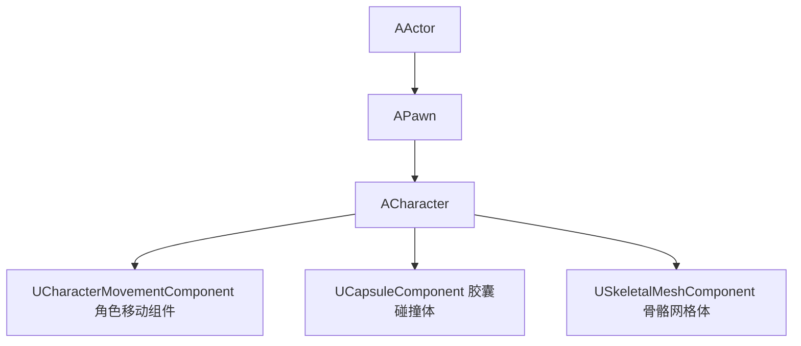
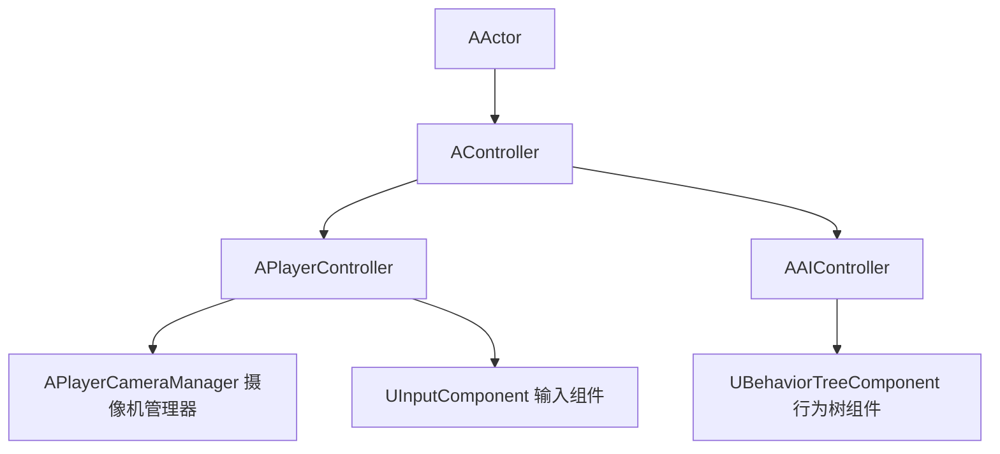
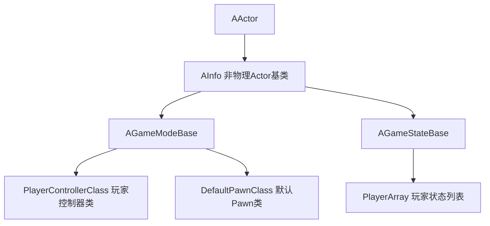

# Unreal Engine AActor

## 一、继承链

### 1.1 核心继承链

```
UObjectBase
  └── UObjectBaseUtility
        └── UObject
              └── AActor
```

### 1.2 UObjectBase

| 成员            | 类型       |
| --------------- | ---------- |
| `EObjectFlags`  | 对象标志位 |
| `InternalIndex` | 内部索引   |
| `NamePrivate`   | 对象名称   |

### 1.3 UObjectBaseUtility

| 成员               | 说明           |
| ------------------ | -------------- |
| `AddToRoot()`      | 防止被GC回收   |
| `GetFullName()`    | 获取完整名称   |
| `GetLinkerIndex()` | 获取Linker索引 |

### 1.4 UObject

| 成员             | 说明          |
| ---------------- | ------------- |
| `BeginDestroy()` | 开始销毁      |
| `Serialize()`    | 序列化        |
| `IsEditorOnly()` | 是否仅编辑器  |
| `GetWorld()`     | 获取所在World |
| `SaveConfig()`   | 保存配置      |
| `FindFunction()` | 查找UFunction |

---


## 二、AActor

```
AActor
  ├── RootSceneComponent        // 根场景组件
  ├── 网络同步（Replication）
  ├── 创建销毁物体
  ├── 帧更新（Tick）
  ├── 组件操作
  ├── Actor嵌套操作
  └── 变换等功能
```

### 2.1 AActor 子类

| 子类                   | 说明             |
| ---------------------- | ---------------- |
| `ASkeletalMeshActor`   | 骨骼网格体 Actor |
| `AStaticMeshActor`     | 静态网格体 Actor |
| `ACameraActor`         | 摄像机 Actor     |
| `AReflectionCapture`   | 反射捕获 Actor   |
| `APlayerCameraManager` | 玩家摄像机管理器 |
| `APawn`                | 可被控制的 Actor |
| `ALightmassPortal`     | 光照传送门       |

---

## 三、APawn / ACharacter 继承链



### 3.1 ACharacter

| 成员                                             | 说明         |
| ------------------------------------------------ | ------------ |
| `UCharacterMovementComponent* CharacterMovement` | 角色移动组件 |
| `UCapsuleComponent* CapsuleComponent`            | 胶囊碰撞体   |
| `USkeletalMeshComponent* Mesh`                   | 骨骼网格体   |
| `Jump()`                                         | 跳跃         |
| `StopJumping()`                                  | 停止跳跃     |
| `Launch()`                                       | 发射/弹射    |

---

## 四、AController 体系



### 4.1 AController

| 成员                   | 说明            |
| ---------------------- | --------------- |
| `APawn* Pawn`          | 当前控制的 Pawn |
| `Possess()`            | 控制 Pawn       |
| `UnPossess()`          | 释放 Pawn       |
| `GetControlRotation()` | 获取控制旋转    |

### 4.2 APlayerController

| 成员                                        | 说明           |
| ------------------------------------------- | -------------- |
| `APlayerCameraManager* PlayerCameraManager` | 摄像机管理器   |
| `UInputComponent* InputComponent`           | 输入组件       |
| `SetViewTarget()`                           | 设置视角目标   |
| `ClientTravel()`                            | 客户端关卡跳转 |

### 4.3 AAIController

| 成员                                     | 说明             |
| ---------------------------------------- | ---------------- |
| `UBehaviorTreeComponent* BrainComponent` | 行为树组件       |
| `MoveToActor()`                          | 移动到目标 Actor |
| `MoveToLocation()`                       | 移动到目标位置   |

---

## 五、AInfo 体系



### 5.1 AInfo

| 成员             | 说明                   |
| ---------------- | ---------------------- |
| `bHidden = true` | 默认隐藏（无物理表现） |

### 5.2 AGameModeBase

| 成员                                                   | 说明                |
| ------------------------------------------------------ | ------------------- |
| `TSubclassOf<APlayerController> PlayerControllerClass` | 玩家控制器类        |
| `TSubclassOf<APawn> DefaultPawnClass`                  | 默认 Pawn 类        |
| `InitGame()`                                           | 初始化游戏          |
| `RestartPlayer()`                                      | 重生玩家            |
| `SpawnDefaultPawnFor()`                                | 为玩家生成默认 Pawn |

### 5.3 AGameStateBase

| 成员                                | 说明               |
| ----------------------------------- | ------------------ |
| `TArray<APlayerState*> PlayerArray` | 玩家状态列表       |
| `float ElapsedTime`                 | 游戏已运行时间     |
| `HasBegunPlay()`                    | 是否已开始游戏     |
| `GetServerWorldTimeSeconds()`       | 获取服务器世界时间 |

---

## 六、组件体系

### 6.1 组件继承链

```
UObject
  └── UActorComponent                           // 无 Transform，逻辑组件
        ├── UAudioComponent
        ├── UInputComponent
        ├── UMovementComponent
        │     └── UCharacterMovementComponent
        └── USceneComponent                     // 有 Transform，场景组件
              └── UPrimitiveComponent           // 可渲染、可碰撞
                    └── UMeshComponent          // 网格体渲染
                          ├── UStaticMeshComponent
                          ├── USkinnedMeshComponent
                          │     └── USkeletalMeshComponent
                          └── UChildActorComponent
```

### 6.2 UActorComponent

| 成员                   | 说明       |
| ---------------------- | ---------- |
| `AActor* OwnerPrivate` | 所属 Actor |
| `UWorld* WorldPrivate` | 所属 World |

> AActor 通过 `TArray<UActorComponent*> OwnedComponents` 持有所有组件

### 6.3 USceneComponent

| 成员                                              | 说明             |
| ------------------------------------------------- | ---------------- |
| `USceneComponent* AttachParent`                   | 父组件           |
| `TArray<USceneComponent*> AttachChildren`         | 子组件列表       |
| `TArray<USceneComponent*> ClientAttachedChildren` | 客户端子组件列表 |
| 位置、旋转、缩放                                  | Transform 信息   |

### 6.4 UPrimitiveComponent

| 成员                 | 说明               |
| -------------------- | ------------------ |
| 渲染基类             | 网格体、粒子系统等 |
| 物理、碰撞、灯光通道 | 物理相关设置       |

### 6.5 UMeshComponent

| 成员                          | 说明                             |
| ----------------------------- | -------------------------------- |
| `TArray<UMaterialInterface*>` | 材质列表                         |
| 渲染三角形网格集合            | 静态模型、动态模型、程序生成模型 |

### 6.6 UCameraComponent

| 成员                                 | 说明           |
| ------------------------------------ | -------------- |
| `UDrawFrustumComponent* DrawFrustum` | 视锥体绘制组件 |

### 6.7 UChildActorComponent

| 成员                                  | 说明          |
| ------------------------------------- | ------------- |
| `TSubclassOf<AActor> ChildActorClass` | 子 Actor 类型 |

### 6.8 UMovementComponent

| 成员                                | 说明             |
| ----------------------------------- | ---------------- |
| `USceneComponent* UpdatedComponent` | 被驱动的场景组件 |
| `FVector Velocity`                  | 当前速度         |
| `TickComponent()`                   | 每帧更新         |
| `StopMovementImmediately()`         | 立即停止移动     |

### 6.9 UCharacterMovementComponent

| 成员                         | 说明                                    |
| ---------------------------- | --------------------------------------- |
| `float MaxWalkSpeed`         | 最大行走速度                            |
| `float GravityScale`         | 重力缩放                                |
| `EMovementMode MovementMode` | 移动模式（Walking/Falling/Swimming...） |

### 6.10 UAudioComponent

| 成员                | 说明     |
| ------------------- | -------- |
| `USoundBase* Sound` | 音效资源 |
| `Play()`            | 播放     |
| `Stop()`            | 停止     |
| `FadeIn()`          | 淡入     |
| `FadeOut()`         | 淡出     |

### 6.11 UInputComponent

| 成员                                         | 说明         |
| -------------------------------------------- | ------------ |
| `TArray<FInputActionBinding> ActionBindings` | 按键绑定列表 |
| `BindAction()`                               | 绑定按键事件 |
| `BindAxis()`                                 | 绑定轴输入   |

---

## 七、World 结构

```
UObject
  ├── UWorld
  │     ├── ULevel* PersistentLevel     // 持久关卡
  │     └── TArray StreamingLevels      // 流送关卡列表
  └── ULevel
        └── TArray<AActor*> Actors      // 关卡内所有 Actor
```

---

## 八、AActor 生命周期

```
PostLoad / PostActorCreated
        ↓
PreInitializeComponents
        ↓
InitializeComponent
        ↓
PostInitializeComponents
        ↓
BeginPlay          ← 游戏开始
        ↓
Tick（每帧）       ← 持续运行
        ↓
EndPlay             ← 即将销毁
        ↓
BeginDestroy
        ↓
FinishDestroy
```

| 阶段                          | 说明                              |
| ----------------------------- | --------------------------------- |
| `PostLoad / PostActorCreated` | 从磁盘加载完成 / 编辑器中创建完成 |
| `PreInitializeComponents`     | 组件初始化前                      |
| `InitializeComponent`         | 各组件执行初始化                  |
| `PostInitializeComponents`    | 所有组件初始化完成后              |
| `BeginPlay`                   | 游戏正式开始，可执行游戏逻辑      |
| `Tick`                        | 每帧调用，处理持续逻辑            |
| `EndPlay`                     | Actor 即将从世界移除              |
| `BeginDestroy`                | 开始销毁，释放资源                |
| `FinishDestroy`               | 销毁完成，内存回收                |
