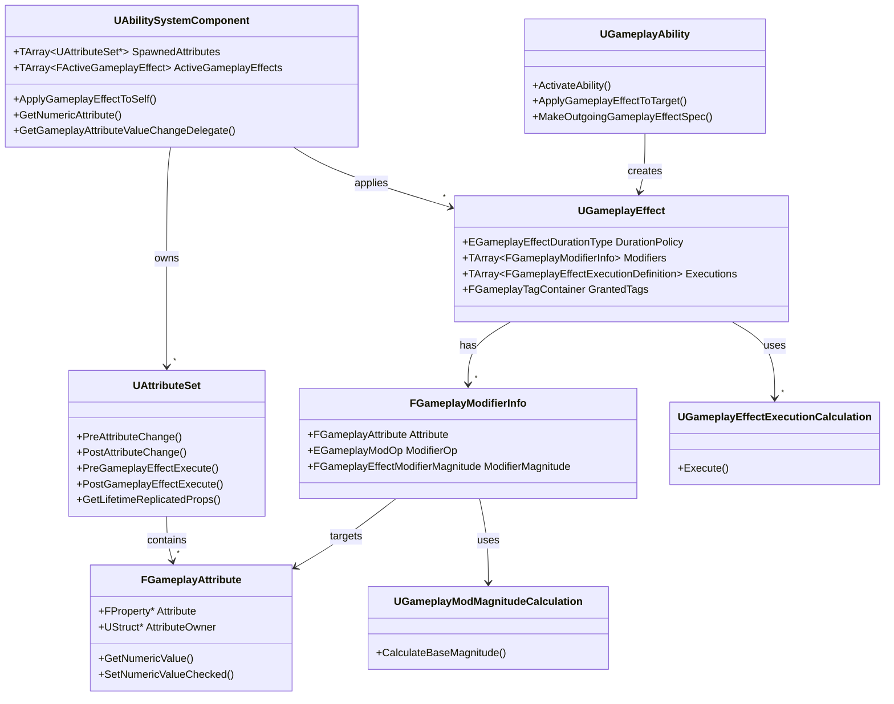
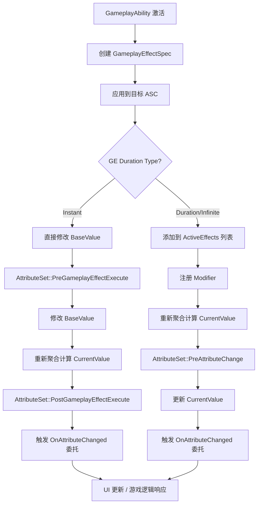
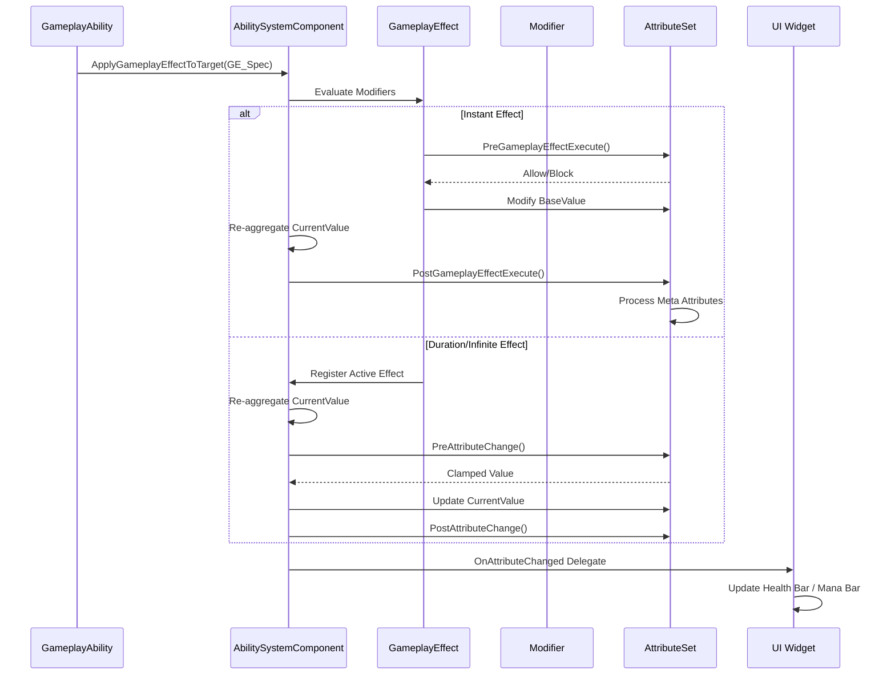
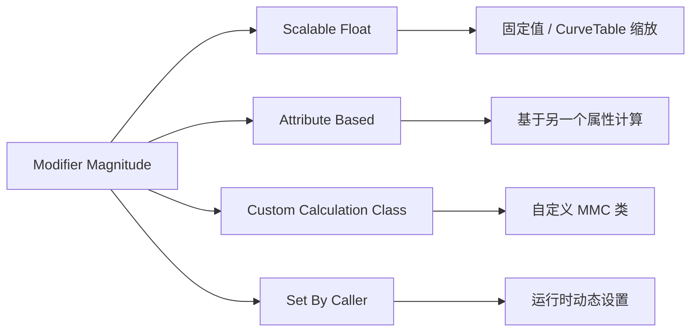
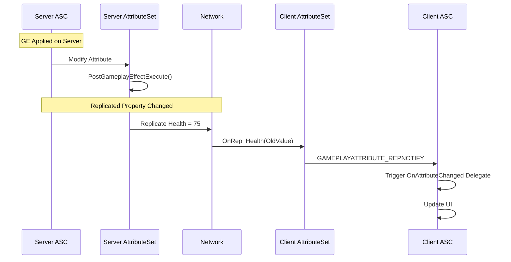
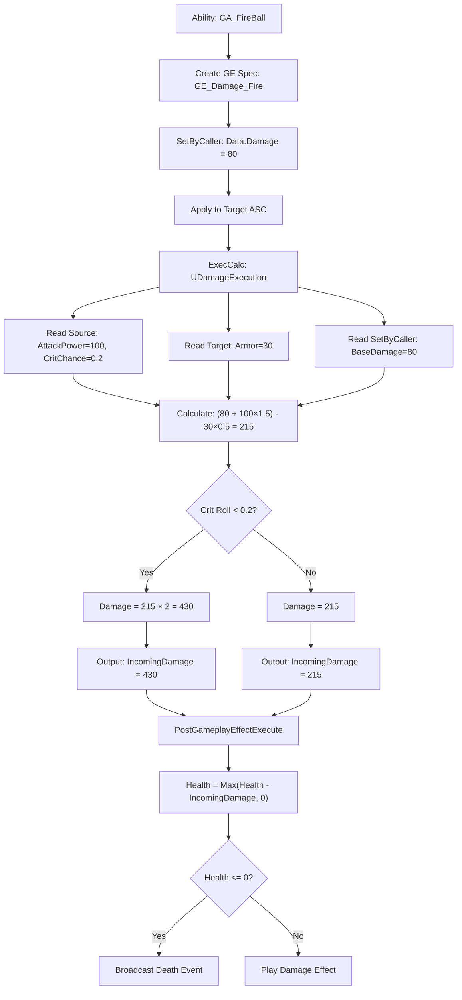

# Unreal Engine GameplayAttribute 完整指南


| ---                   | --                                                                                   |
| --------------------- | ------------------------------------------------------------------------------------ |
| 章节                  | 内容                                                                                 |
| 概述                  | GameplayAttribute 是什么、为什么用它                                                 |
| 核心概念              | BaseValue vs CurrentValue、三种 GE 持续类型                                          |
| 架构关系图            | Mermaid 类图展示 ASC → AttributeSet → GE → Modifier 完整关系                         |
| AttributeSet 详解     | 完整的 C++ 定义与实现，含四个关键回调函数对比                                        |
| GE 如何修改属性       | 完整链路时序图、蓝图配置、C++ 动态创建 GE                                            |
| 属性修改流程          | Modifier 聚合计算公式与具体数值示例                                                  |
| Modifier 类型详解     | 四种操作类型 + 四种 Magnitude 类型（ScalableFloat AttributeBased MMC / SetByCaller） |
| Execution Calculation | 复杂多属性伤害计算的完整实现                                                         |
| 属性变化响应          | C++ 委托绑定 + 蓝图异步监听                                                          |
| 网络同步              | 同步机制时序图、Meta 属性不同步策略                                                  |
| 实战示例              | 完整伤害系统流程图、Buff 系统、DataTable 初始化                                      |
| 最佳实践              | 属性分组建议、性能优化策略                                                           |
| 常见问题              | 5 个高频问题及解决方案                                                               |

> 技能如何改变属性？—— GameplayAttribute 系统深度解析

---

## 目录

1. [概述](#1-概述)
2. [核心概念](#2-核心概念)
3. [架构关系图](#3-架构关系图)
4. [AttributeSet 详解](#4-attributeset-详解)
5. [GameplayEffect 如何修改属性](#5-gameplayeffect-如何修改属性)
6. [属性修改流程](#6-属性修改流程)
7. [Modifier 类型详解](#7-modifier-类型详解)
8. [Execution Calculation](#8-execution-calculation)
9. [属性变化响应](#9-属性变化响应)
10. [网络同步](#10-网络同步)
11. [实战示例](#11-实战示例)
12. [最佳实践](#12-最佳实践)
13. [常见问题与解决方案](#13-常见问题与解决方案)

---

## 1. 概述

### 1.1 What is GameplayAttribute?

**GameplayAttribute** 是 Unreal Engine Gameplay Ability System (GAS) 中用于表示角色可量化属性的数据结构。它是技能系统与角色状态之间的桥梁。

| 概念                             | 说明                                     |
| -------------------------------- | ---------------------------------------- |
| **GameplayAttribute**            | 属性定义（如 Health、Mana、AttackPower） |
| **AttributeSet**                 | 属性集合容器，持有一组相关属性           |
| **GameplayEffect (GE)**          | 修改属性的规则定义                       |
| **Modifier**                     | GE 中具体的修改操作（加/乘/覆盖）        |
| **ExecutionCalculation**         | 复杂的自定义属性计算逻辑                 |
| **AbilitySystemComponent (ASC)** | 管理属性、效果、能力的核心组件           |

### 1.2 Why GameplayAttribute?

```
传统方式:  Ability → 直接修改 Actor 变量 → 难以追踪、无法网络同步、无法撤销
GAS 方式:  Ability → GameplayEffect → Modifier → AttributeSet → 自动同步、可撤销、可追踪
```

**核心优势：**

- ✅ **数据驱动**：属性修改规则在编辑器中配置，无需硬编码
- ✅ **网络同步**：属性变化自动在服务器和客户端之间同步
- ✅ **可撤销**：Duration/Infinite 类型的效果移除后属性自动恢复
- ✅ **可预测**：支持客户端预测，减少网络延迟感
- ✅ **可追踪**：完整的修改链路，便于调试和回溯

---

## 2. 核心概念

### 2.1 BaseValue vs CurrentValue

每个 GameplayAttribute 包含两个值：

```bash
┌───────────────────────────────────────────────────┐
│              GameplayAttribute                    │
│                                                   │
│  BaseValue = 100        (永久基础值)               │
│  CurrentValue = 130     (经过所有 Modifier 后的值) │
│                                                   │
│  CurrentValue = BaseValue                         │
│                + Additive Modifiers               │
│                × Multiplicative Modifiers         │
│                → Override (if any)                │
└───────────────────────────────────────────────────┘
```

| 值类型           | 说明                                 | 修改方式                          |
| ---------------- | ------------------------------------ | --------------------------------- |
| **BaseValue**    | 属性的永久基础值                     | `Instant` GE 直接修改             |
| **CurrentValue** | 经过所有活跃 Modifier 计算后的最终值 | `Duration`/`Infinite` GE 临时修改 |

### 2.2 属性修改的三种 GameplayEffect 持续类型

```bash
Instant (即时)        ──→ 直接修改 BaseValue，立即生效，不可撤销
                          例：受到伤害 -50 HP

Duration (持续时间)   ──→ 临时修改 CurrentValue，到期自动移除
                          例：Buff 持续 10 秒 +20% 攻击力

Infinite (无限)       ──→ 临时修改 CurrentValue，需手动移除
                          例：装备加成 +100 护甲
```

---

## 3. 架构关系图

### 3.1 整体架构



### 3.2 属性修改数据流



---

## 4. AttributeSet 详解

### 4.1 定义 AttributeSet

```cpp
// MyAttributeSet.h
#pragma once

#include "CoreMinimal.h"
#include "AttributeSet.h"
#include "AbilitySystemComponent.h"
#include "Net/UnrealNetwork.h"
#include "MyAttributeSet.generated.h"

// Helper macro for boilerplate getter/setter/initter
#define ATTRIBUTE_ACCESSORS(ClassName, PropertyName) \
    GAMEPLAYATTRIBUTE_PROPERTY_GETTER(ClassName, PropertyName) \
    GAMEPLAYATTRIBUTE_VALUE_GETTER(PropertyName) \
    GAMEPLAYATTRIBUTE_VALUE_SETTER(PropertyName) \
    GAMEPLAYATTRIBUTE_VALUE_INITTER(PropertyName)

UCLASS()
class MYGAME_API UMyAttributeSet : public UAttributeSet
{
    GENERATED_BODY()

public:
    UMyAttributeSet();

    // --- Vital Attributes ---
    
    UPROPERTY(BlueprintReadOnly, Category = "Vital", ReplicatedUsing = OnRep_Health)
    FGameplayAttributeData Health;
    ATTRIBUTE_ACCESSORS(UMyAttributeSet, Health)

    UPROPERTY(BlueprintReadOnly, Category = "Vital", ReplicatedUsing = OnRep_MaxHealth)
    FGameplayAttributeData MaxHealth;
    ATTRIBUTE_ACCESSORS(UMyAttributeSet, MaxHealth)

    UPROPERTY(BlueprintReadOnly, Category = "Vital", ReplicatedUsing = OnRep_Mana)
    FGameplayAttributeData Mana;
    ATTRIBUTE_ACCESSORS(UMyAttributeSet, Mana)

    UPROPERTY(BlueprintReadOnly, Category = "Vital", ReplicatedUsing = OnRep_MaxMana)
    FGameplayAttributeData MaxMana;
    ATTRIBUTE_ACCESSORS(UMyAttributeSet, MaxMana)

    // --- Combat Attributes ---
    
    UPROPERTY(BlueprintReadOnly, Category = "Combat", ReplicatedUsing = OnRep_AttackPower)
    FGameplayAttributeData AttackPower;
    ATTRIBUTE_ACCESSORS(UMyAttributeSet, AttackPower)

    UPROPERTY(BlueprintReadOnly, Category = "Combat", ReplicatedUsing = OnRep_Armor)
    FGameplayAttributeData Armor;
    ATTRIBUTE_ACCESSORS(UMyAttributeSet, Armor)

    UPROPERTY(BlueprintReadOnly, Category = "Combat", ReplicatedUsing = OnRep_CriticalChance)
    FGameplayAttributeData CriticalChance;
    ATTRIBUTE_ACCESSORS(UMyAttributeSet, CriticalChance)

    // --- Meta Attributes (not replicated, server-only) ---
    
    UPROPERTY(BlueprintReadOnly, Category = "Meta")
    FGameplayAttributeData IncomingDamage;
    ATTRIBUTE_ACCESSORS(UMyAttributeSet, IncomingDamage)

    UPROPERTY(BlueprintReadOnly, Category = "Meta")
    FGameplayAttributeData IncomingHealing;
    ATTRIBUTE_ACCESSORS(UMyAttributeSet, IncomingHealing)

protected:
    // --- Attribute Change Callbacks ---
    
    virtual void PreAttributeChange(const FGameplayAttribute& Attribute, float& NewValue) override;
    virtual void PostAttributeChange(const FGameplayAttribute& Attribute, float OldValue, float NewValue) override;
    virtual bool PreGameplayEffectExecute(FGameplayEffectModCallbackData& Data) override;
    virtual void PostGameplayEffectExecute(const FGameplayEffectModCallbackData& Data) override;

    // --- Replication ---
    
    virtual void GetLifetimeReplicatedProps(TArray<FLifetimeProperty>& OutLifetimeProps) const override;

    UFUNCTION()
    virtual void OnRep_Health(const FGameplayAttributeData& OldHealth);
    UFUNCTION()
    virtual void OnRep_MaxHealth(const FGameplayAttributeData& OldMaxHealth);
    UFUNCTION()
    virtual void OnRep_Mana(const FGameplayAttributeData& OldMana);
    UFUNCTION()
    virtual void OnRep_MaxMana(const FGameplayAttributeData& OldMaxMana);
    UFUNCTION()
    virtual void OnRep_AttackPower(const FGameplayAttributeData& OldAttackPower);
    UFUNCTION()
    virtual void OnRep_Armor(const FGameplayAttributeData& OldArmor);
    UFUNCTION()
    virtual void OnRep_CriticalChance(const FGameplayAttributeData& OldCriticalChance);
};
```

### 4.2 实现 AttributeSet

```cpp
// MyAttributeSet.cpp
#include "MyAttributeSet.h"
#include "GameplayEffectExtension.h"
#include "GameFramework/Character.h"

UMyAttributeSet::UMyAttributeSet()
{
    // Initialize default values
    InitHealth(100.0f);
    InitMaxHealth(100.0f);
    InitMana(50.0f);
    InitMaxMana(50.0f);
    InitAttackPower(10.0f);
    InitArmor(5.0f);
    InitCriticalChance(0.05f);
    InitIncomingDamage(0.0f);
    InitIncomingHealing(0.0f);
}

void UMyAttributeSet::PreAttributeChange(const FGameplayAttribute& Attribute, float& NewValue)
{
    Super::PreAttributeChange(Attribute, NewValue);

    // Clamp CurrentValue changes (NOT BaseValue)
    // Note: This only clamps the result of Modifier aggregation
    if (Attribute == GetHealthAttribute())
    {
        NewValue = FMath::Clamp(NewValue, 0.0f, GetMaxHealth());
    }
    else if (Attribute == GetManaAttribute())
    {
        NewValue = FMath::Clamp(NewValue, 0.0f, GetMaxMana());
    }
    else if (Attribute == GetCriticalChanceAttribute())
    {
        NewValue = FMath::Clamp(NewValue, 0.0f, 1.0f);
    }
}

void UMyAttributeSet::PostAttributeChange(
    const FGameplayAttribute& Attribute, float OldValue, float NewValue)
{
    Super::PostAttributeChange(Attribute, OldValue, NewValue);

    // Adjust Health when MaxHealth changes
    if (Attribute == GetMaxHealthAttribute())
    {
        if (GetHealth() > NewValue)
        {
            UAbilitySystemComponent* ASC = GetOwningAbilitySystemComponent();
            if (ASC)
            {
                ASC->ApplyModToAttribute(
                    GetHealthAttribute(), EGameplayModOp::Override, NewValue);
            }
        }
    }
}

bool UMyAttributeSet::PreGameplayEffectExecute(FGameplayEffectModCallbackData& Data)
{
    if (!Super::PreGameplayEffectExecute(Data))
    {
        return false; // Block the effect
    }

    // Example: Block damage if target has invincibility tag
    if (Data.EvaluatedData.Attribute == GetIncomingDamageAttribute())
    {
        if (Data.Target.HasMatchingGameplayTag(
            FGameplayTag::RequestGameplayTag(FName("State.Invincible"))))
        {
            Data.EvaluatedData.Magnitude = 0.0f;
            return false;
        }
    }

    return true;
}

void UMyAttributeSet::PostGameplayEffectExecute(
    const FGameplayEffectModCallbackData& Data)
{
    Super::PostGameplayEffectExecute(Data);

    // Process Meta Attributes
    if (Data.EvaluatedData.Attribute == GetIncomingDamageAttribute())
    {
        const float LocalDamage = GetIncomingDamage();
        SetIncomingDamage(0.0f); // Reset meta attribute

        if (LocalDamage > 0.0f)
        {
            // Apply armor reduction
            const float DamageAfterArmor = FMath::Max(LocalDamage - GetArmor(), 0.0f);
            
            // Apply to Health
            const float NewHealth = FMath::Max(GetHealth() - DamageAfterArmor, 0.0f);
            SetHealth(NewHealth);

            // Check for death
            if (NewHealth <= 0.0f)
            {
                // Broadcast death event
                FGameplayEventData EventData;
                EventData.Instigator = Data.EffectSpec.GetEffectContext().GetInstigator();
                EventData.Target = GetOwningActor();
                
                UAbilitySystemComponent* ASC = GetOwningAbilitySystemComponent();
                if (ASC)
                {
                    ASC->HandleGameplayEvent(
                        FGameplayTag::RequestGameplayTag(FName("Event.Death")),
                        &EventData);
                }
            }
        }
    }
    else if (Data.EvaluatedData.Attribute == GetIncomingHealingAttribute())
    {
        const float LocalHealing = GetIncomingHealing();
        SetIncomingHealing(0.0f); // Reset meta attribute

        if (LocalHealing > 0.0f)
        {
            const float NewHealth = FMath::Min(GetHealth() + LocalHealing, GetMaxHealth());
            SetHealth(NewHealth);
        }
    }
}

void UMyAttributeSet::GetLifetimeReplicatedProps(
    TArray<FLifetimeProperty>& OutLifetimeProps) const
{
    Super::GetLifetimeReplicatedProps(OutLifetimeProps);

    DOREPLIFETIME_CONDITION_NOTIFY(UMyAttributeSet, Health, COND_None, REPNOTIFY_Always);
    DOREPLIFETIME_CONDITION_NOTIFY(UMyAttributeSet, MaxHealth, COND_None, REPNOTIFY_Always);
    DOREPLIFETIME_CONDITION_NOTIFY(UMyAttributeSet, Mana, COND_None, REPNOTIFY_Always);
    DOREPLIFETIME_CONDITION_NOTIFY(UMyAttributeSet, MaxMana, COND_None, REPNOTIFY_Always);
    DOREPLIFETIME_CONDITION_NOTIFY(UMyAttributeSet, AttackPower, COND_None, REPNOTIFY_Always);
    DOREPLIFETIME_CONDITION_NOTIFY(UMyAttributeSet, Armor, COND_None, REPNOTIFY_Always);
    DOREPLIFETIME_CONDITION_NOTIFY(UMyAttributeSet, CriticalChance, COND_None, REPNOTIFY_Always);
    // Note: Meta attributes (IncomingDamage, IncomingHealing) are NOT replicated
}

// --- Rep Notify Functions ---

void UMyAttributeSet::OnRep_Health(const FGameplayAttributeData& OldHealth)
{
    GAMEPLAYATTRIBUTE_REPNOTIFY(UMyAttributeSet, Health, OldHealth);
}

void UMyAttributeSet::OnRep_MaxHealth(const FGameplayAttributeData& OldMaxHealth)
{
    GAMEPLAYATTRIBUTE_REPNOTIFY(UMyAttributeSet, MaxHealth, OldMaxHealth);
}

void UMyAttributeSet::OnRep_Mana(const FGameplayAttributeData& OldMana)
{
    GAMEPLAYATTRIBUTE_REPNOTIFY(UMyAttributeSet, Mana, OldMana);
}

void UMyAttributeSet::OnRep_MaxMana(const FGameplayAttributeData& OldMaxMana)
{
    GAMEPLAYATTRIBUTE_REPNOTIFY(UMyAttributeSet, MaxMana, OldMaxMana);
}

void UMyAttributeSet::OnRep_AttackPower(const FGameplayAttributeData& OldAttackPower)
{
    GAMEPLAYATTRIBUTE_REPNOTIFY(UMyAttributeSet, AttackPower, OldAttackPower);
}

void UMyAttributeSet::OnRep_Armor(const FGameplayAttributeData& OldArmor)
{
    GAMEPLAYATTRIBUTE_REPNOTIFY(UMyAttributeSet, Armor, OldArmor);
}

void UMyAttributeSet::OnRep_CriticalChance(const FGameplayAttributeData& OldCriticalChance)
{
    GAMEPLAYATTRIBUTE_REPNOTIFY(UMyAttributeSet, CriticalChance, OldCriticalChance);
}
```

### 4.3 关键回调函数对比

```bash
┌──────────────────────────────────────────────────────────────────────┐
│                    Attribute Change Callback Flow                    │
│                                                                      │
│  ┌─ Instant GE (修改 BaseValue) ────────────────────────────────┐    │
│  │                                                              │    │
│  │  PreGameplayEffectExecute()  ← 可拦截/修改即将应用的值         │    │
│  │         ↓                                                    │    │
│  │  修改 BaseValue                                              │    │
│  │         ↓                                                    │    │
│  │  重新聚合 CurrentValue                                       │     │
│  │         ↓                                                   │     │
│  │  PostGameplayEffectExecute() ← 处理 Meta 属性、触发死亡等     │     │
│  └─────────────────────────────────────────────────────────────┘     │
│                                                                      │
│  ┌─ Duration/Infinite GE (修改 CurrentValue) ────────────────────┐   │
│  │                                                               │   │
│  │  添加 Modifier 到 ActiveEffects                                │   │
│  │         ↓                                                     │   │
│  │  重新聚合 CurrentValue                                         │   │
│  │         ↓                                                     │   │
│  │  PreAttributeChange()  ← 可 Clamp CurrentValue                │   │
│  │         ↓                                                     │   │
│  │  更新 CurrentValue                                            │   │
│  │         ↓                                                     │   │
│  │  PostAttributeChange() ← 响应变化、调整关联属性                 │   │
│  └────────────────────────────────────────────────────────────────┘  │
└──────────────────────────────────────────────────────────────────────┘
```

| 回调函数                    | 触发时机              | 用途                     | 注意事项              |
| --------------------------- | --------------------- | ------------------------ | --------------------- |
| `PreAttributeChange`        | CurrentValue 即将改变 | Clamp 值范围             | 不要在此做游戏逻辑    |
| `PostAttributeChange`       | CurrentValue 已改变   | 响应变化、调整关联属性   | 可获取新旧值          |
| `PreGameplayEffectExecute`  | Instant GE 执行前     | 拦截/修改效果、免疫判定  | 返回 false 可阻止执行 |
| `PostGameplayEffectExecute` | Instant GE 执行后     | 处理 Meta 属性、死亡判定 | 最常用的游戏逻辑入口  |

---

## 5. GameplayEffect 如何修改属性

### 5.1 GE 修改属性的完整链路



### 5.2 在蓝图中创建 GameplayEffect

```
创建步骤：
1. Content Browser → Right Click → Blueprint Class
2. 选择 Parent Class: GameplayEffect
3. 命名规范: GE_[Effect Type]_[Description]
   例: GE_Damage_FireBall, GE_Buff_SpeedBoost

配置项：
┌─ Duration Policy ─────────────────────────────┐
│  ○ Instant       → 立即修改 BaseValue          │
│  ○ Has Duration  → 持续时间后自动移除           │
│  ○ Infinite      → 永久生效直到手动移除         │
└───────────────────────────────────────────────┘

┌─ Modifiers ───────────────────────────────────┐
│  [0] Attribute: Health                         │
│      Modifier Op: Additive                     │
│      Magnitude: Scalable Float = -50           │
│                                                │
│  [1] Attribute: Mana                           │
│      Modifier Op: Additive                     │
│      Magnitude: Scalable Float = -20           │
└───────────────────────────────────────────────┘
```

### 5.3 在 C++ 中创建和应用 GE

```cpp
// --- Method 1: Apply a Blueprint GE class ---
void UMyAbility::ApplyDamageEffect(AActor* Target)
{
    UAbilitySystemComponent* TargetASC = 
        UAbilitySystemBlueprintLibrary::GetAbilitySystemComponent(Target);
    if (!TargetASC) return;

    // Create GE Spec from class
    FGameplayEffectSpecHandle SpecHandle = 
        MakeOutgoingGameplayEffectSpec(GE_DamageClass, GetAbilityLevel());

    if (SpecHandle.IsValid())
    {
        // Set dynamic magnitude by SetByCaller
        SpecHandle.Data->SetSetByCallerMagnitude(
            FGameplayTag::RequestGameplayTag(FName("Data.Damage")), 75.0f);

        // Apply
        ApplyGameplayEffectSpecToTarget(
            GetCurrentAbilitySpecHandle(), 
            GetCurrentActorInfo(), 
            GetCurrentActivationInfo(),
            SpecHandle, 
            TargetASC);
    }
}

// --- Method 2: Create GE dynamically in C++ ---
void UMyAbility::ApplyDynamicBuff()
{
    UGameplayEffect* GE = NewObject<UGameplayEffect>(GetTransientPackage(), TEXT("DynamicBuff"));
    GE->DurationPolicy = EGameplayEffectDurationType::HasDuration;
    GE->DurationMagnitude = FGameplayEffectModifierMagnitude(FScalableFloat(10.0f)); // 10 seconds

    // Add Modifier: +50% AttackPower
    int32 ModIdx = GE->Modifiers.Num();
    GE->Modifiers.SetNum(ModIdx + 1);
    FGameplayModifierInfo& ModInfo = GE->Modifiers[ModIdx];
    ModInfo.Attribute = UMyAttributeSet::GetAttackPowerAttribute();
    ModInfo.ModifierOp = EGameplayModOp::Multiplicitive;
    ModInfo.ModifierMagnitude = FGameplayEffectModifierMagnitude(FScalableFloat(0.5f));

    // Apply to self
    UAbilitySystemComponent* ASC = GetAbilitySystemComponentFromActorInfo();
    if (ASC)
    {
        ASC->ApplyGameplayEffectToSelf(GE, GetAbilityLevel(), ASC->MakeEffectContext());
    }
}
```

---

## 6. 属性修改流程

### 6.1 Modifier 聚合计算

当多个 GE 同时影响同一属性时，系统按以下顺序聚合：

```
Final CurrentValue 计算公式：

1. 收集所有活跃的 Modifier
2. 按 Channel 和优先级排序
3. 按以下顺序计算：

   Step 1: Additive (加法)
   Sum_Add = Σ(所有 Additive Modifier 的值)

   Step 2: Multiplicative (乘法 - 相乘)
   Product_Mul = Π(1 + 每个 Multiplicitive Modifier 的值)

   Step 3: Division (除法)
   Product_Div = Π(1 + 每个 Division Modifier 的值)

   Step 4: Override (覆盖 - 取最后一个)
   如果存在 Override Modifier，直接使用其值

   最终值 = Override 存在 ? Override值
            : (BaseValue + Sum_Add) × Product_Mul / Product_Div
```

### 6.2 聚合示例

```
场景：角色 AttackPower BaseValue = 100

活跃效果：
  GE_Buff_Strength:    Additive +20
  GE_Buff_Rage:        Additive +30
  GE_Buff_Empower:     Multiplicitive +0.5  (50%)
  GE_Debuff_Weakness:  Multiplicitive -0.2  (-20%)

计算过程：
  Step 1 (Additive):    Sum_Add = 20 + 30 = 50
  Step 2 (Multiply):    Product_Mul = (1 + 0.5) × (1 + (-0.2)) = 1.5 × 0.8 = 1.2
  
  Final CurrentValue = (100 + 50) × 1.2 = 180

当 GE_Buff_Rage 移除后：
  Step 1 (Additive):    Sum_Add = 20
  Step 2 (Multiply):    Product_Mul = 1.2
  
  Final CurrentValue = (100 + 20) × 1.2 = 144
  
  → BaseValue 始终不变 = 100
```

---

## 7. Modifier 类型详解

### 7.1 Modifier Operation 类型

| 操作类型     | 枚举值                           | 说明           | 公式            |
| ------------ | -------------------------------- | -------------- | --------------- |
| **Add**      | `EGameplayModOp::Additive`       | 加法叠加       | `Base + Σ(Add)` |
| **Multiply** | `EGameplayModOp::Multiplicitive` | 乘法叠加       | `× Π(1 + Mul)`  |
| **Divide**   | `EGameplayModOp::Division`       | 除法叠加       | `÷ Π(1 + Div)`  |
| **Override** | `EGameplayModOp::Override`       | 覆盖（取最后） | 直接替换        |

### 7.2 Modifier Magnitude 类型



#### Scalable Float（可缩放浮点数）

```cpp
// Simple fixed value
ModInfo.ModifierMagnitude = FGameplayEffectModifierMagnitude(FScalableFloat(50.0f));

// With CurveTable (scales with ability level)
// CurveTable row: Level 1=50, Level 5=100, Level 10=200
FScalableFloat ScalableValue;
ScalableValue.Value = 1.0f;
ScalableValue.Curve.CurveTable = MyCurveTable;
ScalableValue.Curve.RowName = FName("DamageByLevel");
ModInfo.ModifierMagnitude = FGameplayEffectModifierMagnitude(ScalableValue);
```

#### Attribute Based（基于属性）

```
配置：
  Backing Attribute: Source.AttackPower
  Coefficient: 1.5
  Pre/Post Multiply Additive Value: 10 / 0
  Attribute Calculation Type: AttributeMagnitude

公式: Magnitude = (AttackPower + 10) × 1.5 + 0
```

#### Custom Calculation Class (MMC)

```cpp
// MyDamageCalculation.h
UCLASS()
class UMyDamageMMC : public UGameplayModMagnitudeCalculation
{
    GENERATED_BODY()

public:
    UMyDamageMMC();
    virtual float CalculateBaseMagnitude_Implementation(
        const FGameplayEffectSpec& Spec) const override;
};

// MyDamageCalculation.cpp
UMyDamageMMC::UMyDamageMMC()
{
    // Capture source's AttackPower
    FGameplayEffectAttributeCaptureDefinition AttackCapture;
    AttackCapture.AttributeToCapture = UMyAttributeSet::GetAttackPowerAttribute();
    AttackCapture.AttributeSource = EGameplayEffectAttributeCaptureSource::Source;
    AttackCapture.bSnapshot = true; // Snapshot at application time

    RelevantAttributesToCapture.Add(AttackCapture);

    // Capture target's Armor
    FGameplayEffectAttributeCaptureDefinition ArmorCapture;
    ArmorCapture.AttributeToCapture = UMyAttributeSet::GetArmorAttribute();
    ArmorCapture.AttributeSource = EGameplayEffectAttributeCaptureSource::Target;
    ArmorCapture.bSnapshot = false; // Use current value

    RelevantAttributesToCapture.Add(ArmorCapture);
}

float UMyDamageMMC::CalculateBaseMagnitude_Implementation(
    const FGameplayEffectSpec& Spec) const
{
    const FGameplayTagContainer* SourceTags = Spec.CapturedSourceTags.GetAggregatedTags();
    const FGameplayTagContainer* TargetTags = Spec.CapturedTargetTags.GetAggregatedTags();

    FAggregatorEvaluateParameters EvalParams;
    EvalParams.SourceTags = SourceTags;
    EvalParams.TargetTags = TargetTags;

    float AttackPower = 0.0f;
    GetCapturedAttributeMagnitude(
        RelevantAttributesToCapture[0], Spec, EvalParams, AttackPower);

    float Armor = 0.0f;
    GetCapturedAttributeMagnitude(
        RelevantAttributesToCapture[1], Spec, EvalParams, Armor);

    // Custom formula: Damage = AttackPower * 2.0 - Armor * 0.5
    float Damage = FMath::Max(AttackPower * 2.0f - Armor * 0.5f, 0.0f);

    // Bonus damage if source has "State.Enraged" tag
    if (SourceTags && SourceTags->HasTag(
        FGameplayTag::RequestGameplayTag(FName("State.Enraged"))))
    {
        Damage *= 1.5f;
    }

    return Damage;
}
```

#### Set By Caller（运行时设置）

```cpp
// When creating the GE Spec
FGameplayEffectSpecHandle SpecHandle = MakeOutgoingGameplayEffectSpec(GE_DamageClass);

// Set magnitude using GameplayTag
FGameplayTag DamageTag = FGameplayTag::RequestGameplayTag(FName("Data.Damage"));
SpecHandle.Data->SetSetByCallerMagnitude(DamageTag, CalculatedDamage);

// In GE Blueprint:
// Modifier → Magnitude Calculation Type → Set By Caller
// Modifier → Set By Caller Tag → Data.Damage
```

---

## 8. Execution Calculation

### 8.1 What is Execution Calculation?

Execution Calculation (ExecCalc) 是比 Modifier 更强大的属性修改方式，可以在一次计算中同时读取和修改多个属性。

```
Modifier vs Execution Calculation:

  Modifier:     一个 Modifier → 修改一个属性
  ExecCalc:     一次 Execute → 读取多个属性 → 修改多个属性
```

### 8.2 实现 ExecCalc

```cpp
// MyDamageExecution.h
UCLASS()
class UMyDamageExecution : public UGameplayEffectExecutionCalculation
{
    GENERATED_BODY()

public:
    UMyDamageExecution();
    virtual void Execute_Implementation(
        const FGameplayEffectCustomExecutionParameters& ExecutionParams,
        FGameplayEffectCustomExecutionOutput& OutExecutionOutput) const override;
};

// MyDamageExecution.cpp

// Declare attribute capture macros
struct FDamageStatics
{
    DECLARE_ATTRIBUTE_CAPTUREDEF(AttackPower);
    DECLARE_ATTRIBUTE_CAPTUREDEF(CriticalChance);
    DECLARE_ATTRIBUTE_CAPTUREDEF(Armor);
    DECLARE_ATTRIBUTE_CAPTUREDEF(Health);

    FDamageStatics()
    {
        DEFINE_ATTRIBUTE_CAPTUREDEF(UMyAttributeSet, AttackPower, Source, true);  // Snapshot
        DEFINE_ATTRIBUTE_CAPTUREDEF(UMyAttributeSet, CriticalChance, Source, true);
        DEFINE_ATTRIBUTE_CAPTUREDEF(UMyAttributeSet, Armor, Target, false);       // Current
        DEFINE_ATTRIBUTE_CAPTUREDEF(UMyAttributeSet, Health, Target, false);
    }
};

static const FDamageStatics& DamageStatics()
{
    static FDamageStatics Statics;
    return Statics;
}

UMyDamageExecution::UMyDamageExecution()
{
    RelevantAttributesToCapture.Add(DamageStatics().AttackPowerDef);
    RelevantAttributesToCapture.Add(DamageStatics().CriticalChanceDef);
    RelevantAttributesToCapture.Add(DamageStatics().ArmorDef);
    RelevantAttributesToCapture.Add(DamageStatics().HealthDef);
}

void UMyDamageExecution::Execute_Implementation(
    const FGameplayEffectCustomExecutionParameters& ExecutionParams,
    FGameplayEffectCustomExecutionOutput& OutExecutionOutput) const
{
    UAbilitySystemComponent* SourceASC = ExecutionParams.GetSourceAbilitySystemComponent();
    UAbilitySystemComponent* TargetASC = ExecutionParams.GetTargetAbilitySystemComponent();

    const FGameplayEffectSpec& Spec = ExecutionParams.GetOwningSpec();

    FAggregatorEvaluateParameters EvalParams;
    EvalParams.SourceTags = Spec.CapturedSourceTags.GetAggregatedTags();
    EvalParams.TargetTags = Spec.CapturedTargetTags.GetAggregatedTags();

    // Capture attribute values
    float AttackPower = 0.0f;
    ExecutionParams.AttemptCalculateCapturedAttributeMagnitude(
        DamageStatics().AttackPowerDef, EvalParams, AttackPower);

    float CritChance = 0.0f;
    ExecutionParams.AttemptCalculateCapturedAttributeMagnitude(
        DamageStatics().CriticalChanceDef, EvalParams, CritChance);

    float Armor = 0.0f;
    ExecutionParams.AttemptCalculateCapturedAttributeMagnitude(
        DamageStatics().ArmorDef, EvalParams, Armor);

    // Get SetByCaller value (base damage from ability)
    float BaseDamage = Spec.GetSetByCallerMagnitude(
        FGameplayTag::RequestGameplayTag(FName("Data.Damage")), false, 0.0f);

    // --- Damage Formula ---
    float TotalDamage = BaseDamage + AttackPower * 1.5f;

    // Critical hit check
    if (FMath::FRand() < CritChance)
    {
        TotalDamage *= 2.0f; // Critical multiplier
    }

    // Armor reduction
    float ArmorReduction = Armor * 0.5f;
    TotalDamage = FMath::Max(TotalDamage - ArmorReduction, 1.0f); // Minimum 1 damage

    // --- Output: Modify target attributes ---
    if (TotalDamage > 0.0f)
    {
        // Use Meta Attribute pattern
        OutExecutionOutput.AddOutputModifier(
            FGameplayModifierEvaluatedData(
                UMyAttributeSet::GetIncomingDamageAttribute(),
                EGameplayModOp::Additive,
                TotalDamage));
    }
}
```

---

## 9. 属性变化响应

### 9.1 监听属性变化（C++）

```cpp
// In your Character or Controller class
void AMyCharacter::BindAttributeCallbacks()
{
    UAbilitySystemComponent* ASC = GetAbilitySystemComponent();
    if (!ASC) return;

    const UMyAttributeSet* AS = ASC->GetSet<UMyAttributeSet>();
    if (!AS) return;

    // Method 1: Delegate binding
    ASC->GetGameplayAttributeValueChangeDelegate(
        UMyAttributeSet::GetHealthAttribute())
        .AddUObject(this, &AMyCharacter::OnHealthChanged);

    ASC->GetGameplayAttributeValueChangeDelegate(
        UMyAttributeSet::GetManaAttribute())
        .AddUObject(this, &AMyCharacter::OnManaChanged);
}

void AMyCharacter::OnHealthChanged(const FOnAttributeChangeData& Data)
{
    // Data.OldValue → Previous value
    // Data.NewValue → Current value
    // Data.GEModData → The GE that caused the change (can be null)

    float HealthPercent = 0.0f;
    const UMyAttributeSet* AS = GetAbilitySystemComponent()->GetSet<UMyAttributeSet>();
    if (AS && AS->GetMaxHealth() > 0.0f)
    {
        HealthPercent = Data.NewValue / AS->GetMaxHealth();
    }

    // Update UI
    OnHealthChangedDelegate.Broadcast(Data.NewValue, Data.OldValue, HealthPercent);

    // Visual feedback
    if (Data.NewValue < Data.OldValue)
    {
        PlayDamageFlash();
    }
    else if (Data.NewValue > Data.OldValue)
    {
        PlayHealEffect();
    }
}
```

### 9.2 监听属性变化（蓝图 / UI Widget）

```cpp
// Async Task for Blueprint usage
UCLASS(BlueprintType, meta = (ExposedAsyncProxy = AsyncTask))
class UAsyncTask_ListenForAttributeChange : public UBlueprintAsyncActionBase
{
    GENERATED_BODY()

public:
    UPROPERTY(BlueprintAssignable)
    FOnAttributeChangedSignature OnAttributeChanged;

    UFUNCTION(BlueprintCallable, meta = (BlueprintInternalUseOnly = "true"))
    static UAsyncTask_ListenForAttributeChange* ListenForAttributeChange(
        UAbilitySystemComponent* ASC, FGameplayAttribute Attribute);

    UFUNCTION(BlueprintCallable)
    void EndTask();

protected:
    UPROPERTY()
    TWeakObjectPtr<UAbilitySystemComponent> ASCWeakPtr;
    FGameplayAttribute AttributeToListen;
    FDelegateHandle DelegateHandle;

    void AttributeChanged(const FOnAttributeChangeData& Data);
};
```

---

## 10. 网络同步

### 10.1 属性同步机制



### 10.2 同步配置要点

```
┌─────────────────────────────────────────────────────────────┐
│                    Replication Rules                         │
│                                                             │
│  ✅ Vital Attributes (Health, Mana)                         │
│     → DOREPLIFETIME + REPNOTIFY_Always                      │
│     → All clients need to see health bars                   │
│                                                             │
│  ✅ Combat Attributes (AttackPower, Armor)                  │
│     → DOREPLIFETIME + COND_OwnerOnly (optional)             │
│     → Only owner needs to see their stats                   │
│                                                             │
│  ❌ Meta Attributes (IncomingDamage, IncomingHealing)       │
│     → NOT replicated                                        │
│     → Server-only, used as temporary calculation values     │
│                                                             │
│  ⚠️ Mixed Replication Mode                                  │
│     → Minimal for most GEs                                  │
│     → Full for GEs that need client prediction              │
└─────────────────────────────────────────────────────────────┘
```

---

## 11. 实战示例

### 11.1 完整伤害系统



### 11.2 Buff/Debuff 系统

```cpp
// --- GE_Buff_SpeedBoost (Blueprint Configuration) ---
// Duration Policy: Has Duration
// Duration: 8 seconds
// Modifiers:
//   [0] Attribute: MoveSpeed, Op: Multiplicitive, Magnitude: 0.3 (+30%)
// Granted Tags: State.Buff.SpeedBoost
// Stacking:
//   Type: AggregateBySource
//   Limit: 3
//   Duration Refresh: RefreshOnSuccessfulApplication

// --- Apply in Ability ---
void UGA_SpeedBoost::ActivateAbility(
    const FGameplayAbilitySpecHandle Handle,
    const FGameplayAbilityActorInfo* ActorInfo,
    const FGameplayAbilityActivationInfo ActivationInfo,
    const FGameplayEventData* TriggerEventData)
{
    if (!CommitAbility(Handle, ActorInfo, ActivationInfo))
    {
        EndAbility(Handle, ActorInfo, ActivationInfo, true, true);
        return;
    }

    // Apply speed buff to self
    FGameplayEffectSpecHandle BuffSpec = 
        MakeOutgoingGameplayEffectSpec(GE_SpeedBoostClass, GetAbilityLevel());

    if (BuffSpec.IsValid())
    {
        ActiveBuffHandle = ApplyGameplayEffectSpecToOwner(
            Handle, ActorInfo, ActivationInfo, BuffSpec);
    }

    // Play VFX
    UAbilityTask_PlayMontageAndWait* MontageTask = 
        UAbilityTask_PlayMontageAndWait::CreatePlayMontageAndWaitProxy(
            this, NAME_None, BuffMontage);
    MontageTask->ReadyForActivation();
}
```

### 11.3 属性初始化（Data Table）

```cpp
// Use a DataTable to initialize attributes per character class

// In Character initialization
void AMyCharacter::InitializeAttributes()
{
    UAbilitySystemComponent* ASC = GetAbilitySystemComponent();
    if (!ASC || !DefaultAttributeEffect) return;

    FGameplayEffectContextHandle ContextHandle = ASC->MakeEffectContext();
    ContextHandle.AddSourceObject(this);

    FGameplayEffectSpecHandle SpecHandle = 
        ASC->MakeOutgoingSpec(DefaultAttributeEffect, CharacterLevel, ContextHandle);

    if (SpecHandle.IsValid())
    {
        ASC->ApplyGameplayEffectSpecToSelf(*SpecHandle.Data.Get());
    }
}
```

**DataTable 结构示例：**

| RowName      | Health | MaxHealth | Mana | MaxMana | AttackPower | Armor | CritChance |
| ------------ | ------ | --------- | ---- | ------- | ----------- | ----- | ---------- |
| Warrior_Lv1  | 200    | 200       | 30   | 30      | 15          | 20    | 0.05       |
| Warrior_Lv10 | 500    | 500       | 50   | 50      | 40          | 50    | 0.10       |
| Mage_Lv1     | 80     | 80        | 150  | 150     | 25          | 5     | 0.15       |
| Mage_Lv10    | 200    | 200       | 400  | 400     | 80          | 15    | 0.25       |
| Rogue_Lv1    | 120    | 120       | 60   | 60      | 20          | 10    | 0.25       |
| Rogue_Lv10   | 350    | 350       | 120  | 120     | 60          | 30    | 0.40       |

---

## 12. 最佳实践

### 12.1 属性设计原则

```
✅ DO:
  • Use Meta Attributes for intermediate calculations (IncomingDamage)
  • Clamp values in PreAttributeChange (for CurrentValue)
  • Clamp values in PostGameplayEffectExecute (for BaseValue)
  • Use Execution Calculations for complex multi-attribute formulas
  • Separate AttributeSets by domain (VitalSet, CombatSet, MovementSet)
  • Use SetByCaller for dynamic values from abilities

❌ DON'T:
  • Don't modify other attributes in PreAttributeChange
  • Don't use Instant GE for temporary buffs
  • Don't replicate Meta Attributes
  • Don't directly set attribute values outside of GE system
  • Don't create circular attribute dependencies
  • Don't put too many attributes in a single AttributeSet
```

### 12.2 属性分组建议

```
📁 UVitalAttributeSet
   ├── Health / MaxHealth
   ├── Mana / MaxMana
   ├── Stamina / MaxStamina
   └── Shield / MaxShield

📁 UCombatAttributeSet
   ├── AttackPower
   ├── MagicPower
   ├── Armor / MagicResist
   ├── CriticalChance / CriticalDamage
   ├── AttackSpeed
   └── CooldownReduction

📁 UMovementAttributeSet
   ├── MoveSpeed
   ├── JumpHeight
   └── DashDistance

📁 UMetaAttributeSet (NOT replicated)
   ├── IncomingDamage
   ├── IncomingHealing
   └── IncomingXP
```

### 12.3 性能优化

| 优化策略          | 说明                                      |
| ----------------- | ----------------------------------------- |
| **Snapshot 属性** | 对不需要实时更新的源属性使用 Snapshot     |
| **条件同步**      | 使用 `COND_OwnerOnly` 减少非必要同步      |
| **批量应用**      | 多个属性修改合并到一个 GE 中              |
| **避免频繁 GE**   | 对持续伤害使用 Period 而非频繁 Instant GE |
| **Meta 属性**     | 使用 Meta 属性避免不必要的网络同步        |
| **Lazy 计算**     | 只在需要时才获取属性值                    |

---

## 13. 常见问题与解决方案

### Q1: 属性值超出范围

```cpp
// Problem: Health goes below 0 or above MaxHealth

// Solution 1: Clamp in PreAttributeChange (for CurrentValue from Duration/Infinite GE)
void UMyAttributeSet::PreAttributeChange(const FGameplayAttribute& Attribute, float& NewValue)
{
    if (Attribute == GetHealthAttribute())
    {
        NewValue = FMath::Clamp(NewValue, 0.0f, GetMaxHealth());
    }
}

// Solution 2: Clamp in PostGameplayEffectExecute (for BaseValue from Instant GE)
void UMyAttributeSet::PostGameplayEffectExecute(const FGameplayEffectModCallbackData& Data)
{
    if (Data.EvaluatedData.Attribute == GetIncomingDamageAttribute())
    {
        float NewHealth = FMath::Clamp(GetHealth() - GetIncomingDamage(), 0.0f, GetMaxHealth());
        SetHealth(NewHealth);
    }
}
```

### Q2: MaxHealth 改变时 Health 不跟随

```cpp
// Solution: Adjust Health proportionally when MaxHealth changes
void UMyAttributeSet::PostAttributeChange(
    const FGameplayAttribute& Attribute, float OldValue, float NewValue)
{
    if (Attribute == GetMaxHealthAttribute())
    {
        UAbilitySystemComponent* ASC = GetOwningAbilitySystemComponent();
        if (ASC && OldValue > 0.0f)
        {
            // Maintain health percentage
            float HealthPercent = GetHealth() / OldValue;
            float NewHealth = NewValue * HealthPercent;
            ASC->ApplyModToAttribute(GetHealthAttribute(), EGameplayModOp::Override, NewHealth);
        }
    }
}
```

### Q3: Buff 移除后属性不恢复

```
Problem: Using Instant GE for buff → BaseValue permanently changed

Solution: Use Duration or Infinite GE for temporary effects
  - Duration GE → Auto-remove after time
  - Infinite GE → Manual remove with handle

  FActiveGameplayEffectHandle BuffHandle = ASC->ApplyGameplayEffectSpecToSelf(...);
  // Later...
  ASC->RemoveActiveGameplayEffect(BuffHandle);
```

### Q4: 属性修改顺序不正确

```
Problem: Armor reduction applied before damage calculation

Solution: Use Execution Calculation to control calculation order
  - ExecCalc reads all needed attributes
  - Applies custom formula in correct order
  - Outputs final result to Meta Attribute
```

### Q5: 调试属性变化

```
Console Commands:
  showdebug abilitysystem          → Show GAS debug HUD
  AbilitySystem.Debug.NextCategory → Cycle debug categories
  AbilitySystem.Debug.NextTarget   → Cycle debug targets

C++ Logging:
  UE_LOG(LogAbilitySystem, Log, TEXT("Health: %f → %f"), OldValue, NewValue);

Gameplay Debugger:
  Press ' (apostrophe) in PIE → Select GAS category
  Shows active effects, attributes, and tags in real-time
```

---

## 附录：快速参考表

### A. 属性修改方式选择

```
┌─────────────────────┬──────────────────┬─────────────────────────────┐
│ 需求                 │ 推荐方式          │ 说明                         │
├─────────────────────┼──────────────────┼─────────────────────────────┤
│ 固定伤害/治疗        │ Instant GE       │ 直接修改 BaseValue           │
│ 临时 Buff/Debuff    │ Duration GE      │ 到期自动恢复                  │
│ 装备/被动加成        │ Infinite GE      │ 手动移除时恢复                │
│ 简单数值修改         │ Modifier         │ 单属性加/乘/覆盖             │
│ 基于其他属性计算     │ MMC              │ 自定义公式，单属性输出         │
│ 复杂多属性计算       │ ExecCalc         │ 读取多属性，输出多属性         │
│ 运行时动态值         │ SetByCaller      │ 能力激活时设置具体数值         │
│ 等级缩放            │ CurveTable       │ 配合 ScalableFloat 使用       │
└─────────────────────┴──────────────────┴─────────────────────────────┘
```

### B. 回调函数选择

```
┌──────────────────────────────┬────────────────────────────────────────┐
│ 需求                          │ 使用回调                               │
├──────────────────────────────┼────────────────────────────────────────┤
│ Clamp CurrentValue           │ PreAttributeChange                     │
│ 响应 CurrentValue 变化       │ PostAttributeChange                    │
│ 拦截/修改 Instant GE         │ PreGameplayEffectExecute               │
│ 处理 Meta 属性 / 死亡判定    │ PostGameplayEffectExecute              │
│ UI 更新                      │ GetGameplayAttributeValueChangeDelegate│
└──────────────────────────────┴────────────────────────────────────────┘
```