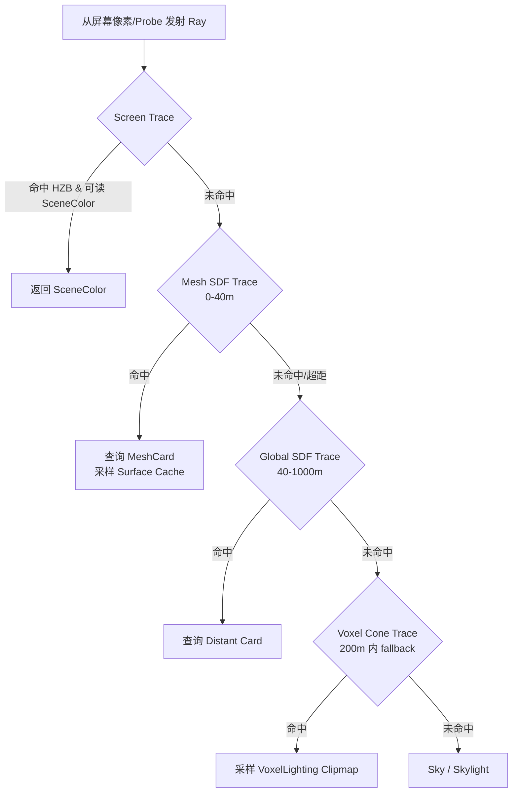

# 基础原理

## Lumen 是什么

**Lumen** 是 UE5 推出的**全动态全局光照与反射**系统。一旦启用，Lumen 将接管：

| 替代项        | 原方案               | Lumen 方案        |
| ------------- | -------------------- | ----------------- |
| **漫反射 GI** | SSGI + DFAO          | Lumen Diffuse GI  |
| **镜面反射**  | SSR                  | Lumen Reflections |
| **静态光照**  | Lightmap（会被禁用） | 完全实时          |

## 核心设计理念

Lumen 不追求"单点最精确"，而是把多种追踪技术按距离/场景特性分层混合：

```
                        相机
                         │
    ┌────────────────────┼────────────────────┐
    │                    │                    │
    ▼ 屏幕内             ▼ 2-40m              ▼ 200-1000m
┌─────────┐   ┌──────────────────┐   ┌──────────────────┐
│ Screen  │→  │ Detail MeshCard  │→  │ Distant MeshCard │
│ Trace   │   │ Trace (MeshSDF)  │   │ Trace (GlobalSDF)│
└─────────┘   └──────────────────┘   └──────────────────┘
                         │
                         ▼  200m 内作为 fallback
                ┌──────────────────┐
                │  Voxel Lighting  │
                │  (Clipmap)       │
                └──────────────────┘
```

**追踪类型对比**

| 类型                       | 范围             | 依赖数据            | 特性                    |
| -------------------------- | ---------------- | ------------------- | ----------------------- |
| **Screen Trace**           | 全场景（屏幕内） | SceneColor + HZB    | 最优先，屏幕外 fallback |
| **Detail MeshCard Trace**  | 2~40m            | Mesh SDF + Card     | VSM 式概率遮挡估算      |
| **Distant MeshCard Trace** | 200~1000m        | Global SDF + Card   | 无遮挡估算，全局        |
| **Voxel Lighting Trace**   | 200m 内          | Voxel Clipmap（SH） | Cone Tracing + Mip      |
| **Hardware RT**（可选）    | 全场景           | BVH（真三角形）     | 精确、支持蒙皮          |

## Lumen 四大数据基石

### ① Mesh SDF（Mesh Signed Distance Field）

每个静态网格**离线预生成**的有符号距离场，用于**软件光线追踪**（Sphere Tracing）。

### ② Global SDF

以相机为中心的**多级 Clipmap 全局 SDF**，每帧合并 Mesh SDF 到 Global SDF，用于远距离快速追踪。

### ③ MeshCard / LumenCard

每个网格离线生成 **6 个朝向（±X, ±Y, ±Z）** 的正交卡片（Card），运行时把材质属性（Albedo / Normal / Emissive / Opacity）捕获到**卡片图集**中。这是 Lumen 能"快速查询任意命中点的光照"的关键。

### ④ Surface Cache

在 Card 图集上**增量更新**的直接光照 + 间接光照缓存。Cone Tracing 命中后，直接读取 Surface Cache 即可获得命中点的 Final Lighting，而无需重新做光栅化或材质求值。

```
Offline Bake            Runtime Every Frame
────────────────        ──────────────────
[Mesh] ─→ [MeshSDF]     Global SDF (Clipmap 合并)
       └→ [MeshCards]   │
                        ├─ UpdateLumenScene:
                        │    捕获 Card 的 Albedo/Normal/Emissive
                        ├─ RenderLumenSceneLighting:
                        │    在 Card 上做 Direct Light + Radiosity
                        └─ 输出 FinalLightingAtlas（SurfaceCache）
```

## 核心数据结构

源码：`Engine/Source/Runtime/Renderer/Private/Lumen/LumenSceneData.h`

```cpp
FLumenSceneData                                           // 整个 Lumen 场景（每 FScene 一个）
 ├─ TArray<FLumenPrimitive>               LumenPrimitives // 图元（网格代表）
 │    └─ TArray<FLumenPrimitiveInstance>  Instances       // 实例
 ├─ TSparseSpanArray<FLumenMeshCards>     MeshCards       // 网格的卡片集合
 ├─ TSparseSpanArray<FLumenCard>          Cards           // 单张卡片
 │
 ├─ Captured（从三角形场景捕获得到的数据）:
 │    ├─ AlbedoAtlas        // 基础色图集
 │    ├─ NormalAtlas        // 法线图集
 │    └─ EmissiveAtlas      // 自发光图集
 │
 └─ Generated（运行时生成的光照数据）:
      ├─ DepthAtlas
      ├─ FinalLightingAtlas       // Surface Cache 最终光照
      ├─ IrradianceAtlas          // 辐照度
      ├─ IndirectIrradianceAtlas  // 间接辐照度
      ├─ RadiosityAtlas           // 辐射度
      └─ OpacityAtlas             // 不透明度
```

`FLumenCard` 关键字段：`WorldBounds`（世界包围盒）+ `LocalToWorldRotationXYZ`（朝向矩阵）+ `Orientation`（6 朝向枚举）+ `AtlasAllocation`（图集 Rect）+ `ResolutionScale`。

---

# Build 流程（离线构建）

Lumen 启动工程时需预构建两类数据，由两个异步队列并行处理：

| 全局队列                        | 职责                             |
| ------------------------------- | -------------------------------- |
| `GDistanceFieldAsyncQueue`      | Mesh SDF 构建（用于软件光追）    |
| `GCardRepresentationAsyncQueue` | Lumen Card 构建（MeshCard 放置） |

源码：`Engine/Source/Runtime/Engine/Public/MeshCardRepresentation.h`

## 构建流程总览

```c
UStaticMesh 导入
       │
       ▼
CacheDerivedData (DDC 缓存键 = DistanceFieldKey + CardRepresentationKey)
       │
       ├─→ GDistanceFieldAsyncQueue::AddTask
       │     └─ 构建 MeshDistanceField（稀疏体素 + 三线性插值）
       │
       └─→ GCardRepresentationAsyncQueue::AddTask
             └─ FAsyncCardRepresentationTaskWorker::DoWork
                  └─ BuildMeshCards(MeshBounds, Context, OutData)
                       └─ 输出 FMeshCardsBuildData
                            ├─ Bounds
                            ├─ MaxLODLevel
                            └─ TArray<FLumenCardBuildData> CardBuildData
                                 (Center, Extent, Orientation, LODLevel)
```

## BuildMeshCards 算法

源码：`Engine/Source/Developer/MeshUtilities/Private/MeshCardRepresentation.cpp` → `BuildMeshCards(...)`

**核心思想**：用 **Embree 光追 + 高度场（Heightfield Ray Tracing）** 在 6 个朝向上采样网格表面，识别"连续表面层"，自适应放置 Card。

### 算法步骤

```cpp
void BuildMeshCards(const FBox& MeshBounds, const FGenerateCardMeshContext& Context, FCardRepresentationData& OutData)
{
    // 1. 确定体素分辨率：4~64，每 10 世界单位一个体素
    const float SamplesPerWorldUnit = 1.0f / 10.0f;
    VolumeSizeInVoxels = clamp(MeshCardsBounds.Size * SamplesPerWorldUnit, 4, 64);

    // 2. 半球均匀射线（64 根，用于 IsInsideMesh 检测）
    MeshUtilities::GenerateStratifiedUniformHemisphereSamples(64, RandomStream, RayDirectionsOverHemisphere);

    // 3. 6 个朝向分别处理
    for (Orientation = 0; Orientation < 6; ++Orientation)
    {
        // 3.1 建立高度场（HeightfieldSize × HeightfieldSize 的射线网格）
        for (HeightfieldY / X) {
            float StepTMin = 0;
            for (StepIndex = 0; StepIndex < 64; ++StepIndex) {
                rtcIntersect1(EmbreeScene, &EmbreeContext, &EmbreeRay);  // Embree 光追
                if (命中) {
                    // 三重检测：
                    bPassCullTest          = 双面 || NdotD <= 0
                    bPassProjectionAngle   = |NdotD| >= cos(75°)      // 投影角 < 75°
                    bPassDistToAnotherSurf = 两次命中距离 > MinDist
                    bIsInsideMesh          = IsSurfacePointInsideMesh (半球射线检测)
                    if (全通过) HeightfieldLayers[...].Add({ tNear, tFar });
                }
                StepTMin = EmbreeRay.tfar + 0.01;  // 继续下一个 surface
            }
        }

        // 3.2 先放一个默认 Card 覆盖整个朝向
        PlacedCards = [{ 0, MeshSliceNum }];
        PlacedCardsHits = UpdatePlacedCards(...);
        if (PlacedCardsHits < MinCardHits) PlacedCards = [];
        SerializePlacedCards(PlacedCards, /*LOD*/ 0, ...);

        // 3.3 自适应细分：最多 4 轮，每轮尝试把现有 Card 沿 Slice 切开，
        //     若命中数净增 ≥ MinCardHits，则接受新的拆分方案
        for (CardPlacementIteration = 0; CardPlacementIteration < 4; ++CardPlacementIteration) {
            for (每个已放置 Card) {
                for (每个可能的 SliceIndex) {
                    TempPlacedCards = 插入一个切分点;
                    NumHits = UpdatePlacedCards(TempPlacedCards, ...);
                    if (NumHits > BestPlacedCardHits) 记录最优拆分;
                }
            }
            if (BestPlacedCardHits >= PlacedCardsHits + MinCardHits)
                PlacedCards = BestPlacedCards;
        }
        SerializePlacedCards(PlacedCards, /*LOD*/ 1, ...);
    }
}
```

### 关键点

- **6 朝向独立**：每个朝向（-X/+X/-Y/+Y/-Z/+Z）独立生成 Card 列表，运行时也独立追踪
- **Embree 多次命中**：一条射线最多可命中 64 次（厚实物体的内部/背面）
- **三重过滤**：剔除朝向不对、投影角过大、距离过近的采样点
- **IsInsideMesh**：用半球 64 根射线投票判断采样点是否在实体内部
- **两级 LOD**：LOD0（单 Card 覆盖） + LOD1（自适应细分）
- **启发式分裂**：以 "覆盖率增益 ≥ MinCardHits" 为准则，避免过度细分

---

# Render 总入口（每帧）

Lumen 每帧在 `FDeferredShadingSceneRenderer::Render` 中分两阶段执行：

```cpp
void FDeferredShadingSceneRenderer::Render(FRDGBuilder& GraphBuilder)
{
    // 检测各 View 是否启用 Lumen
    for (View : Views) {
        bAnyLumenEnabled |= (DiffuseIndirectMethod == Lumen) || (ReflectionsMethod == Lumen);
    }

    RenderPrePass(...);

    // ★ 阶段 1：更新 Lumen 场景（Card 图集捕获）
    UpdateLumenScene(GraphBuilder);

    if (bOcclusionBeforeBasePass) {
        RenderLumenSceneLighting(GraphBuilder, Views[0]);   // 直接光 + Radiosity
        ComputeVolumetricFog(GraphBuilder);
    }

    RenderBasePass(...);

    if (!bOcclusionBeforeBasePass) {
        AllocateVirtualShadowMaps(bAfterBasePass = true);
        RenderShadowDepthMaps(...);

        // ★ 阶段 2：更新 Lumen Surface Cache 的光照
        RenderLumenSceneLighting(GraphBuilder, Views[0]);
    }

    // ★ 阶段 3：最终屏幕空间间接光计算
    RenderLumenSceneVisualization(GraphBuilder, SceneTextures);
    RenderDiffuseIndirectAndAmbientOcclusion(GraphBuilder, SceneTextures, LightingChannelsTexture, true);
}
```

三阶段对应关系：

| 阶段       | 函数                                       | 产物                                                  |
| ---------- | ------------------------------------------ | ----------------------------------------------------- |
| ① 场景更新 | `UpdateLumenScene`                         | Albedo / Normal / Emissive Atlas                      |
| ② 场景光照 | `RenderLumenSceneLighting`                 | FinalLightingAtlas（Surface Cache）                   |
| ③ 屏幕 GI  | `RenderDiffuseIndirectAndAmbientOcclusion` | DiffuseIndirect + SpecularIndirect（与 GBuffer 合成） |

---

# 阶段 ① UpdateLumenScene（场景更新）

源码：`Engine/Source/Runtime/Renderer/Private/Lumen/LumenSceneRendering.cpp` → `UpdateLumenScene(...)`

**目标**：把本帧待捕获的 Card 的材质属性（Albedo/Normal/Emissive）光栅化到 Atlas 中。

## 流程

```
UpdateLumenScene
  │
  ├─ 更新 CardSceneBuffer（GPU 端 Card 结构）
  ├─ 重建 ViewUniformBuffer（图元映射变了）
  │
  ├─ 若 CardsToRender.Num() > 0:
  │   │
  │   ├─ GPU Culling（GPUScene 路径）
  │   │   └─ FInstanceCullingContext::BuildRenderingCommands
  │   │
  │   ├─ 上传 RectMinMaxBuffer（每个待渲染 Card 的图集矩形）
  │   ├─ ClearLumenCards（清理对应 Rect）
  │   │
  │   ├─ ▶ MeshCardCapture Pass (非 Nanite)
  │   │    每个 Card → SetViewport(AtlasRect)
  │   │             → SubmitMeshDrawCommandsRange
  │   │    输出到 3 MRT: AlbedoAtlas / NormalAtlas / EmissiveAtlas
  │   │
  │   ├─ ▶ Nanite 捕获（若有 Nanite 网格）
  │   │    Nanite::InitRasterContext (EOutputBufferMode::VisBuffer)
  │   │    Nanite::InitCullingContext (bPrimaryContext = false)
  │   │    多视图模式：每批最多 MAX_VIEWS_PER_CULL_RASTERIZE_PASS 个 Card
  │   │    Nanite::CullRasterize(NaniteViews, &NaniteInstanceDraws)
  │   │    Nanite::DrawLumenMeshCapturePass → 解析 VisBuffer 写 Atlas
  │   │
  │   └─ 远景 Card：bDistantScene → 独立渲染整个场景（不裁剪近平面）
  │
  ├─ 上传 CardsToRenderIndexBuffer / HashMapBuffer / VisibleCardsIndexBuffer
  │
  └─ PrefilterLumenSceneDepth（预过滤深度，为 Radiosity 使用）
```

## 关键设计

- **增量更新**：Card 并非每帧全部重捕，只有在满足以下条件时加入 `CardsToRender`：
  - `r.LumenScene.RecaptureEveryFrame` 开启，**或**
  - Card 可见、且**分辨率发生变化**
- **分辨率自适应**：`FLumenCard::ResolutionScale` 控制图集占比，远处 Card 自动缩小
- **Nanite 加速**：对高面数网格**必须**使用 Nanite 才能高效捕获（否则单 Card 几千 DrawCall）
- **多视图批处理**：Nanite 一次 `CullRasterize` 可处理多个 Card（多个 PackedView），大幅降低调度开销
- **图集分配器**：`FBinnedTextureLayout AtlasAllocator`，按 2 的幂次分 bin 管理矩形

---

# 阶段 ② RenderLumenSceneLighting（Surface Cache 光照）

源码：`Engine/Source/Runtime/Renderer/Private/Lumen/LumenSceneLighting.cpp` → `RenderLumenSceneLighting(...)`

**目标**：在 Card 图集上计算 **直接光照 + 间接光照（辐射度）** → FinalLightingAtlas（即 Surface Cache）。

## 流程

```
RenderLumenSceneLighting
 ├─ TracingInputs = FLumenCardTracingInputs(...)      // 装配 Card 场景 UB
 │
 ├─ RenderRadiosityForLumenScene
 │   └─ 基于 Card 上一帧的 FinalLighting，重新在 Card 上做
 │      Cone Tracing 采样反弹光（间接光 → RadiosityAtlas）
 │      ┌──────────────────────────────────────┐
 │      │ Radiosity：把 FinalLighting 作为光源  │
 │      │ 再反弹一次，得到**多次弹射**效果        │
 │      └──────────────────────────────────────┘
 │
 ├─ DirectLightingCardScatterContext.Init(...)
 ├─ CullCardsToShape(...)                   // 裁剪待更新的 Card 面
 ├─ BuildScatterIndirectArgs(...)           // GPU 散射参数（间接绘制）
 │
 ├─ CombineLumenSceneLighting(...)          // 组合 Radiosity → FinalLightingAtlas
 │
 ├─ RenderDirectLightingForLumenScene(...)  // 在 Card 上算直接光（阴影 + BRDF）
 │   └─ LumenCardDirectLightingPS：对每个可见 Card 纹素，做
 │      对所有相关光源的 NdotL + 阴影（从 ShadowMap / VSM 取样）
 │
 ├─ ApplyLumenCardAlbedo(...)               // 把 Albedo × Lighting 叠加
 │
 ├─ PrefilterLumenSceneLighting(...)        // 预滤波，提供 Mip 供 Cone Tracing
 │
 └─ ComputeLumenSceneVoxelLighting(...)     // 把 Card 的 FinalLighting
     └─ 烘进 Voxel Clipmap（Voxel Lighting Trace 使用）
```

## 关键设计

### Radiosity（ 多次反弹）

- 以 **上一帧 FinalLightingAtlas** 为光源，做一次 Cone Tracing → 写 `RadiosityAtlas`
- 相当于**每帧做一次反弹**，累计多帧即可达到多次间接反弹效果
- 成本可控：只处理可见 Card，且 `r.Lumen.Radiosity.CardUpdateFrequencyScale` 可摊销到多帧

### 直接光照在 Card 上而非屏幕上
- 传统 GI：屏幕像素 → 采样光照 + 阴影
- Lumen 的创新：**光照先烘在 Card 图集上**，屏幕像素只做"查询"
- 好处：
  1. Card 分辨率低于屏幕 → 直接光计算量少
  2. Surface Cache 可跨帧复用（动态光时局部更新）
  3. 屏幕间接光就是一次"采样 Surface Cache"

### Scatter 绘制模型
- `FLumenCardScatterContext`：基于 CullCardsToShape 找出需要更新的 Card 面 → 生成 IndirectArgs
- 用 GPU 散射绘制（`DispatchIndirect`）精确更新**纹素级别**，避免全图重算

### Voxel Lighting 构造
- `ComputeLumenSceneVoxelLighting` 把 FinalLighting 按 Clipmap 层级**体素化**
- 每个体素面存 SH 或方向辐射率，供远距离 Cone Tracing 使用
- Clipmap 以相机为中心，随相机移动而滚动更新

---

# 阶段 ③ RenderDiffuseIndirectAndAmbientOcclusion（屏幕空间 GI）

源码：`Engine/Source/Runtime/Renderer/Private/IndirectLightRendering.cpp`

**目标**：对每个屏幕像素，通过**混合追踪**采样 Surface Cache → 得到 DiffuseIndirect + SpecularIndirect，最终与 GBuffer 合成。

## 方法派发

```cpp
if (bUseLumenProbeHierarchy) RenderLumenProbeHierarchy(...);
else if (DiffuseIndirectMethod == SSGI) ScreenSpaceRayTracing::CastStandaloneDiffuseIndirectRays(...);
else if (DiffuseIndirectMethod == RTGI) RenderRayTracingGlobalIllumination(...);
else if (DiffuseIndirectMethod == Lumen) {
    RenderLumenScreenProbeGather(...);        // 漫反射 GI
    if (ReflectionsMethod == Lumen)
        RenderLumenReflections(...);          // 反射
}

// 最后统一：
DiffuseIndirectComposite(...);   // 与 GBuffer/SceneColor 合成
```

## 3.1 RenderLumenScreenProbeGather（屏幕探针收集）

**核心思想**：每 8×8 或 16×16 像素放一个 **Screen Probe**（辐射率探针），对每个 Probe 发射若干条射线，采样 Surface Cache，结果再降噪扩散到全屏像素。

```
UniformPlacement (DownsampleFactor=16)            // 均匀分布
  ↓
AdaptivePlacement (DownsampleFactor=8 / 4)        // 几何密集处加密
  ↓
ComputeBRDF_PDF                                   // 每像素 BRDF 概率分布
  ↓
RadianceCache                                     // 世界空间辐射率探针
  ↓
ComputeLightingPDF                                // 根据光照历史采样方向
  ↓
GenerateRays (8x8)                                // 重要性采样射线
  ↓
TraceScreen  (Screen Trace)                       // 优先屏幕追踪
  ↓
CompactTraces                                     // 压缩未命中的射线
  ↓
TraceVoxels  (Voxel Cone Trace)                   // 屏幕外用 Voxel fallback
  ↓
CompositeTraces                                   // 合并命中结果
  ↓
FilterRadianceWithGather × 3                      // 3 次空间降噪
  ↓
ConvertToSH / CalculateMoving / FixupBorders      // SH 编码 + 边缘修复
  ↓
ScreenSpaceBentNormal                             // 屏幕空间弯曲法线（AO 信息）
  ↓
ComputeIndirect                                   // 按像素 BRDF 积分得 DiffuseIndirect
  ↓
UpdateHistory                                     // TAA 时域累积
```

### 关键技术点

| 技术                | 作用                                                              |
| ------------------- | ----------------------------------------------------------------- |
| **自适应探针放置**  | 屏幕均匀 + 几何密集处加密，减少探针数量                           |
| **Radiance Cache**  | 世界空间 Clipmap 探针，缓存 SH，加速重要性采样                    |
| **Octahedral 映射** | 2D 纹理表示球面辐射率（`ScreenProbeTracingOctahedronResolution`） |
| **混合追踪**        | Screen → Mesh SDF → Voxel，逐级 fallback                          |
| **重要性采样**      | 基于 BRDF 和上一帧光照 PDF 分配射线方向                           |
| **空间+时域降噪**   | 3 次 Gather + TAAUpdateHistory                                    |

## 3.2 RenderLumenReflections（反射）

与 Diffuse GI 类似的管线，但：

- **仅在 `Roughness ≤ GLumenReflectionMaxRoughnessToTrace`（默认 0.4）** 时追踪，高粗糙度直接用 GI fallback
- **GGX 重要性采样**：采样方向围绕镜面 Lobe，而非半球均匀
- 每像素通常只发 1 条射线 → `TemporalReprojection` 时域累积

```
GBufferTileClassification            // 粗糙度分类，跳过平滑/过粗表面
  ↓
GenerateRaysCS (GGX sample)
  ↓
ClearTraces → TraceScreen → CompactTraces → TraceVoxels
  ↓
ReflectionResolve                    // 双边加权重建
  ↓
TemporalReprojection                 // 历史累积
```

## 3.3 DiffuseIndirectComposite（最终合成）

```
最终合成 = DiffuseIndirect（SH × GBuffer.Diffuse）
        + SpecularIndirect（Reflection × GBuffer.Specular）
        + DirectLight（RenderLights 产物）
        + Emissive
        + VolumetricFog
```

源码：`Engine/Shaders/Private/DiffuseIndirectComposite.usf`

---

# Hybrid Tracing（混合追踪）深入

这是 Lumen 最核心的工程创新。单像素/单射线的追踪过程：



**对应源码函数**：

- Screen Trace: `LumenScreenTracing.usf` / `TraceScreen`
- Mesh SDF Trace: `LumenMeshSDFTracing.usf`
- Global SDF Trace: `GlobalDistanceFieldShared.usf`
- Voxel Trace: `ScreenProbeTraceVoxelsCS.ush`

**切换阈值**：
```
r.Lumen.DiffuseIndirect.CardTraceEndDistanceFromCamera  // 切到 Global SDF
r.Lumen.MaxTraceDistance                                 // 射线总长上限
```

---

# 硬件光线追踪（HWRT）

当开启 `r.Lumen.HardwareRayTracing 1` 且显卡支持：

| 项           | Software RT              | Hardware RT                    |
| ------------ | ------------------------ | ------------------------------ |
| 几何源       | Mesh SDF + Global SDF    | BVH（真三角形 / Nanite Proxy） |
| 支持类型     | 静态/实例化静态/HISM     | + 骨骼网格                     |
| 光照来源     | Surface Cache            | 实际命中点的完整 material eval |
| 场景规模     | 大世界（仅相机 200m 内） | < 10 万实例                    |
| 平台         | SM5 即可                 | DX12 + RTX 20/AMD 6000+        |
| 动态网格成本 | -                        | 每帧重建 BVH（蒙皮很贵）       |

HWRT 仍然只在**屏幕追踪未命中**后才启动，并非完全取代 SDF。

---

# 限制与注意事项

## 几何
- ✅ 静态网格、InstancedStaticMesh、HISM
- ❌ Landscape（尚不支持 Lumen GI）
- ❌ 骨骼网格（仅 HWRT 支持）
- ❌ WPO / Spline Mesh / Morph Target
- ⚠️ 场景**必须模块化**：墙/地/顶独立网格；整体大山会自遮挡

## 材质
- ❌ Transparent / Translucent（视 Masked 为 Opaque）
- ❌ 运行时覆盖材质（Override Material 不影响 Lumen）
- 不支持 Lightmap 同时启用

## 工作流
- 墙壁应 > 10cm，避免漏光
- Mesh SDF 精度由导入配置决定，过压缩会漏光
- Lumen 场景仅覆盖相机 **200m** 内
- 植被和移动物体易产生噪点（下采样 + 时域滤波放大了低采样的问题）

---

# 性能预算（4K + PC RTX 3070 参考）

| 阶段                     | 成本             | 备注                            |
| ------------------------ | ---------------- | ------------------------------- |
| UpdateLumenScene         | 0.3 ~ 1.0 ms     | 每帧只更新可见变化 Card         |
| RenderLumenSceneLighting | 0.8 ~ 2.0 ms     | Radiosity + DirectLight + Voxel |
| ScreenProbeGather        | 1.5 ~ 3.0 ms     | 占比最大                        |
| LumenReflections         | 0.8 ~ 1.8 ms     | 按开关可选                      |
| DiffuseIndirectComposite | 0.2 ~ 0.4 ms     |                                 |
| **Lumen Total**          | **3.5 ~ 8.0 ms** | 相当于整体帧时的 30~50%         |

## 调优关键 CVar

| 参数                                                    | 作用                             |
| ------------------------------------------------------- | -------------------------------- |
| `r.Lumen.DiffuseIndirect.Allow`                         | 总开关                           |
| `r.Lumen.ScreenProbeGather.DownsampleFactor`            | 探针密度（8/16）                 |
| `r.Lumen.ScreenProbeGather.TracingOctahedronResolution` | 每探针射线数                     |
| `r.Lumen.ScreenProbeGather.RadianceCache`               | 开启/关闭 RadianceCache          |
| `r.Lumen.Reflections.DownsampleFactor`                  | 反射分辨率                       |
| `r.Lumen.Reflections.MaxRoughnessToTrace`               | 反射追踪最大粗糙度               |
| `r.Lumen.Radiosity.CardUpdateFrequencyScale`            | Radiosity 更新频率（降频省性能） |
| `r.Lumen.MaxTraceDistance`                              | 射线最长距离                     |
| `r.Lumen.HardwareRayTracing`                            | 硬件光追开关                     |
| `r.LumenScene.RecaptureEveryFrame`                      | 每帧重捕（调试用，性能差）       |

## 可视化调试

| 命令                                          | 用途                                        |
| --------------------------------------------- | ------------------------------------------- |
| `r.Lumen.Visualize.CardPlacement 1`           | 可视化 Card 放置（色块显示朝向）            |
| `r.Lumen.Visualize.TraceMeshSDFs 1`           | 显示 Mesh SDF 追踪范围                      |
| `r.Lumen.Visualize.Voxels 1`                  | 显示 Voxel Clipmap                          |
| `r.Lumen.Visualize.ConeAngle`                 | 显示 Cone 角度                              |
| `ShowFlag.VisualizeLumenScene 1`              | 只显示 Lumen 场景（排查与三角形场景不匹配） |
| `ShowFlag.VisualizeLumenIndirectDiffuse 1`    | 只看 Lumen 间接漫反射                       |
| `r.Lumen.ScreenProbeGather.VisualizeTraces 1` | 可视化探针射线                              |

---

# 源码地图

| 模块               | 路径                                                                            |
| ------------------ | ------------------------------------------------------------------------------- |
| Card 离线构建      | `Engine/Source/Developer/MeshUtilities/Private/MeshCardRepresentation.cpp`      |
| Card 结构          | `Engine/Source/Runtime/Engine/Public/MeshCardRepresentation.h`                  |
| Lumen 场景数据     | `Engine/Source/Runtime/Renderer/Private/Lumen/LumenSceneData.h`                 |
| 场景更新           | `Engine/Source/Runtime/Renderer/Private/Lumen/LumenSceneRendering.cpp`          |
| Surface Cache 光照 | `Engine/Source/Runtime/Renderer/Private/Lumen/LumenSceneLighting.cpp`           |
| 直接光照           | `Engine/Source/Runtime/Renderer/Private/Lumen/LumenSceneDirectLighting.cpp`     |
| Radiosity          | `Engine/Source/Runtime/Renderer/Private/Lumen/LumenRadiosity.cpp`               |
| Voxel Lighting     | `Engine/Source/Runtime/Renderer/Private/Lumen/LumenVoxelLighting.cpp`           |
| 屏幕探针           | `Engine/Source/Runtime/Renderer/Private/Lumen/LumenScreenProbeGather.cpp`       |
| Lumen 反射         | `Engine/Source/Runtime/Renderer/Private/Lumen/LumenReflections.cpp`             |
| Radiance Cache     | `Engine/Source/Runtime/Renderer/Private/Lumen/LumenRadianceCache.cpp`           |
| SW 光追            | `Engine/Shaders/Private/Lumen/LumenScreenTracing.usf` `LumenMeshSDFTracing.usf` |
| HW 光追            | `Engine/Source/Runtime/Renderer/Private/Lumen/LumenHardwareRayTracing*.cpp`     |
| 间接光合成         | `Engine/Source/Runtime/Renderer/Private/IndirectLightRendering.cpp`             |
| 合成 Shader        | `Engine/Shaders/Private/DiffuseIndirectComposite.usf`                           |

---

# 小结

Lumen 的设计哲学可以总结为 **"分层缓存 + 混合追踪 + 时空重用"**：

1. **分层缓存**：离线 Card 放置 → 运行时 Card 图集捕获（Albedo/Normal/Emissive） → Surface Cache（FinalLighting）→ Voxel Lighting Clipmap → Radiance Cache。每一层都是对场景光照的**不同精度近似**。

2. **混合追踪**：同一条射线依次尝试 Screen → Mesh SDF → Global SDF → Voxel。每种方式都有明确的优势区间，按距离/场景特性自动分派，工程化做到"足够好、足够快"。

3. **时空重用**：
   - **时域**：Radiosity 每帧用上一帧 FinalLighting 做反弹，累计多次弹射；ScreenProbeGather 用 TAA 累积；Radiance Cache 跨帧缓存。
   - **空间**：Card 共享给所有屏幕像素；Probe 间插值；SH 编码压缩球面信息。

4. **GPU-Driven**：`GPUScene + InstanceCulling + Nanite MultiView` 让 Card 捕获可以成百上千个一起批处理，是 UE5 "小 CPU 开销、大 GPU 吞吐" 架构的又一体现。

Lumen 的代价是：**静态光照被禁用**、**仅限 200m 范围**、**对场景模块化有工作流约束**。但它换来了"所见即所得"的光照迭代体验和可观的画面品质提升，这也是 UE5 时代最重要的渲染变革之一。