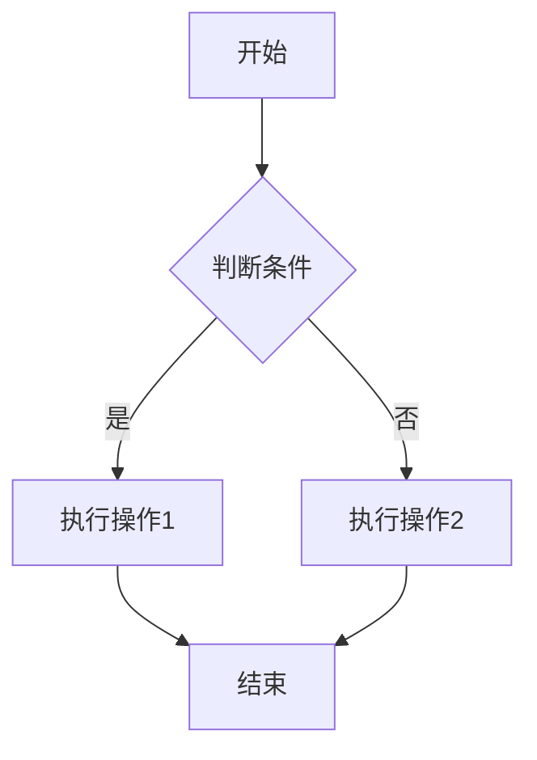
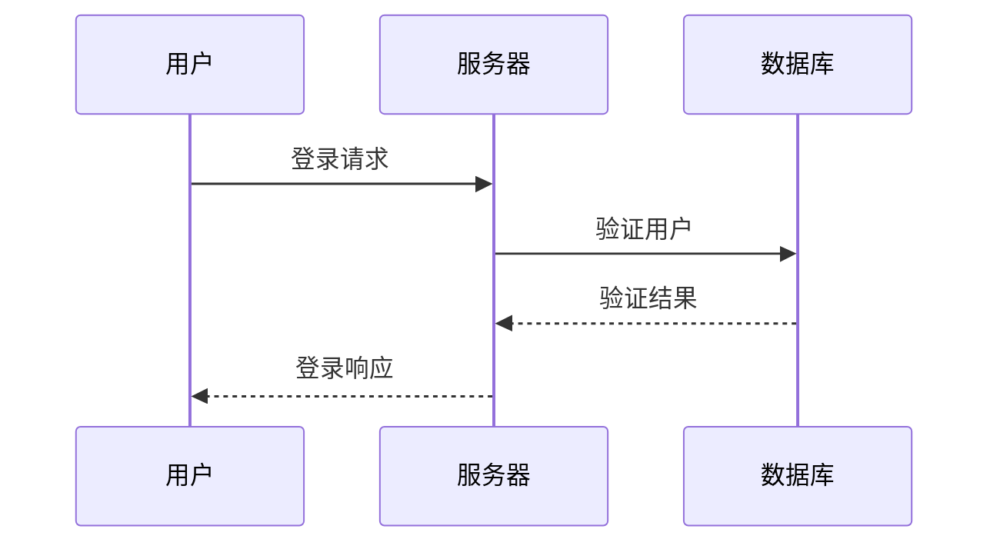
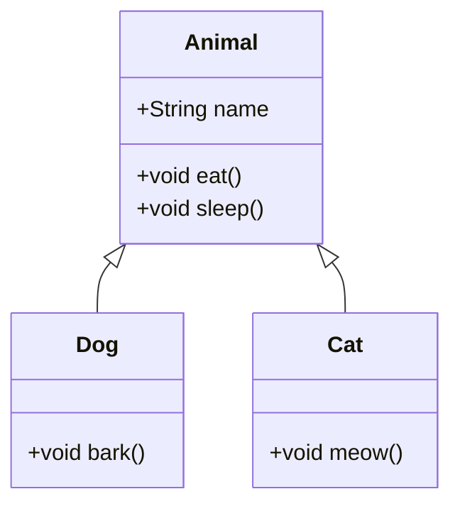
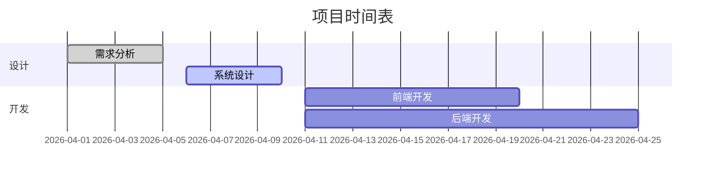
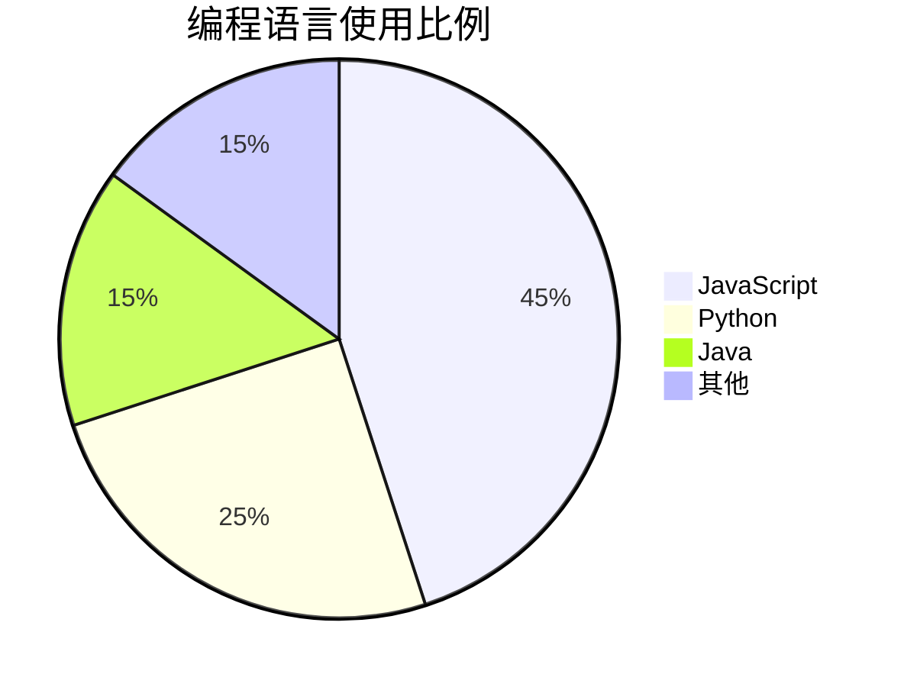
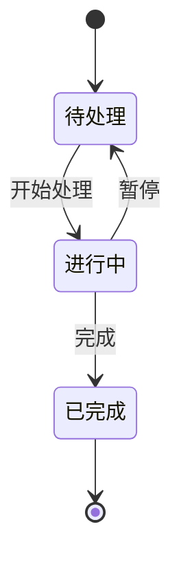

# Mermaid图表测试

## 流程图示例

## 序列图示例

## 类图示例

## 甘特图示例

## 饼图示例

## 状态图示例

## 使用说明

在Markdown中使用Mermaid图表，只需将图表代码包裹在\`\`\`mermaid代码块中即可。

支持的图表类型包括：
- 流程图 (flowchart)
- 序列图 (sequenceDiagram) 
- 类图 (classDiagram)
- 甘特图 (gantt)
- 饼图 (pie)
- 状态图 (stateDiagram)
- 等等...