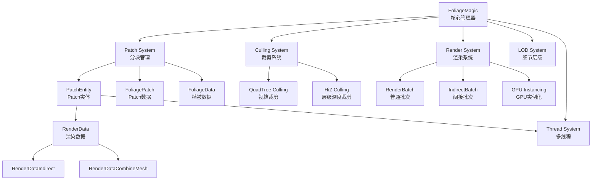
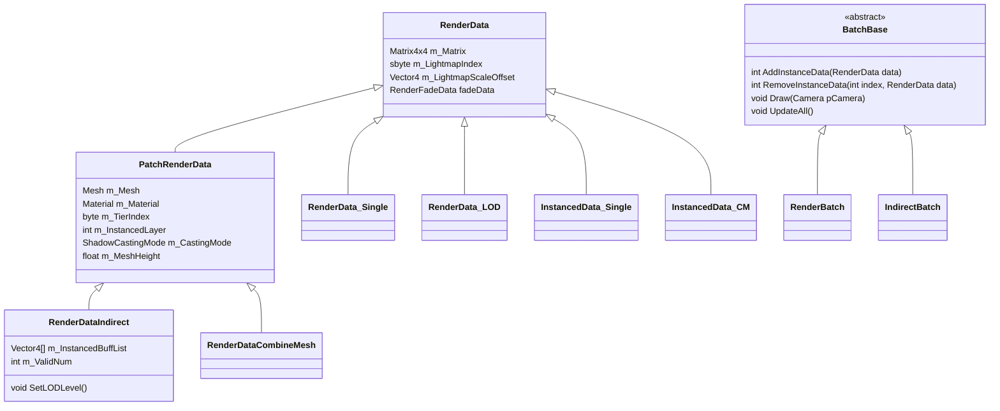
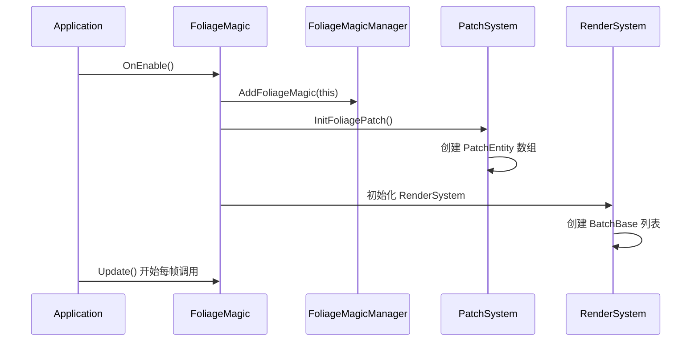
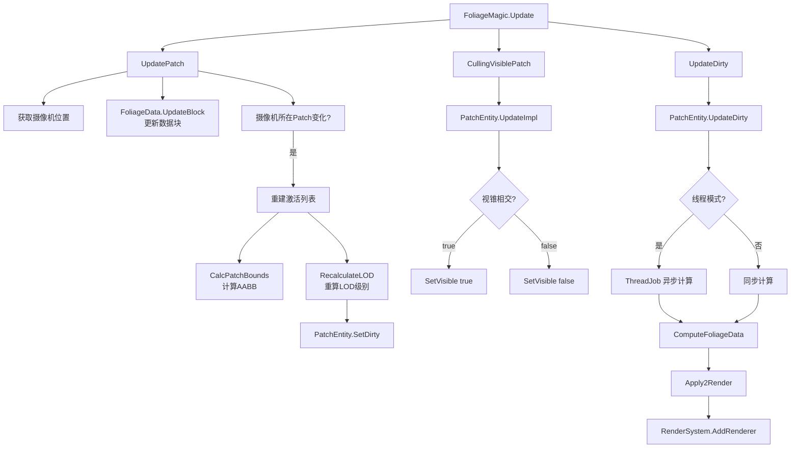
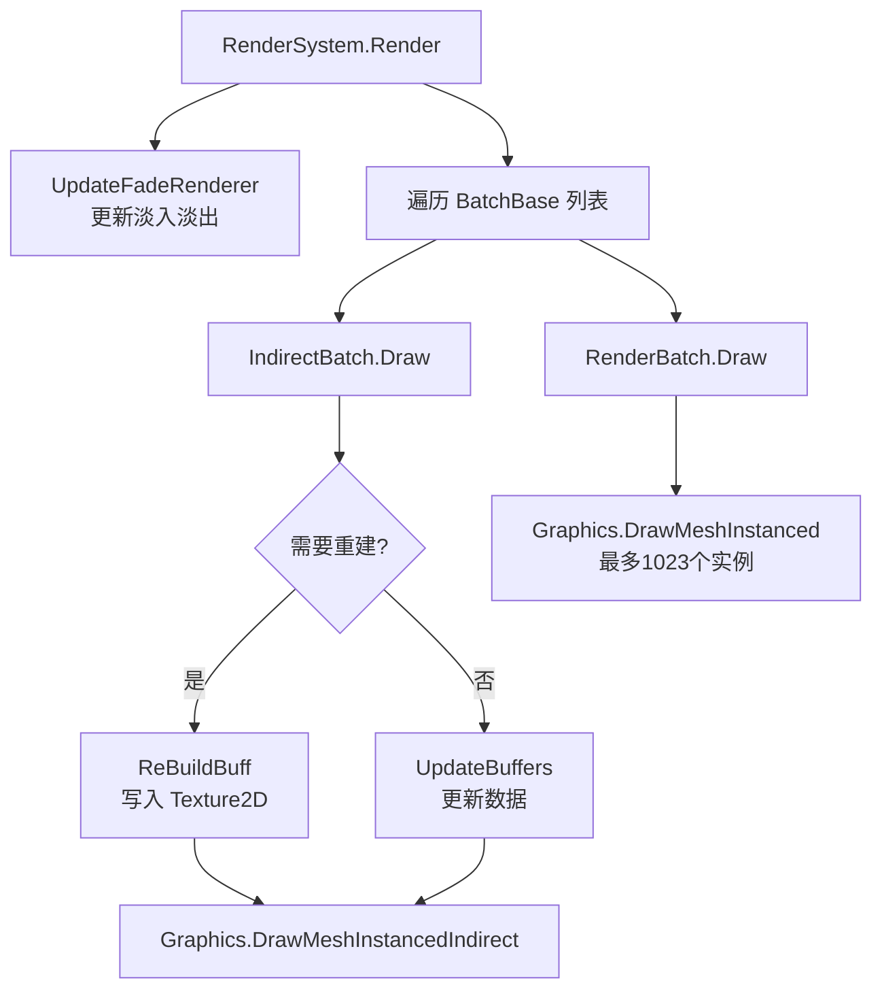
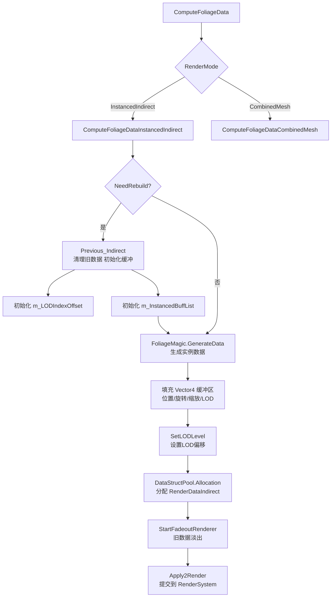
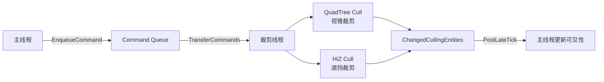
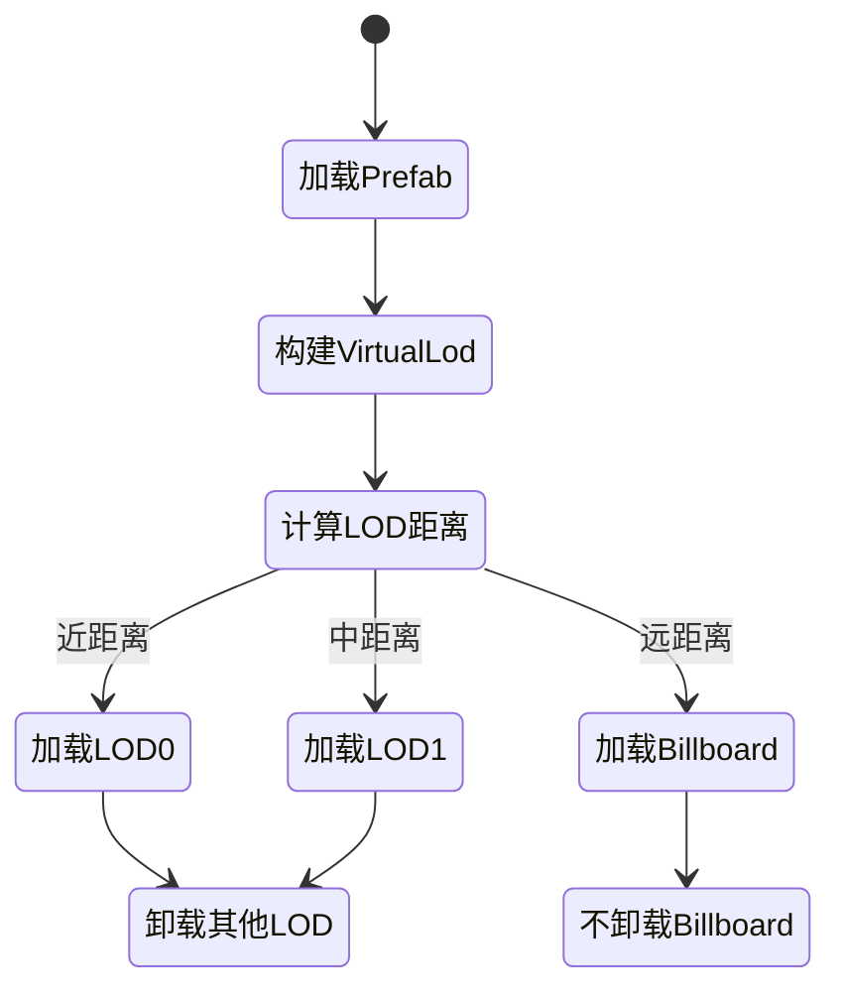

# Unity 植被渲染系统 — 详细技术文档

## 目录

1. [系统架构总览](#1-系统架构总览)
2. [核心数据结构](#2-核心数据结构)
3. [完整调用流程](#3-完整调用流程)
4. [渲染管线详解](#4-渲染管线详解)
5. [裁剪系统详解](#5-裁剪系统详解)
6. [LOD 系统详解](#6-lod-系统详解)
7. [多线程系统](#7-多线程系统)
8. [注意事项](#8-注意事项)
9. [优化方案](#9-优化方案)
10. [平台适配](#10-平台适配)

---

## 1. 系统架构总览

### 1.1 模块依赖关系



### 1.2 类继承关系



---

## 2. 核心数据结构

### 2.1 植被实例数据编码（Vector4）

每个植被实例用一个 `Vector4` 压缩存储：

```
info.x = worldPositionX          // 世界坐标 X
info.y = compressedY             // 压缩的 Y 坐标 + Scale
info.z = worldPositionZ          // 世界坐标 Z
info.w = ConverTo_Data_w(...)    // 旋转 + LOD 级别
```

**Y 轴压缩格式（32bit）：**
```
[31:10] 20bit → 高度值 (position_y & 0xfffff) << 10
[9:0]   10bit → 缩放值 (scale & 0x3ff)
```

**W 分量编码格式（32bit）：**
```
[0-8]   9bit → rotation.eulerAngles.y (360 - y)
[9-17]  9bit → rotation.eulerAngles.x (360 - x)
[18-26] 9bit → rotation.eulerAngles.z (360 - z)
[27-28] 2bit → LOD 级别 (0, 1, 2)
```

### 2.2 Patch 坐标系

```
PatchCount = Resolution / PatchSamples

// 一个 Patch 内的局部坐标
lx = patchX * PatchSamples + [0, PatchSamples)
ly = patchY * PatchSamples + [0, PatchSamples)

// 世界坐标
pos.xz = [lx, ly] + FoliageOffset.xy
pos.y  = GetDynamicHeight(lx, ly)
```

### 2.3 LOD 分布策略（打乱交叉）

LOD 数据在缓冲区中**交叉排列**，避免连续同级 LOD 导致的视觉突变：

```csharp
// 原始顺序: 0, 1, 2, 3, 4, 5, 6 ... 20
// 交叉后:   0, 3, 6, 9, 12, 15, 18, 1, 4, 7, 10, 13, 16, 19, 2, 5, 8, 11, 14, 17
float lodf = (float)(index * 3 % objectNum) / objectNum;
// lodf <= LODPercentage.z → LOD2
// lodf <= LODPercentage.y → LOD1
// else                    → LOD0
```

**缓冲区偏移量：**
```csharp
int index_offset_2 = 0;                                  // LOD2 起始偏移
int index_offset_1 = offset[0] * BuffBias;               // LOD1 起始偏移
int index_offset_0 = (offset[0] + offset[1]) * BuffBias; // LOD0 起始偏移
```

---

## 3. 完整调用流程

### 3.1 初始化流程



### 3.2 每帧主循环流程



### 3.3 渲染帧流程



### 3.4 PatchEntity 数据生成流程（Indirect 模式）



---

## 4. 渲染管线详解

### 4.1 两种渲染模式对比

| 特性     | DrawMeshInstanced（直接） | DrawMeshInstancedIndirect（间接） |
| -------- | ------------------------- | --------------------------------- |
| 实例上限 | 1023                      | 无限制                            |
| 数据传递 | CPU Matrix4x4 数组        | GPU Buffer / Texture2D            |
| LOD 支持 | 需 CPU 分组               | GPU 侧直接处理                    |
| 裁剪支持 | CPU 裁剪                  | GPU Compute Shader 裁剪           |
| 适用场景 | 少量实例                  | 大规模植被                        |

### 4.2 IndirectBatch 渲染实现

```csharp
class IndirectBatch : BatchBase {
    Texture2D m_DrawTexture;      // 实例数据纹理（Vector4 格式）
    Texture2D m_FadeTexture;      // 淡入淡出纹理
    ComputeBuffer m_ArgsBuffer;   // 间接绘制参数 [indexCount, instanceCount, indexStart, baseVertex, 0]
    MaterialPropertyBlock m_Block;

    void Draw(Camera pCamera) {
        // 实例数 <= GlobalDefine.InstancedCombine 时用 Indirect
        if (m_InstanceCount <= GlobalDefine.InstancedCombine) {
            Graphics.DrawMeshInstancedIndirect(
                m_Mesh, m_SubMeshIndex, m_DrawMaterial,
                m_Bounds, m_ArgsBuffer, 0, m_Block,
                m_CastingMode, m_ReceiveShadows, m_InstanceUnityLayer);
        } else {
            // 超出阈值降级为 DrawMeshInstanced
            Graphics.DrawMeshInstanced(
                m_Mesh, m_SubMeshIndex, m_Material,
                m_InstancedData.m_Matrix.Data(), m_InstanceCount);
        }
    }
}
```

### 4.3 Texture2D 实例数据传递

```csharp
// 写入实例数据到 Texture2D
NativeArray<Vector4> rawData = texture2D.GetRawTextureData<Vector4>();
NativeArray<Vector4>.Copy(entity.compressedData, 0, rawData, positionIndex, entity.bounds.Count);
texture2D.Apply(); // 上传 GPU

// Shader 端读取
m_Block.SetFloat(GlobalDefine._TexWidth, nSize);
m_Block.SetTexture(GlobalDefine._InstanceTex, m_DrawTexture);
m_Block.SetTexture(GlobalDefine._InstanceFadeTex, m_FadeTexture);
m_Block.SetFloat(GlobalDefine._FoliageHeight, maxFoliageHeight);
```

### 4.4 BatchQueryHandle 批次复用机制

```csharp
// 批次查找键值（所有字段相同才复用同一批次）
struct BatchQueryValue {
    Mesh Mesh;
    Material Material;
    byte SubMeshIndex;
    ShadowCastingMode CastingMode;
    LightProbeUsage LightProbe;
    bool ReceiveShadows;
    int InstanceUnityLayer;
    Type Type;
    sbyte LightmapIndex;
}
// RenderSystem 优先查找已有批次，避免重复创建
// BatchQuery._cache 缓存最近使用的批次，加速查找
```

### 4.5 淡入淡出（CrossFade）

```csharp
// LOD 切换时触发淡出旧数据
if (IsEnableCrossFade() && m_LODLevel != m_lastLODLevel) {
    RenderSystem.Instance.StartFadeoutRenderer(oldRender, GlobalDefine.GrassCrossFadeTime);
}
// 新数据淡入
if (pRender.fadeData.fadeState == FadeState.kTryFadeIn) {
    RenderSystem.Instance.StartFadeinRenderer(pRender, GlobalDefine.GrassCrossFadeTime);
}
```

---

## 5. 裁剪系统详解

### 5.1 裁剪系统整体架构



### 5.2 四叉树裁剪系统

**九宫格结构：**
- 以摄像机为中心，构建 3×3 = 9 棵四叉树
- `blockSize`：每棵四叉树根节点的尺寸（必须为 2 的幂次）
- `leafBoundSize`：叶子节点尺寸（必须为 2 的幂次）
- 摄像机离开中央格子时，触发九宫格重建

```csharp
void DoCull(Frustum frustum) {
    ExecuteCommandQueue();          // 处理添加/删除命令
    UpdateQuadTree(frustum.cameraLogicPosition, frustum.cameraFarClipPlane, leafBoundSize);
    CullDynamicEntities();          // 动态实体裁剪
    // 遍历 3x3 四叉树
    for (int x = 0; x < 3; x++)
        for (int z = 0; z < 3; z++)
            quadTrees[x, z].Cull(frustum);
    // 处理边界节点
    for (int i = 0; i < count; i++)
        cullingEntity.SetCulledByFrustum(!cullingEntity.cullingProxy.ICullingProxy_Cull(frustum));
}
```

**执行顺序：**
```
OnPreCull_RunningOnMainThread
    → OnPreCull_RunningOnCullingThread（裁剪线程）
        → ExecuteCommandQueue
        → UpdateQuadTree
        → DoCull
        → OnCullFinished_RunningOnCullingThread
    → PostLateTick（主线程 LateUpdate）
        → CompleteCullingJob
        → UpdateChangedCullingEntitiesVisibility
        → HIZCullingSystem.SetupComputeBuffer
```

### 5.3 HiZ 遮挡裁剪

**原理：**
- 使用上一帧深度图构建多级 Mipmap（Hi-Z）
- 物体包围盒投影到屏幕空间，选取合适 Mip 级别采样深度
- 若包围盒最近深度 ≥ 采样深度，则物体被遮挡，执行剔除

**Mip 级别选择：**
```
// 包围盒在屏幕上占 16x16 像素 → 选 mip4（1个像素覆盖16x16）
// 该像素记录的是 16x16 区域内最远深度
// 若最远深度都能遮挡物体，则整个物体被遮挡
```

**Compute Shader 实现：**
```hlsl
[numthreads(64,1,1)]
void CSMain(uint3 id : SV_DispatchThreadID) {
    AABB aabb = _AABBBuffer[id.x];
    // 计算包围盒8个顶点的屏幕坐标
    // 找到覆盖范围对应的 Mip 级别
    // 采样 Hi-Z 深度图
    float depth = min(min(d1, d2), min(d3, d4));
    // nearZ >= depth → 被遮挡 → visibility = 负值
    _VisibilityBuffer[id.x] = visibility;
}
```

**限制条件：**
- 需要 `SystemInfo.supportsAsyncGPUReadback`
- 摄像机旋转未变化时才读取 GPU 结果（避免错误剔除）
- 间隔若干帧才开启 HiZ（避免首帧错误）

### 5.4 裁剪代理（RendererCullingProxy）

```csharp
// 主线程：设置激活状态（通过 Command 异步）
proxy.SetActive(true);
    → CullingManager.EnqueueRendererCullingProxySetActiveCommand()

// 裁剪线程：执行 Command
    → RendererCullingProxy.SetActiveImpl()
    → CullingSystem.AddCullingEntityImmediately(cullingEntity)

// 裁剪结果回调
void ICullingProxy_OnCullingStateChanged(bool newVisible) {
    renderer.forceRenderingOff = !newVisible;
}
```

---

## 6. LOD 系统详解

### 6.1 LOD 距离计算

```csharp
void RecalculateLOD(Vector3 cameraPos) {
    float distance = Vector3.Distance(bounds.center, cameraPos);
    sbyte newLodLevel = -1;
    if (distance < LODDistance.x)      newLodLevel = 0;  // 近距离：高精度
    else if (distance < LODDistance.y) newLodLevel = 1;  // 中距离
    else if (distance < LODDistance.z) newLodLevel = 2;  // 远距离：低精度
    // newLodLevel == -1 → 超出最大距离，隐藏
}
```

### 6.2 Virtual LOD 系统



**LOD 百分比计算：**
```csharp
// Unity LOD Group 计算方式
LodPercentage = 物体包围盒高度 / 当前屏幕高度
// LOD Bias 影响：Bias=2 时，原本 50% 切换的 LOD0 变为 25% 才切换
```

### 6.3 LOD 数据在缓冲区中的布局

```
m_InstancedBuffList 布局（以 LOD2 在前为例）：
┌─────────────────────────────────────────────────────┐
│ LOD2 数据 │ LOD1 数据 │ LOD0 数据                   │
│ [0, off1) │ [off1, off2) │ [off2, total)            │
└─────────────────────────────────────────────────────┘
offset[0] = LOD2 数量
offset[1] = LOD1 数量
offset[2] = LOD0 数量
```

---

## 7. 多线程系统

### 7.1 线程架构


### 7.2 ThreadJob 生命周期

```
Stage: none → ready → running → apply → stop → dead

none    : 初始状态
ready   : 已加入队列，等待执行
running : 线程正在执行 Calculate
apply   : 计算完成，等待主线程 Apply
stop    : 被取消，等待清理
dead    : 已完成，可回收
```

### 7.3 线程安全要点

```csharp
// ThreadWorkerManager 选择最空闲的线程
ThreadWorker pIdleThread = null;
int nMinJobCount = 99999;
foreach (var pThread in m_ThreadList) {
    if (pThread.m_JobQueue.Count < nMinJobCount) {
        pIdleThread = pThread;
    }
}

// 无可用线程时，同步执行（降级保障）
if (pIdleThread == null) {
    pJob.ThreadFn();
    pJob.ApplyFn();
}

// Monitor.Wait / Monitor.Pulse 控制线程唤醒
lock (jobs) {
    jobs.Enqueue(job);
    Monitor.Pulse(jobs); // 唤醒等待线程
}
```

---

## 8. 注意事项

### 8.1 数据生命周期

> ⚠️ **RenderDataIndirect 回收时机**
> - 处于 `FadeOut` 状态的 RenderData **不能立即回收**，需等淡出完成
> - 使用 `DataStructPool` 管理对象池，避免频繁 GC

```csharp
// 错误：直接回收正在淡出的数据
DataStructPool<RenderDataIndirect>.Instance.Recycle(pRenderData); // ❌

// 正确：检查淡出状态
if (pRenderData.fadeData.fadeState != FadeState.kFadeOut) {
    DataStructPool<RenderDataIndirect>.Instance.Recycle(pRenderData); // ✅
}
```

### 8.2 线程安全

> ⚠️ **主线程与裁剪线程的数据隔离**
> - 主线程通过 `Command Queue` 与裁剪线程通信，**禁止直接跨线程访问**
> - `mainThreadCommandQueue` → `cullingThreadCommandQueue` 需要显式 Transfer

```csharp
// 主线程添加命令
CullingManager.EnqueueRendererCullingProxySetActiveCommand(proxy, active);
// 裁剪线程消费命令
CullingManager.Instance.TransferRendererCullingProxyCommands();
CullingManager.Instance.ExecuteRendererCullingProxyCommands();
```

### 8.3 HiZ 裁剪限制

> ⚠️ **HiZ 不适用于快速旋转场景**
> - 摄像机旋转变化时，跳过 GPU 结果读取，避免错误剔除
> - 需要平台支持 `SystemInfo.supportsAsyncGPUReadback`

```csharp
// 仅在旋转未变化时读取 GPU 结果
if (cameraRotation == hizCameraRotation) {
    _VisibilityBuffer.GetData(_VisibilityBufferData);
    // _VisibilityBufferData[i] > 0.5 → 可见
}
```

### 8.4 四叉树重建开销

> ⚠️ **九宫格重建代价较高**
> - 摄像机跨越格子边界时触发重建
> - `blockSize` 和 `leafBoundSize` 必须为 2 的幂次，否则自动向上取整
> - 避免频繁小幅度移动触发重建（可加入移动阈值）

### 8.5 Texture2D 同一 RT 不同 Mip 问题

> ⚠️ **Hi-Z Mip 生成时不能同一 RT 读写**
> - 不支持同一张 RT 的不同 Mipmap 分别作为输入和输出
> - 需要中转 RT（`TempRT1`）进行降采样

```csharp
// 错误：直接从 HIZ_MIP_0 降采样到 HIZ_MIP_1（同一RT）❌
// 正确：先 Blit 到 TempRT1，再从 TempRT1 复制到 HIZ_MIP_1 ✅
BlitHIZMip0ToTempRT1(cmd);
CopyTempRT1ToHIZMip1(cmd);
```

### 8.6 LOD 切换抖动

> ⚠️ **LOD 切换时避免频繁 Dirty**
> - 仅当 `m_LODLevel != newLodLevel` 时才 `SetDirty`
> - 可加入 Hysteresis（滞后）避免边界抖动

---

## 9. 优化方案

### 9.1 渲染批次优化

**合并同材质批次：**
```csharp
// RenderSystem 查找已有批次时，所有属性必须完全匹配
// 优化：尽量复用相同 Mesh + Material + Layer 的植被
// 减少 Material 变体数量，降低批次数
```

**间接渲染 vs 直接渲染选择：**
```
实例数 < 1023  → DrawMeshInstanced（CPU 侧，低延迟）
实例数 >= 1023 → DrawMeshInstancedIndirect（GPU 侧，高吞吐）
```

### 9.2 裁剪优化

**多级裁剪策略（由粗到细）：**
```
1. 距离裁剪    → 超出 MaxLODDistance 直接隐藏
2. 四叉树裁剪  → 视锥体快速剔除（CPU 多线程）
3. HiZ 裁剪   → GPU 遮挡剔除（异步，间隔帧执行）
```

**异步裁剪：**
```csharp
// 裁剪任务异步执行，不阻塞主线程
cullingJob = ThreadJob.Create(InternalAsyncCull, null, "QuadTreeCullingSystem.InternalAsyncCull");
// 下一帧 PostLateTick 时完成并应用结果
CompleteCullingJob();
UpdateChangedCullingEntitiesVisibility();
```

### 9.3 内存优化

**对象池：**
```csharp
// 避免频繁 new/GC
DataStructPool<RenderDataIndirect>.Instance.Allocation();  // 分配
DataStructPool<RenderDataIndirect>.Instance.Recycle(obj);  // 回收

DataStructPool<RenderBatch>.Instance.Allocation();
DataStructPool<IndirectBatch>.Instance.Allocation();
```

**实例数据缓冲复用：**
```csharp
// m_InstancedBuffList 按需分配，LOD 切换时复用缓冲区
// 避免每帧重新分配 Vector4 数组
```

### 9.4 LOD 优化

**LOD Bias 调整：**
```csharp
// LOD Bias = 2 → 使用更高精度 LOD，适合高端设备
// LOD Bias = 0.5 → 更早切换低精度，适合低端设备
class VirtualConfig {
    float LodBias; // 影响 LOD 切换距离
}
```

**低配设备策略：**
- 不加载 LOD0（最高精度）
- 不加载 ShadowProxy
- 减少 PatchSamples（降低植被密度）
- 禁用 HiZ 裁剪（节省 GPU 计算）

### 9.5 数据生成优化

**法线插值优化（Sobel 算子）：**
```csharp
// 使用双线性插值计算地形法线，避免逐顶点计算
Vector3 interpolatedNormal = Vector3.LerpUnclamped(
    Vector3.LerpUnclamped(n00, n10, u),
    Vector3.LerpUnclamped(n01, n11, u),
    v
);
```

**高度插值（三角形内插值）：**
```csharp
// 根据 u > v 选择不同三角形，提高精度
if (u > v) {
    return z00 + (z01 - z00) * u + (z11 - z01) * v;
} else {
    return z00 + (z11 - z10) * u + (z10 - z00) * v;
}
```

---

## 10. 平台适配

### 10.1 GPU Instancing 支持检测

```csharp
// 检查平台是否支持 GPU Instancing
bool m_SupportsInstancing = SystemInfo.supportsInstancing;

// RenderBatch 根据支持情况决定批次容量
if (!pBatch.FullUtilization(m_SupportsInstancing)) {
    pRenderBatch = pBatch; // 复用已有批次
}
```

### 10.2 HiZ 平台兼容

```csharp
// HiZ 需要异步 GPU 读取支持
if (!SystemInfo.supportsAsyncGPUReadback) {
    enableHIZCulling = false; // 降级：禁用 HiZ，仅使用视锥裁剪
}
```

### 10.3 数据传递方式选择

| 平台           | 推荐方式         | 原因                     |
| -------------- | ---------------- | ------------------------ |
| PC / 主机      | StructuredBuffer | GPU cache 友好，性能最优 |
| 移动端（高端） | StructuredBuffer | 现代移动 GPU 支持良好    |
| 移动端（低端） | Texture2D        | 兼容性更好，老平台支持   |
| WebGL          | Texture2D        | 不支持 StructuredBuffer  |

### 10.4 Texture2D vs StructuredBuffer

```csharp
// Texture2D 方式（当前实现，兼容性好）
Texture2D m_DrawTexture;
m_Block.SetTexture(GlobalDefine._InstanceTex, m_DrawTexture);

// StructuredBuffer 方式（性能更优，现代平台推荐）
ComputeBuffer instanceBuffer = new ComputeBuffer(count, stride);
material.SetBuffer("instanceBuffer", instanceBuffer);
```

### 10.5 线程数配置

```csharp
// 根据平台 CPU 核心数配置线程数
ThreadWorkerManager.OnInit(nMaxThreads: SystemInfo.processorCount > 4 ? 2 : 1);
```

### 10.6 质量分级配置

```
高配（PC/主机）:
  - 启用 HiZ 裁剪
  - LOD0 全加载
  - PatchSamples = 4
  - 启用 CrossFade

中配（移动高端）:
  - 启用视锥裁剪，禁用 HiZ
  - LOD0 按需加载
  - PatchSamples = 4

低配（移动低端）:
  - 仅距离裁剪
  - 不加载 LOD0
  - PatchSamples = 2
  - 禁用 CrossFade
  - 禁用 ShadowProxy
```

---

## 附录：关键配置参数

| 参数                 | 类型  | 描述                      | 建议值 |
| -------------------- | ----- | ------------------------- | ------ |
| `Resolution`         | int   | 植被系统总分辨率          | 1024   |
| `PatchSamples`       | int   | 每个 Patch 的采样数       | 4      |
| `LODDistance.x`      | float | LOD0→LOD1 切换距离        | 50     |
| `LODDistance.y`      | float | LOD1→LOD2 切换距离        | 100    |
| `LODDistance.z`      | float | LOD2→隐藏 切换距离        | 200    |
| `BuffBias`           | int   | LOD 缓冲区偏移系数        | 1      |
| `GrassCrossFadeTime` | float | 淡入淡出时长（秒）        | 0.5    |
| `blockSize`          | int   | 四叉树根节点尺寸（2的幂） | 512    |
| `leafBoundSize`      | int   | 四叉树叶节点尺寸（2的幂） | 16     |
| `LodBias`            | float | LOD 偏移系数              | 1.0    |

---
