# Unity URP 渲染管线 — 详细技术文档

## 目录

1. [系统架构总览](#1-系统架构总览)
2. [核心类结构](#2-核心类结构)
3. [完整调用流程](#3-完整调用流程)
4. [Pass 渲染顺序详解](#4-pass-渲染顺序详解)
5. [SRP Batcher 与批次系统](#5-srp-batcher-与批次系统)
6. [CBuffer 与数据传递](#6-cbuffer-与数据传递)
7. [多光源系统（Forward+）](#7-多光源系统forward)
8. [注意事项](#8-注意事项)
9. [优化方案](#9-优化方案)
10. [平台适配](#10-平台适配)

---

## 1. 系统架构总览

### 1.1 URP vs 内置管线

| 特性           | 内置管线（Built-in） | URP                         |
| -------------- | -------------------- | --------------------------- |
| 渲染流程定制   | 不可定制             | 完全可编程（SRP）           |
| 多光源支持     | 最多4个逐像素光      | Forward+ 支持上百个动态光   |
| SRP Batcher    | ❌                    | ✅                           |
| CBuffer 管理   | 无                   | 自动管理                    |
| 移动端优化     | 一般                 | 专项优化                    |
| Surface Shader | ✅                    | ❌（需迁移）                 |
| 可扩展 Pass    | ❌                    | ✅ ScriptableRendererFeature |
| 适用场景       | 老项目/原型          | 新项目/跨平台               |

### 1.2 模块依赖关系

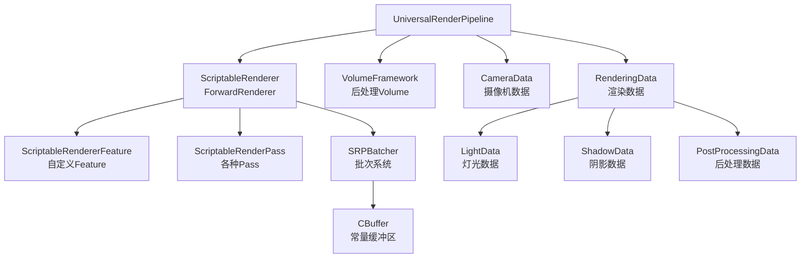

---

## 2. 核心类结构

### 2.1 类继承关系

#### 2.1.1 管线资产层（Asset）

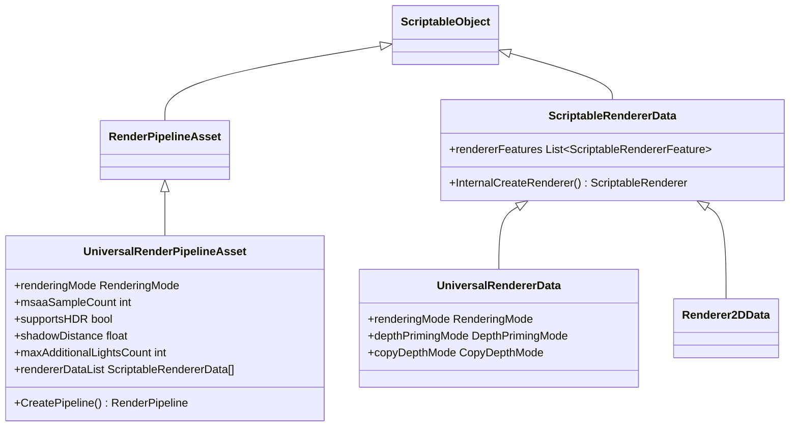

#### 2.1.2 管线实例层（Pipeline / Renderer）

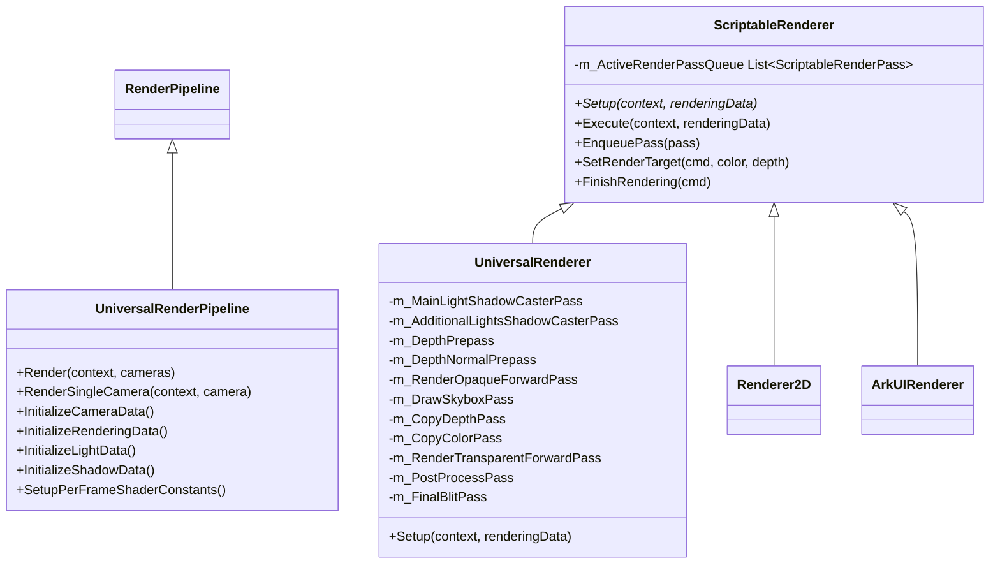

#### 2.1.3 渲染 Pass 层

```mermaid
classDiagram
    ScriptableRenderPass <|-- DrawObjectsPass
    ScriptableRenderPass <|-- MainLightShadowCasterPass
    ScriptableRenderPass <|-- AdditionalLightsShadowCasterPass
    ScriptableRenderPass <|-- DepthOnlyPass
    ScriptableRenderPass <|-- DepthNormalOnlyPass
    ScriptableRenderPass <|-- PostProcessPass
    ScriptableRenderPass <|-- FinalBlitPass
    ScriptableRenderPass <|-- CopyDepthPass
    ScriptableRenderPass <|-- CopyColorPass
    ScriptableRenderPass <|-- DrawSkyboxPass
    ScriptableRenderPass <|-- ScreenSpaceShadowResolvePass
    ScriptableRenderPass <|-- ColorGradingLutPass
    ScriptableRenderPass <|-- InvokeOnRenderObjectCallbackPass

    class ScriptableRenderPass {
        +renderPassEvent RenderPassEvent
        +colorAttachments RTHandle[]
        +depthAttachment RTHandle
        +Configure(cmd, descriptor)*
        +Execute(context, renderingData)*
        +FrameCleanup(cmd)
        +OnCameraSetup(cmd, renderingData)
        +OnCameraCleanup(cmd)
    }
    class DrawObjectsPass {
        +m_FilteringSettings FilteringSettings
        +m_RenderStateBlock RenderStateBlock
        +m_ShaderTagIdList List~ShaderTagId~
        +Execute(context, renderingData)
    }
    class MainLightShadowCasterPass {
        +m_ShadowmapTexture RTHandle
        +m_MaxShadowDistanceSq float
        +Setup(renderingData) bool
        +Execute(context, renderingData)
    }
    class PostProcessPass {
        +m_Materials MaterialLibrary
        +m_Bloom Bloom
        +m_ColorAdjustments ColorAdjustments
        +m_Tonemapping Tonemapping
        +RenderPostProcessingEffects()
    }
```

#### 2.1.4 Feature 层

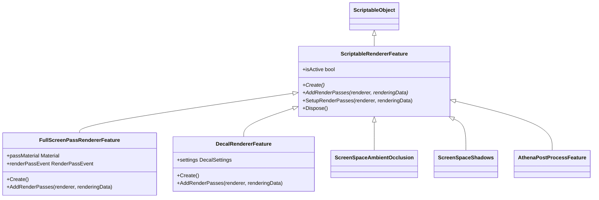

#### 2.1.5 数据结构层（Data）

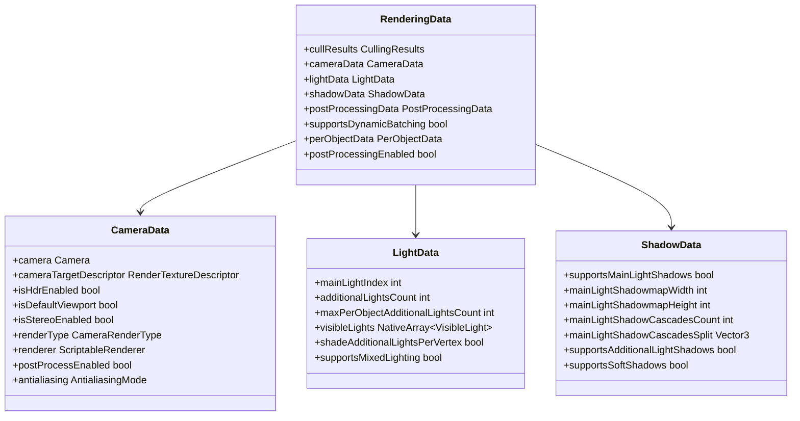

#### 2.1.6 完整层级总览

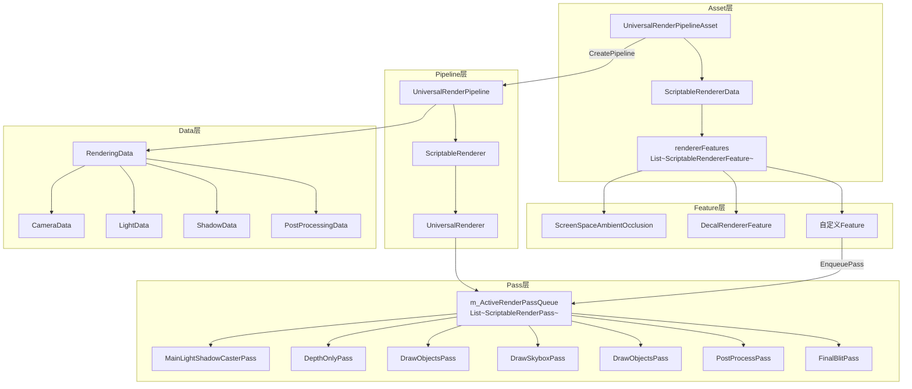

### 2.2 RenderingData 数据结构

```csharp
public struct RenderingData {
    public CullingResults cullResults;       // 裁剪结果
    public CameraData cameraData;            // 摄像机数据
    public LightData lightData;              // 灯光数据
    public ShadowData shadowData;            // 阴影数据
    public PostProcessingData postProcessingData; // 后处理数据
    public bool supportsDynamicBatching;     // 是否支持动态合批
    public PerObjectData perObjectData;      // 每物体数据
    public bool postProcessingEnabled;       // 后处理开关
}
```

---

## 3. 完整调用流程

### 3.1 帧渲染主流程

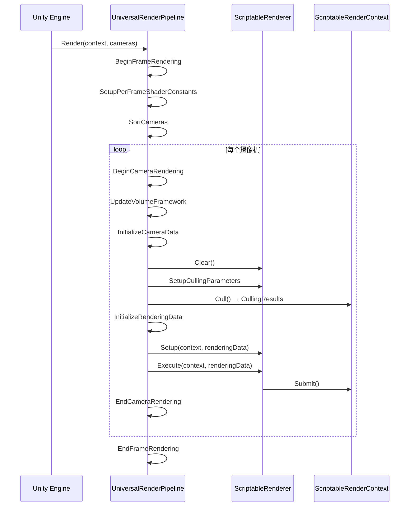

### 3.2 ScriptableRenderer.Execute 详细流程

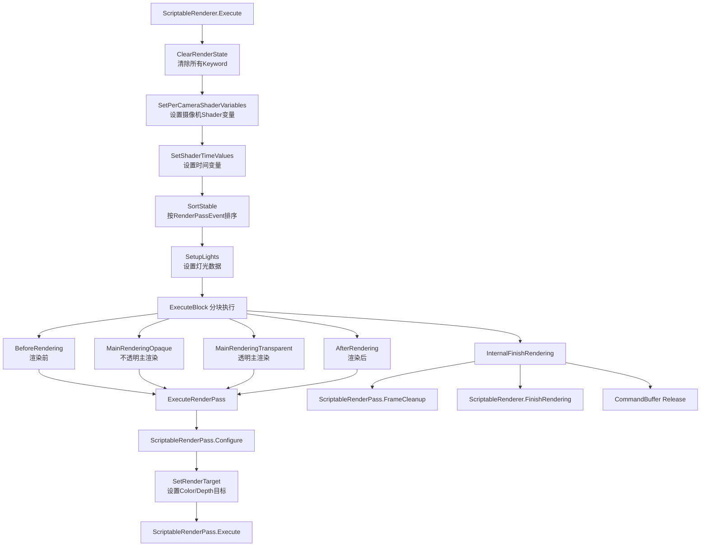

### 3.3 ForwardRenderer.Setup Pass 入队顺序

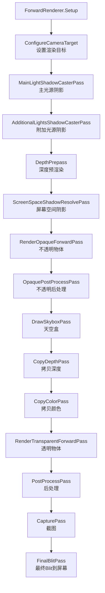

### 3.4 ClearRenderState 清除的 Keyword

```csharp
cmd.DisableShaderKeyword(ShaderKeywordStrings.MainLightShadows);
cmd.DisableShaderKeyword(ShaderKeywordStrings.MainLightShadowCascades);
cmd.DisableShaderKeyword(ShaderKeywordStrings.AdditionalLightsVertex);
cmd.DisableShaderKeyword(ShaderKeywordStrings.AdditionalLightsPixel);
cmd.DisableShaderKeyword(ShaderKeywordStrings.AdditionalLightShadows);
cmd.DisableShaderKeyword(ShaderKeywordStrings.SoftShadows);
cmd.DisableShaderKeyword(ShaderKeywordStrings.MixedLightingSubtractive);
```

---

## 4. Pass 渲染顺序详解

### 4.1 完整 Pass 执行顺序（23步）

| 步骤 | Pass 名称                           | 说明                                                   |
| ---- | ----------------------------------- | ------------------------------------------------------ |
| 1    | SetupPerObjectLightIndices          | 设置每个物体的灯光索引                                 |
| 2    | CreateLightweightRenderTexturesPass | 创建 Color RT + Depth RT                               |
| 3    | IBeforeRender                       | 开发者自定义渲染前行为                                 |
| 4    | MainLightShadowCasterPass           | 主光源阴影（ShadowCaster Pass）                        |
| 5    | AdditionalLightsShadowCasterPass    | 附加光源阴影                                           |
| 6    | SetupCameraPropertiesPass           | 设置摄像机矩阵/视口/时间等参数                         |
| 7    | DepthOnlyPass                       | 深度预渲染 → `_CameraDepthTexture`                     |
| 8    | IAfterDepthPrePass                  | 开发者自定义深度处理                                   |
| 9    | ScreenSpaceShadowResolvePass        | 屏幕空间阴影合并                                       |
| 10   | LightWeightConstantsPass            | 设置渲染常量                                           |
| 11   | RenderOpaqueForwardPass             | 渲染不透明物体（LightweightForward / SRPDefaultUnlit） |
| 12   | IAfterOpaquePass                    | 开发者自定义不透明后行为                               |
| 13   | OpaquePostProcessPass               | 不透明物体后处理                                       |
| 14   | IAfterOpaquePostProcess             | 开发者自定义                                           |
| 15   | DrawSkyboxPass                      | 渲染天空盒                                             |
| 16   | IAfterSkyboxPass                    | 开发者自定义天空盒后行为                               |
| 17   | CopyDepthPass                       | 拷贝深度 → `_CameraDepthAttachment`                    |
| 18   | CopyColorPass                       | 拷贝颜色 → `_CameraOpaqueTexture`                      |
| 19   | RenderTransparentForwardPass        | 渲染透明物体                                           |
| 20   | IAfterTransparentPass               | 开发者自定义透明后行为                                 |
| 21   | TransparentPostProcessPass          | 透明物体后处理                                         |
| 22   | FinalBlitPass                       | 将 Color RT Blit 到屏幕                                |
| 23   | IAfterRender                        | 开发者自定义渲染后行为                                 |

### 4.2 RenderPassEvent 枚举顺序

```csharp
// Pass 按此顺序执行（数值越小越早执行）
BeforeRendering = 0
BeforeRenderingShadows = 50
AfterRenderingShadows = 100
BeforeRenderingPrePasses = 150
AfterRenderingPrePasses = 200
BeforeRenderingGbuffer = 210
AfterRenderingGbuffer = 220
BeforeRenderingDeferredLights = 230
AfterRenderingDeferredLights = 240
BeforeRenderingOpaques = 250
AfterRenderingOpaques = 300
BeforeRenderingSkybox = 350
AfterRenderingSkybox = 400
BeforeRenderingTransparents = 450
AfterRenderingTransparents = 500
BeforeRenderingPostProcessing = 550
AfterRenderingPostProcessing = 600
AfterRendering = 1000
```

### 4.3 自定义 ScriptableRendererFeature

```csharp
public class AthenaPostProcessFeature : ScriptableRendererFeature {
    public override void Create() {
        // 创建自定义 Pass
        m_Pass = new MyCustomPass();
        m_Pass.renderPassEvent = RenderPassEvent.AfterRenderingTransparents;
    }

    public override void AddRenderPasses(ScriptableRenderer renderer, ref RenderingData renderingData) {
        renderer.EnqueuePass(m_Pass);
    }
}
```

### 4.4 自定义 ScriptableRenderer（UI 渲染示例）

```csharp
class ArkUIRenderer : ScriptableRenderer {
    public override void Setup(ScriptableRenderContext context, ref RenderingData renderingData) {
        EnqueuePass(m_RenderTransparentForwardPass);
        EnqueuePass(m_OnRenderObjectCallbackPass);
        m_FinalBlitPass.Setup(cameraTargetDescriptor);
        EnqueuePass(m_FinalBlitPass);
    }
}
```

---

## 5. SRP Batcher 与批次系统

### 5.1 StandardBatch vs SRPBatcher 对比

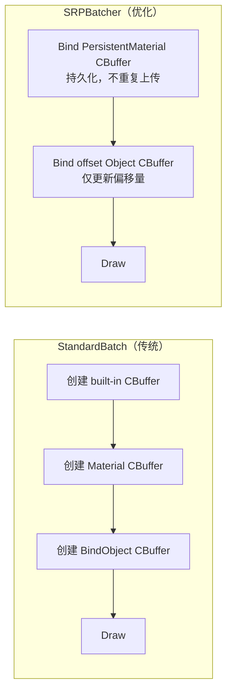

| 特性         | StandardBatch        | SRPBatcher                       |
| ------------ | -------------------- | -------------------------------- |
| 材质数据上传 | 每次 Draw 都上传     | 持久化存储在 GPU，仅变化时更新   |
| 每物体数据   | 每次 Draw 都上传     | 专用大型 GPU CBuffer，仅更新偏移 |
| 合批条件     | 相同材质 + 相同 Mesh | 相同 Shader 变体（材质可不同）   |
| 性能         | 材质越多越慢         | 大量不同材质时性能优势明显       |

### 5.2 SRPBatcher 打断合批的原因

```
kSRPBatchBreakDifferentShader          // Shader 不同
kSRPBatchBreakCauseMultiPassShader     // 多 Pass Shader
kSRPBatchkeywordsChange                // Keyword 变化
kSRPBatchEndOfBatchFlush               // 批次结束强制 Flush
kSRPBatchNotCompatibleNode             // 节点不兼容
kSRPBatchMaterialNeedDeviceStateChange // 材质需要改变设备状态
kSRPBatchFirstCall                     // 第一次调用
kSRPBatchMaterialBufferOverride        // 材质 Buffer 被覆盖
```

### 5.3 SRPBatcher 兼容条件

```
✅ 支持 SRPBatcher 的条件：
  - Mesh / SkinnedMesh 渲染器
  - Shader 兼容 SRP Batcher（在 Shader Inspector 中可查看）
  - 对象不使用 MaterialPropertyBlock

❌ 不支持 SRPBatcher 的情况：
  - 使用 MaterialPropertyBlock
  - 多 Pass Shader
  - 不兼容的 Shader 变体
```

### 5.4 RenderLoopNewBatcher.Draw 流程

```
RenderLoopNewBatcher.Draw
    → ObjectData 不一致 → Flush（提交当前批次）
    → 填充 Buffer（写入 CBuffer 数据）
    → SRPBatcher.Flush
        → 填充 PersistentMaterial CBuffer
        → 填充 PerObject CBuffer（偏移量）
        → 提交 DrawCall
```

### 5.5 SRPBatcher 完整提交流程

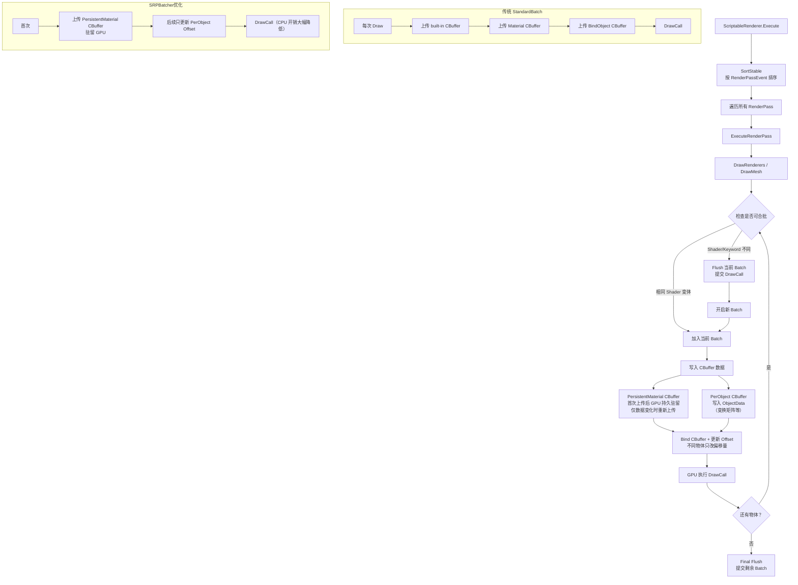

### 5.6 SRPBatcher 内存布局

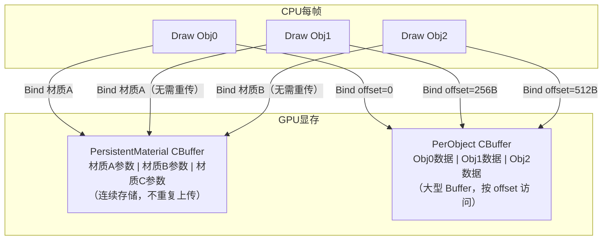

> **核心优化点**：传统管线每次 DrawCall 都要上传材质数据；SRPBatcher 将材质数据持久化在 GPU，CPU 只需更新 PerObject 的偏移量，大幅减少 CPU→GPU 数据传输带宽。

---

## 6. CBuffer 与数据传递

### 6.1 URP 内置 CBuffer 分类

| CBuffer 名称       | 更新频率     | 包含数据                       |
| ------------------ | ------------ | ------------------------------ |
| `UnityPerFrame`    | 每帧一次     | 时间、全局光照                 |
| `UnityPerCamera`   | 每摄像机一次 | 视图矩阵、投影矩阵、摄像机位置 |
| `UnityPerDraw`     | 每 DrawCall  | 物体变换矩阵（M矩阵）          |
| `UnityPerMaterial` | 材质变化时   | 材质参数（颜色、贴图等）       |
| `_LightBuffer`     | 每帧/摄像机  | 灯光颜色、方向、衰减           |

### 6.2 Shader 端 CBuffer 声明

```hlsl
// 每帧数据
CBUFFER_START(UnityPerFrame)
    float4 _Time;
    float4 _SinTime;
    float4 _CosTime;
CBUFFER_END

// 每摄像机数据
CBUFFER_START(UnityPerCamera)
    float4x4 _ViewMatrix;
    float4x4 _ProjectionMatrix;
    float3 _WorldSpaceCameraPos;
CBUFFER_END

// 每材质数据（SRPBatcher 兼容必须放在此块）
CBUFFER_START(UnityPerMaterial)
    float4 _BaseColor;
    float _Glossiness;
    float _Metallic;
CBUFFER_END
```

### 6.3 灯光 CBuffer 数据

```hlsl
// 主光源
float4 _MainLightPosition;    // xyz: 方向, w: 1(平行光)/0(点光)
float4 _MainLightColor;       // rgb: 颜色, a: 强度

// 附加光源（移动端）
#define MAX_VISIBLE_LIGHTS 32
float4 _AdditionalLightsPosition[MAX_VISIBLE_LIGHTS];
half4  _AdditionalLightsColor[MAX_VISIBLE_LIGHTS];
half4  _AdditionalLightsAttenuation[MAX_VISIBLE_LIGHTS];
half4  _AdditionalLightsSpotDir[MAX_VISIBLE_LIGHTS];
half4  _AdditionalLightsOcclusionProbes[MAX_VISIBLE_LIGHTS];
```

### 6.4 Forward+ 使用 StructuredBuffer（PC/主机）

```csharp
// C# 侧
NativeArray<ShaderInput.LightData> lightDataArray;
// 使用 StructuredBuffer 替代数组，支持更多光源
StructuredBuffer<LightData> _AdditionalLightsBuffer;
StructuredBuffer<int> _AdditionalLightsIndices;

// 填充数据
CullingResults.FillLightAndReflectionProbeIndices(buffer);
```

### 6.5 Forward+ ZBin 与 TileMask Buffer

```csharp
// ZBin：深度分区，用于快速光源剔除
m_ZBins = new NativeArray<uint>(UniversalRenderPipeline.maxZBinWords, Allocator.Persistent);
m_ZBinsBuffer = new GraphicsBuffer(
    GraphicsBuffer.Target.Constant,
    UniversalRenderPipeline.maxZBinWords / 4,
    UnsafeUtility.SizeOf<float4>());

// TileMask：每个 Tile 的光源掩码
m_TileMasks = new NativeArray<uint>(UniversalRenderPipeline.maxTileWords, Allocator.Persistent);
m_TileMasksBuffer = new GraphicsBuffer(
    GraphicsBuffer.Target.Constant,
    UniversalRenderPipeline.maxTileWords / 4,
    UnsafeUtility.SizeOf<float4>());
```

### 6.6 CBuffer 与 UniformBuffer 原理详解

#### 6.6.1 概念对应关系

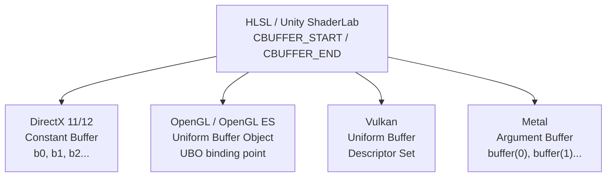

> Unity 通过 `CBUFFER_START/CBUFFER_END` 宏统一抽象，编译时自动映射到各平台实现，开发者无需关心底层差异。

#### 6.6.2 CBuffer vs UniformBuffer 对比

| 特性            | CBuffer（DirectX）           | UniformBuffer / UBO（OpenGL/Vulkan）    |
| --------------- | ---------------------------- | --------------------------------------- |
| 命名            | Constant Buffer              | Uniform Buffer Object (UBO)             |
| 绑定方式        | 寄存器槽 `b0~b13`            | Binding Point（0, 1, 2...）             |
| 最大大小        | 64KB（DX11）/ 无限制（DX12） | 16KB（最低保证）/ 通常 64KB+            |
| 数据对齐        | 16字节对齐（float4 边界）    | std140 / std430 布局规则                |
| 更新方式        | `UpdateSubresource` / `Map`  | `glBufferSubData` / `vkCmdUpdateBuffer` |
| GPU 缓存        | 专用常量缓存（L1 Cache）     | 通用显存，部分平台有专用缓存            |
| SRPBatcher 支持 | ✅ 持久化 CBuffer             | ✅ 持久化 UBO                            |

#### 6.6.3 内存对齐规则（std140 / HLSL）

```hlsl
// ⚠️ HLSL CBuffer 对齐规则：每个变量不能跨 float4（16字节）边界

// ❌ 错误示例：float3 + float 会被编译器自动填充，但手动排列可能出错
CBUFFER_START(UnityPerMaterial)
    float3 _Color;   // 占 12 字节
    float  _Alpha;   // 紧接在后，共 16 字节 ✅
    float  _Value1;  // 新的 float4 起始
    float  _Value2;
    float  _Value3;
    // 此处有 4 字节隐式 padding！
    float4 _NextVec; // 下一个 float4
CBUFFER_END

// ✅ 推荐写法：手动补齐，避免隐式 padding
CBUFFER_START(UnityPerMaterial)
    float4 _ColorAlpha;   // xyz=Color, w=Alpha
    float4 _Values;       // xyzw 全部使用
CBUFFER_END
```

```
std140 对齐规则（OpenGL UBO）：
  float        → 4 字节对齐
  vec2         → 8 字节对齐
  vec3 / vec4  → 16 字节对齐
  mat4         → 16 字节对齐（每列视为 vec4）
  数组元素      → 每个元素强制 16 字节对齐（即使是 float）

HLSL CBuffer 规则：
  - 变量不能跨 16 字节（float4）边界
  - 数组元素每个占 16 字节（与 std140 一致）
  - 结构体内部按成员最大对齐
```

#### 6.6.4 CBuffer 更新流程

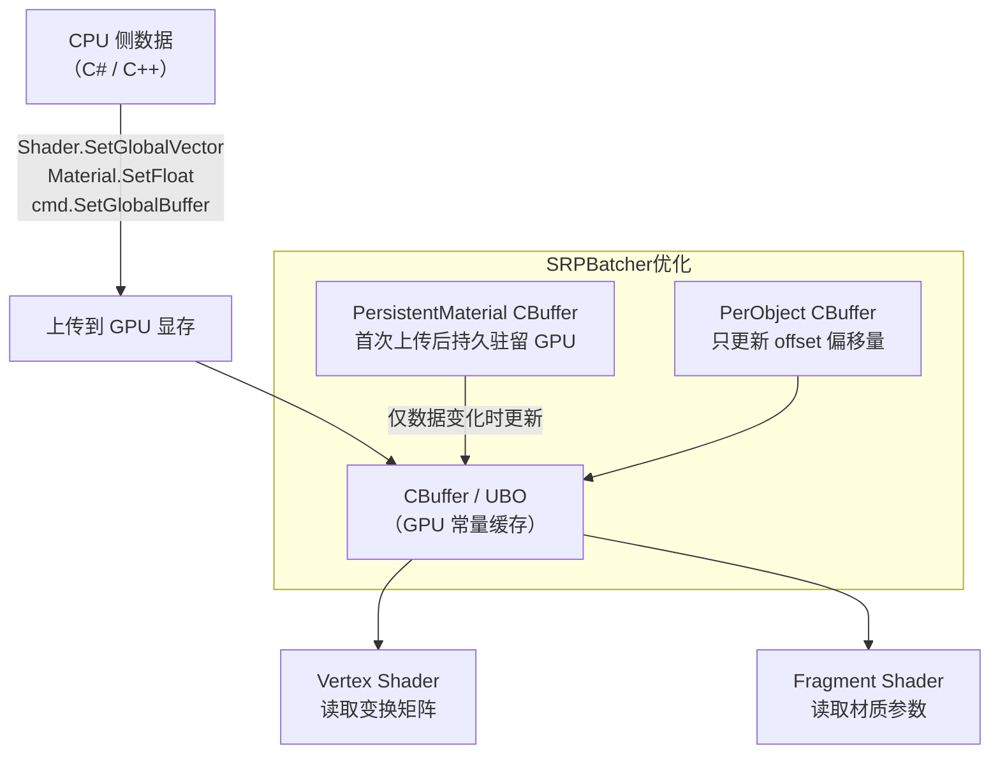

#### 6.6.5 各平台 CBuffer 绑定槽位

```hlsl
// DirectX：使用寄存器槽 b0~b13
CBUFFER_START(UnityPerFrame)    // → register(b0)
CBUFFER_START(UnityPerCamera)   // → register(b1)
CBUFFER_START(UnityPerDraw)     // → register(b2)
CBUFFER_START(UnityPerMaterial) // → register(b3)

// OpenGL / Vulkan：使用 Binding Point
layout(std140, binding = 0) uniform UnityPerFrame { ... };
layout(std140, binding = 1) uniform UnityPerCamera { ... };
layout(std140, binding = 2) uniform UnityPerDraw { ... };
layout(std140, binding = 3) uniform UnityPerMaterial { ... };

// Metal：使用 buffer 索引
// vertex shader: buffer(0), buffer(1)...
// Unity 自动处理，开发者无需手动指定
```

#### 6.6.6 CBuffer 大小限制与最佳实践

```
各平台 CBuffer 大小限制：
  DirectX 11：单个 CBuffer 最大 64KB（4096 个 float4）
  DirectX 12：无硬性限制，但建议 < 64KB
  OpenGL ES：最低保证 16KB，通常 64KB
  Vulkan：Push Constants 最大 128~256 字节（极小数据用）
           Uniform Buffer 通常 64KB+
  Metal：Argument Buffer 无严格限制

最佳实践：
  ✅ 将高频更新数据（每帧/每摄像机）与低频数据（材质）分开放不同 CBuffer
  ✅ 使用 float4 对齐，避免隐式 padding 浪费空间
  ✅ 大量只读数据（灯光列表）使用 StructuredBuffer 而非 CBuffer
  ✅ 极少量高频数据（< 128字节）考虑 Push Constants（Vulkan）
  ❌ 避免在单个 CBuffer 中混合不同更新频率的数据
  ❌ 避免 CBuffer 超过 64KB
```

#### 6.6.7 Push Constants（Vulkan 特有）

```hlsl
// Vulkan Push Constants：极低延迟的小数据传递（< 128 字节）
// 适合每 DrawCall 变化的少量数据（如物体 ID、材质索引）

// Vulkan GLSL 写法
layout(push_constant) uniform PushConstants {
    mat4 modelMatrix;   // 64 字节
    int  materialIndex; // 4 字节
} pc;

// Unity 中通过 SRPBatcher 的 PerObject CBuffer 实现类似效果
// 不需要手动使用 Push Constants
```

---

## 7. 多光源系统（Forward+）

### 7.1 Forward+ 工作原理

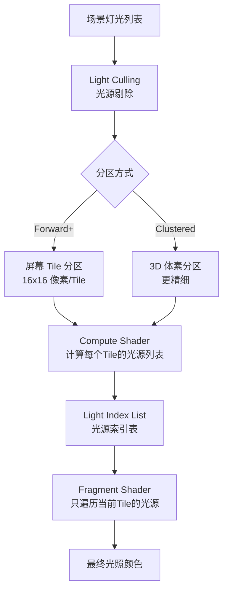

### 7.1.1 Forward vs Deferred vs Forward+ 对比

```mermaid
graph TD
    subgraph Forward传统
        F1["每个物体"] --> F2["遍历所有灯光\nO(物体数 × 灯光数)"]
        F2 --> F3["灯光越多越慢"]
    end

    subgraph Deferred延迟渲染
        D1["GBuffer Pass\n写入法线/颜色/深度"] --> D2["Lighting Pass\n每个灯光一个 DrawCall"]
        D2 --> D3["带宽消耗大\n不支持 MSAA"]
    end

    subgraph ForwardPlus
        P1["Depth Prepass\n渲染所有不透明物体深度\n输出 _CameraDepthTexture"] --> P2["ZBin 构建\n将深度范围划分为 N 个 Bin\n每个 Bin 记录覆盖的灯光范围"]
        P2 --> P3["Tile 光源剔除\nCompute Shader 并行执行\n屏幕划分为 16×16 像素的 Tile"]
        P3 --> P4["Forward Shading Pass\n渲染不透明物体"]
        P4 --> P5["Fragment Shader\n读取当前像素所在 Tile\n只遍历该 Tile 的灯光列表"]
        P5 --> P6["支持 MSAA\n带宽低于 Deferred"]
    end
```

### 7.1.2 Forward+ 完整渲染流程

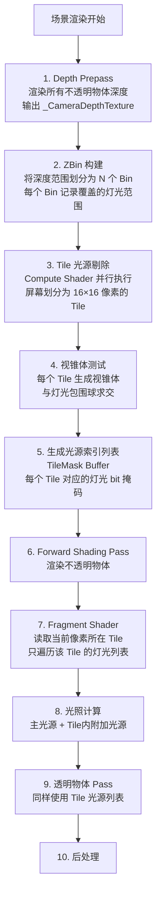

### 7.1.3 ZBin 深度分区原理

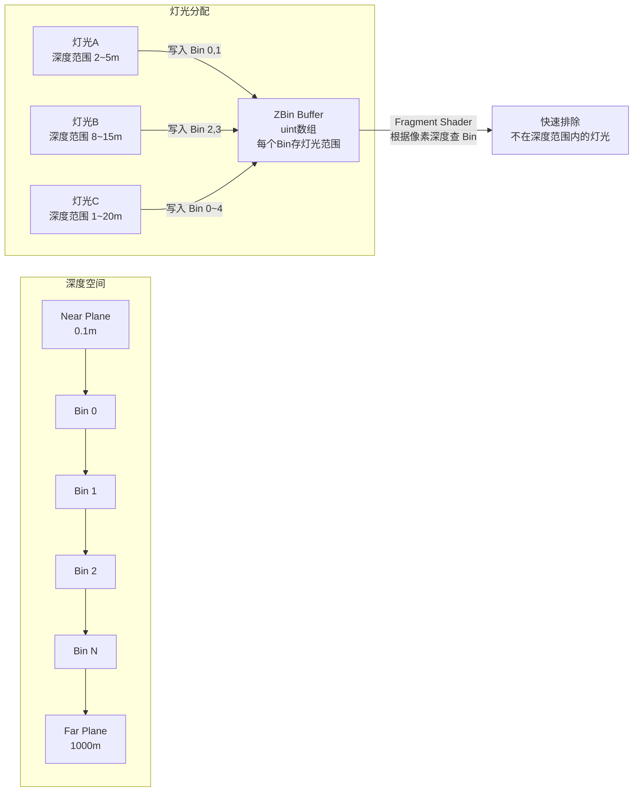

> **ZBin 作用**：在 Tile 剔除之前先用深度快速过滤灯光，减少 Compute Shader 的计算量。像素深度落在某个 Bin，只需检查该 Bin 内的灯光，大幅减少无效光照计算。

### 7.1.4 TileMask Buffer 结构

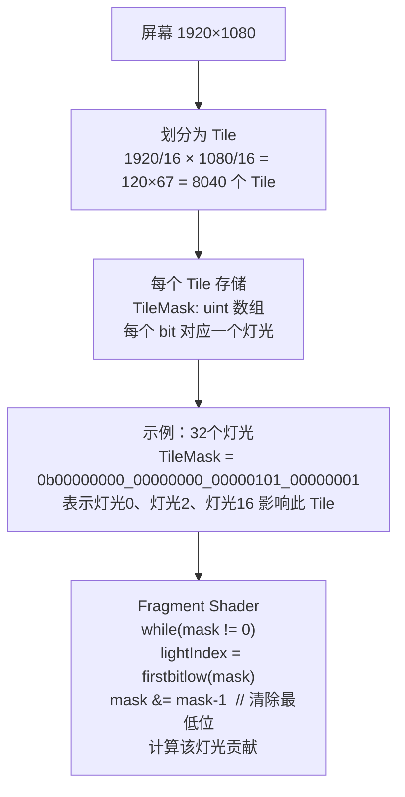

### 7.2 灯光数量配置

```
每个物体：
  - 1 个主方向光（MainLight）
  - 最多 4 个附加光（AdditionalLights，逐像素）
  - 超出部分降级为逐顶点光

每个摄像机：
  - 最多 16 个可见光（默认）
  - 修改后需重启引擎生效

Shader 宏定义：
  #define MAX_VISIBLE_LIGHTS 4   // 移动端
  #define MAX_VISIBLE_LIGHTS 32  // PC/主机
```

### 7.3 灯光 Keyword 设置

| Keyword                       | 含义                       |
| ----------------------------- | -------------------------- |
| `_ADDITIONAL_LIGHTS_VERTEX`   | 附加光源使用顶点着色器处理 |
| `_ADDITIONAL_LIGHTS`          | 附加光源使用片元着色器处理 |
| `_MIXED_LIGHTING_SUBTRACTIVE` | 混合灯光（减法模式）       |
| `_MAIN_LIGHT_SHADOWS`         | 主光源阴影                 |
| `_MAIN_LIGHT_SHADOWS_CASCADE` | 主光源级联阴影             |
| `_ADDITIONAL_LIGHT_SHADOWS`   | 附加光源阴影               |
| `_SOFT_SHADOWS`               | 软阴影                     |

### 7.4 Shader 端多光源遍历

```hlsl
#include "Packages/com.unity.render-pipelines.universal/ShaderLibrary/Lighting.hlsl"

float4 frag(Varyings input) : SV_Target {
    float3 color = float3(0, 0, 0);

    // 主光源
    Light mainLight = GetMainLight();
    color += LightingLambert(mainLight.color, mainLight.direction, input.normalWS);

    // 附加光源
    int additionalLightCount = GetAdditionalLightsCount();
    for (int i = 0; i < additionalLightCount; ++i) {
        Light light = GetAdditionalLight(i, input.positionWS);
        color += LightingLambert(light.color * light.distanceAttenuation,
                                  light.direction, input.normalWS);
    }
    return float4(color, 1.0);
}
```

### 7.5 C# 配置 Forward+

```csharp
var urpAsset = (UniversalRenderPipelineAsset)GraphicsSettings.renderPipelineAsset;
urpAsset.supportsAdditionalLights = true;
urpAsset.maxAdditionalLightsCount = 8;
urpAsset.renderingMode = RenderingMode.ForwardPlus; // Unity 2022.2+
```

---

## 8. 注意事项

### 8.1 SRPBatcher 兼容性

> ⚠️ **MaterialPropertyBlock 会破坏 SRPBatcher**
> - 使用 `MaterialPropertyBlock` 设置属性时，SRPBatcher 自动失效
> - 替代方案：将属性写入 `CBUFFER_START(UnityPerMaterial)` 块

```csharp
// ❌ 破坏 SRPBatcher
var mpb = new MaterialPropertyBlock();
mpb.SetColor("_Color", Color.red);
renderer.SetPropertyBlock(mpb);

// ✅ 兼容 SRPBatcher（通过材质实例）
renderer.material.SetColor("_Color", Color.red);
```

### 8.2 颜色空间与 Gamma 校正

> ⚠️ **HDR 开启时颜色格式变化**
> - 开启 HDR：颜色格式为 `B10G11R11_UFloatPack32`
> - 关闭 HDR：颜色格式为 `R8G8B8A8_SRGB`
> - UI 使用线性空间时，Blit 到 FrameBuffer 会自动做 Linear→SRGB 转换
> - 如需关闭 Gamma 校正，需修改源码关闭 RenderTexture GammaCorrection

### 8.3 FrameDebug 调试

> ⚠️ **FrameDebug 不显示 RenderTarget 名称**
> - 原因：变量用函数返回值，FrameDebug 无法识别名称
> - 解决：将 RT 名称改为常量字符串

### 8.4 灯光数量限制

> ⚠️ **修改可见光数量需重启引擎**
> - 默认每摄像机最多 16 个可见光
> - 修改 `MAX_VISIBLE_LIGHTS` 宏后必须重启 Unity 才能生效
> - 移动端建议保持 4 个逐像素光，超出部分用逐顶点光

```hlsl
// Shader 中的灯光数量宏
Shaders stripping
#define MAX_VISIBLE_LIGHTS 4

CBUFFER_START(_LightBuffer)
    float4 _VisibleLightColors[MAX_VISIBLE_LIGHTS];
    float4 _VisibleLightDirections[MAX_VISIBLE_LIGHTS];
CBUFFER_END
```

### 8.5 Camera Stack 注意事项

> ⚠️ **堆叠摄像机（Camera Stack）的渲染目标**
> - Base Camera：创建 `CreateCameraRenderTarget`，设置 AA
> - Overlay Camera：复用 Base Camera 的 Color/Depth Attachment
> - Stack 摄像机最后压入 `FinalBlitPass`

```csharp
// Base Camera
case CameraRenderType.Base:
    CreateCameraRenderTarget(context, ref cameraData);
    SetupBackbufferFormat(msaaSamples, stereoEnabled);
    break;

// Overlay Camera
default:
    m_ActiveCameraColorAttachment = m_CameraColorAttachment;
    m_ActiveCameraDepthAttachment = m_CameraDepthAttachment;
    break;
```

### 8.6 Volume 性能问题

> ⚠️ **多个 Volume 混合开销较大**
> - 每帧 `UpdateVolumeFramework` 会遍历所有 Volume 并混合参数
> - 优化：减少 Volume 数量，合并相同区域的 Volume
> - 对于静态场景，可以缓存 Volume 混合结果

### 8.7 资源冗余问题

> ⚠️ **ScriptableRendererData 更新问题**
> - 在 `ScriptableRendererData` 增加 Override 数组覆盖数据
> - 避免运行时频繁修改 RendererData，会触发管线重建

---

## 9. 优化方案

### 9.1 SRP Batcher 最大化利用

```
优化策略：
1. 所有材质参数放入 CBUFFER_START(UnityPerMaterial) 块
2. 避免使用 MaterialPropertyBlock（改用材质实例）
3. 减少 Shader 变体数量（Shader Stripping）
4. 同一 Shader 的物体尽量连续渲染（减少 Keyword 切换）
```

### 9.2 Shader Stripping（变体裁剪）

```csharp
// 在 IPreprocessShaders 中裁剪不需要的变体
public class ShaderVariantStripper : IPreprocessShaders {
    public void OnProcessShader(Shader shader, ShaderSnippetData snippet,
                                IList<ShaderCompilerData> data) {
        // 移除不需要的平台变体
        for (int i = data.Count - 1; i >= 0; i--) {
            if (data[i].shaderKeywordSet.IsEnabled(keyword_not_needed))
                data.RemoveAt(i);
        }
    }
}
```

### 9.3 渲染目标优化

```
1. 避免不必要的 CopyDepthPass / CopyColorPass
   - 仅在 Shader 中使用 _CameraDepthTexture 时才开启 CopyDepth
   - 仅在 Shader 中使用 _CameraOpaqueTexture 时才开启 CopyColor

2. 使用 MSAA 替代 TAA（移动端）
   - MSAA 在 TBR 架构上几乎免费
   - TAA 需要额外的 RT 和 Blit，移动端开销大

3. 减少 RT 切换
   - 合并相邻 Pass 的 RT（相同 Color/Depth 目标）
   - 使用 SubPass（Vulkan/Metal）合并 Pass
```

### 9.4 后处理优化

```
1. Bloom 优化：
   - 降低 Bloom 迭代次数（Iterations）
   - 使用半分辨率 RT 进行模糊
   - 使用 Mask 限制 Bloom 影响范围（只影响特定物体）

2. Volume 优化：
   - 减少 Volume 数量，合并相邻 Volume
   - 静态场景缓存 Volume 混合结果
   - 使用 Volume Layer Mask 限制影响范围

3. 后处理 Pass 合并：
   - 将多个后处理效果合并到一个 Pass（UberPost）
   - 避免每个效果单独 Blit
```

### 9.5 灯光优化

```
1. 减少逐像素光源数量（移动端保持 ≤ 4）
2. 使用烘焙光照替代动态光（静态场景）
3. 使用 Light Layer 限制灯光影响范围
4. Forward+ 模式下合理设置 Tile 大小
5. 关闭不需要的阴影（Per-Light Shadow 设置）
```

### 9.6 移动端 TBR 优化

```
TBR（Tile-Based Rendering）架构优化：
1. 避免 Framebuffer Fetch 之外的 RT 读取
2. 减少 Depth/Stencil 的 Load/Store 操作
3. 使用 MSAA（TBR 上几乎免费）
4. 避免 Compute Shader 写入 Framebuffer（破坏 TBR 优化）
5. 使用 SubPass 合并 Pass（Vulkan/Metal）
```

---

## 10. 平台适配

### 10.1 各平台渲染 API 对应

| 平台        | 渲染 API           | CBuffer 实现    | 特殊注意                |
| ----------- | ------------------ | --------------- | ----------------------- |
| Windows PC  | DirectX 11/12      | Constant Buffer | 支持 StructuredBuffer   |
| macOS / iOS | Metal              | Argument Buffer | 需要 Metal Shader 编译  |
| Android     | Vulkan / OpenGL ES | Uniform Buffer  | 低端设备用 OpenGL ES    |
| WebGL       | WebGL 2.0          | Uniform Buffer  | 不支持 StructuredBuffer |
| PS5 / Xbox  | GNM / DX12         | Constant Buffer | 主机专用优化            |

### 10.2 CBuffer vs UniformBuffer 平台映射

```
Unity ShaderLab CBUFFER_START/CBUFFER_END
    → DirectX：Constant Buffer (b0, b1, ...)
    → OpenGL：Uniform Buffer Object (UBO)
    → Vulkan：Uniform Buffer / Push Constants
    → Metal：Argument Buffer
（Unity 自动处理平台映射，开发者只需写 CBUFFER 语法）
```

### 10.3 StructuredBuffer 平台支持

```csharp
// 检查是否支持 StructuredBuffer（用于 Forward+ 灯光数据）
bool useStructuredBuffer = SystemInfo.supportsComputeShaders
                        && !Application.isMobilePlatform
                        && SystemInfo.graphicsDeviceType != GraphicsDeviceType.OpenGLES2;

if (useStructuredBuffer) {
    // 使用 StructuredBuffer 传递灯光数据（PC/主机）
    _AdditionalLightsBuffer = new ComputeBuffer(maxLights, stride);
} else {
    // 使用数组传递灯光数据（移动端/WebGL）
    Shader.SetGlobalVectorArray("_AdditionalLightsPosition", positions);
}
```

### 10.4 HDR 与颜色格式

```csharp
// 根据平台选择颜色格式
RenderTextureFormat colorFormat;
if (cameraData.isHdrEnabled) {
    // HDR 格式
    colorFormat = SystemInfo.SupportsRenderTextureFormat(RenderTextureFormat.ARGBHalf)
        ? RenderTextureFormat.ARGBHalf      // 移动端
        : RenderTextureFormat.DefaultHDR;   // PC（B10G11R11）
} else {
    colorFormat = RenderTextureFormat.Default; // R8G8B8A8_SRGB
}
```

### 10.5 质量分级配置

```
高配（PC / 主机）:
  - 渲染模式：Forward+
  - 最大附加光源：8+
  - 阴影：级联阴影（4级）+ 软阴影
  - 后处理：全效果
  - MSAA：4x 或 TAA
  - StructuredBuffer 传递灯光数据

中配（移动高端）:
  - 渲染模式：Forward+
  - 最大附加光源：4
  - 阴影：级联阴影（2级）
  - 后处理：精简效果
  - MSAA：2x

低配（移动低端）:
  - 渲染模式：Forward
  - 最大附加光源：1-2（逐顶点）
  - 阴影：简单阴影或无阴影
  - 后处理：禁用或仅 Bloom
  - 无 MSAA
```

### 10.6 Bloom 后处理适配

```
高端设备：
  - 全分辨率 Bloom
  - 迭代次数：6
  - 高斯模糊

低端设备：
  - 半分辨率 Bloom
  - 迭代次数：3
  - 双线性模糊（更快）
  - 降低 Threshold，减少参与 Bloom 的像素
```

---

## 附录：关键 Shader 全局变量

| 变量名                   | 类型      | 说明                                  |
| ------------------------ | --------- | ------------------------------------- |
| `_CameraDepthTexture`    | Texture2D | 场景深度图（DepthOnly Pass 输出）     |
| `_CameraOpaqueTexture`   | Texture2D | 不透明场景颜色（CopyColor Pass 输出） |
| `_MainLightPosition`     | float4    | 主光源方向/位置                       |
| `_MainLightColor`        | float4    | 主光源颜色                            |
| `_AdditionalLightsCount` | int       | 附加光源数量                          |
| `_Time`                  | float4    | 时间（t/20, t, t*2, t*3）             |
| `_ScreenParams`          | float4    | 屏幕尺寸（w, h, 1+1/w, 1+1/h）        |
| `unity_WorldToLight`     | float4x4  | 世界到灯光空间矩阵                    |
| `unity_LightShadowBias`  | float4    | 阴影偏移参数                          |

---