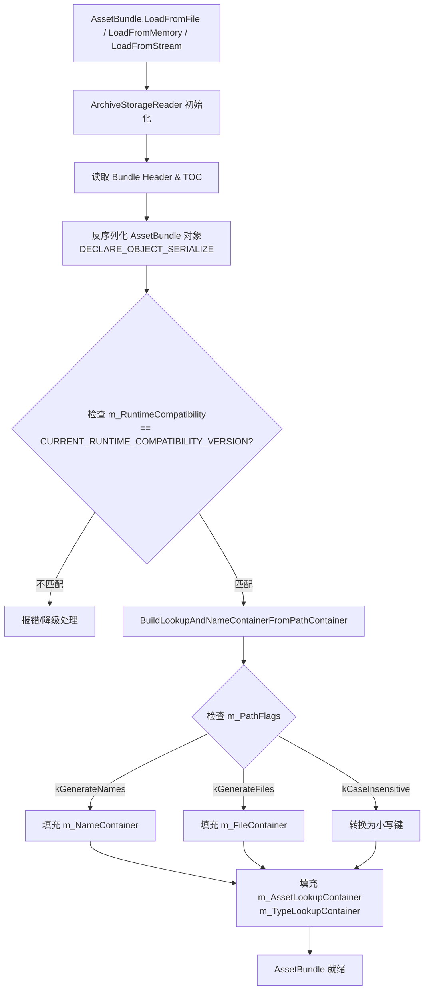
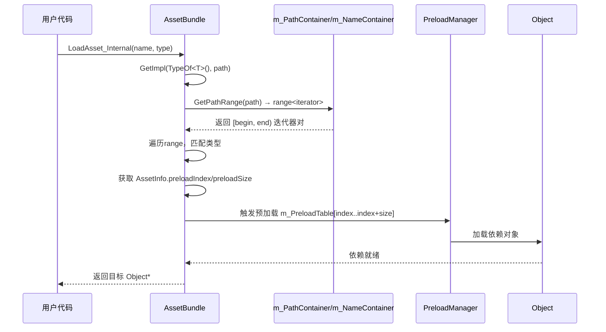
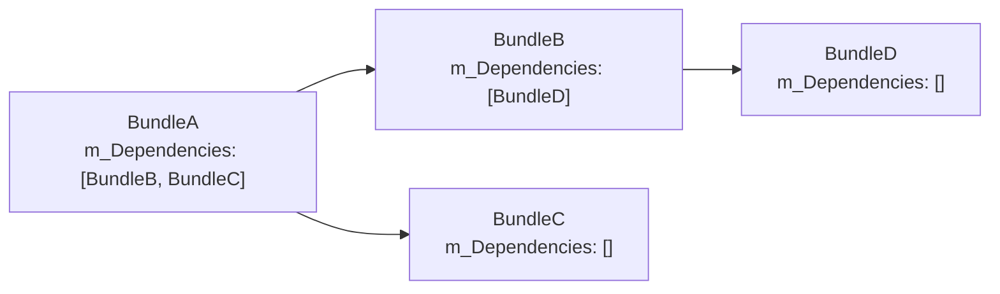
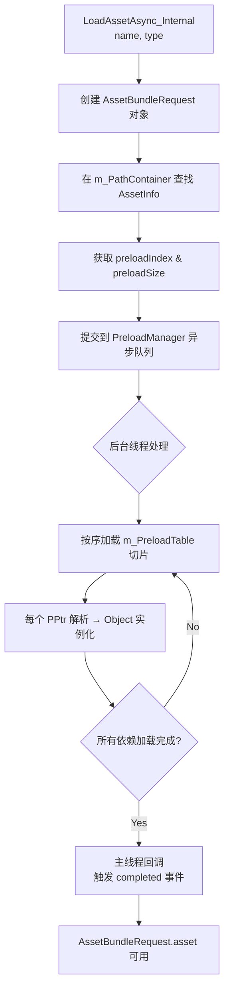
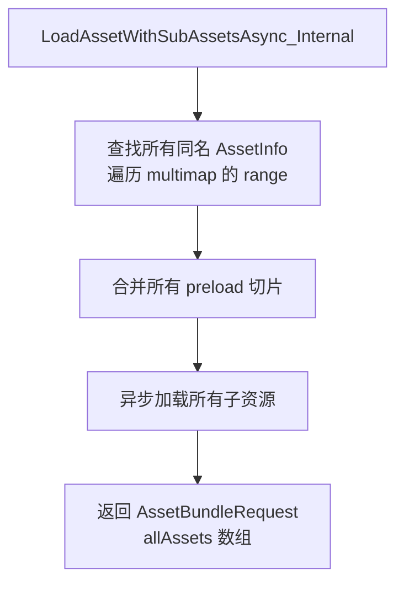
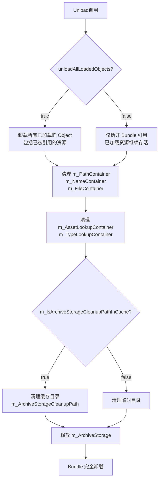
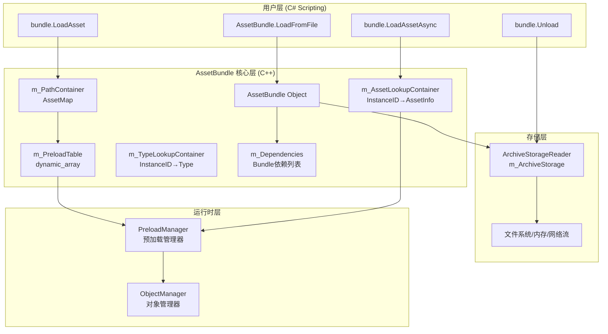

# Unity AssetBundle 底层原理

---

## 1. 核心数据结构

`AssetBundle` 继承自 `NamedObject`，其核心数据结构如下：

```
AssetBundle
├── NamedObject (基类)
│   └── Object (基类)
├── m_MainAsset             : AssetInfo                     // 主资源
├── m_PreloadTable          : dynamic_array<PPtr<Object>>   // 预加载表
├── m_PathContainer         : AssetMap                      // 路径->资源映射
├── m_NameContainer         : AssetMap                      // 名称->资源映射
├── m_FileContainer         : AssetMap                      // 文件->资源映射
├── m_AssetLookupContainer  : AssetLookupMap                // InstanceID->AssetInfo 快速查找
├── m_TypeLookupContainer   : TypeLookupMap                 // InstanceID->Type 快速查找
├── m_ArchiveStorage        : ArchiveStorageReader*         // 文件存储读取器
├── m_Dependencies          : vector<ConstantString>        // 依赖包列表
├── m_SceneHashes           : SceneHashMap                  // 场景路径->内部名称
└── m_PathFlags             : PathFlags                     // 路径标志位
```

---

## 2. 关键数据类型解析

### 2.1 AssetInfo 结构体

```cpp
struct AssetInfo {
    int preloadIndex;   // 预加载表起始索引
    int preloadSize;    // 预加载表条目数量
    PPtr<Object> asset; // 资源的持久化指针
};
```

- `preloadIndex` + `preloadSize` 共同定义了该资源在 `m_PreloadTable` 中的切片范围
- `PPtr<Object>` 是 Unity 的持久化指针，通过 `fileID + pathID` 跨文件引用对象

### 2.2 AssetMap 类型

```cpp
typedef std::multimap<core::string, AssetInfo> AssetMap;
```

使用 `multimap` 允许**同一路径/名称对应多个资源**（如同名的不同类型资源）

### 2.3 PathFlags 标志位

| 标志               | 值    | 含义                         |
| ------------------ | ----- | ---------------------------- |
| `kPathFlagsNone`   | 0     | 无标志                       |
| `kGenerateNames`   | 1<<0  | 加载时生成 `m_NameContainer` |
| `kGenerateFiles`   | 1<<1  | 加载时生成 `m_FileContainer` |
| `kCaseInsensitive` | 1<<2  | 大小写不敏感匹配             |
| `kGenerateAll`     | 0b111 | 生成所有容器                 |

---

## 3. AssetBundle 加载流程



### 3.1 关键步骤说明

**Step 1: ArchiveStorage 初始化**
- `m_ArchiveStorage` 指向 `ArchiveStorageReader`，负责底层文件 I/O
- `m_ArchiveStorageCleanupPath` 记录临时/缓存路径，卸载时清理
- `m_IsArchiveStorageCleanupPathInCache` 区分是否为缓存路径

**Step 2: 版本兼容性检查**
```cpp
CURRENT_RUNTIME_COMPATIBILITY_VERSION = 1
// m_RuntimeCompatibility 必须与此值匹配
```

**Step 3: 构建查找容器**
```cpp
void BuildLookupAndNameContainerFromPathContainer();
// 从 m_PathContainer 派生出其他所有容器
```

---

## 4. 资源查找与加载

### 4.1 同步加载流程



### 4.2 GetImpl 核心逻辑

```cpp
Object* GetImpl(const Unity::Type* type, core::string_ref path) {
    // 1. 在 m_PathContainer 中查找路径范围
    range r = GetPathRange(path);
    // 2. 遍历匹配类型
    for (auto it = r.first; it != r.second; ++it) {
        if (/* type matches */) {
            // 3. 触发预加载
            // 4. 返回 asset.Resolve()
        }
    }
}
```

---

## 5. 预加载机制（Preload Table）

```
m_PreloadTable: [obj0, obj1, obj2, obj3, obj4, obj5, obj6, obj7, ...]
                 ↑                   ↑              ↑
              AssetA                AssetB         AssetC
           index=0,size=3        index=3,size=2  index=5,size=3
```

- 每个 `AssetInfo` 通过 `preloadIndex` 和 `preloadSize` 定义其在预加载表中的**切片**
- 加载某资源时，会**批量加载**该切片内的所有依赖对象
- 这是 Unity 实现**资源依赖自动加载**的核心机制

---

## 6. 文件依赖关系

### 6.1 Bundle 间依赖

```cpp
std::vector<ConstantString> m_Dependencies;
// 记录当前 Bundle 依赖的其他 Bundle 名称
```



**依赖加载规则：**
- 必须先加载所有依赖 Bundle，再加载当前 Bundle
- 通过 `AssetBundleManifest` 在运行时获取依赖列表
- `PPtr<Object>` 跨 Bundle 引用通过 `fileID` 定位到具体 Bundle

### 6.2 Bundle 内依赖（通过 PreloadTable）

```
Asset "Player.prefab"
  └── preloadIndex=0, preloadSize=5
       ├── [0] Mesh "player_body.mesh"
       ├── [1] Texture "player_diffuse.png"
       ├── [2] Material "player_mat.mat"
       ├── [3] Shader "Standard.shader"
       └── [4] AnimationClip "idle.anim"
```

### 6.3 场景资源依赖

```cpp
SceneHashMap m_SceneHashes;
// key:   场景路径 (e.g. "Assets/Scenes/Level1.unity")
// value: 内部哈希名称 (用于 ArchiveStorage 中定位)

bool GetSceneHash(const core::string& scenePath, core::string& sceneHash) const;
```

---

## 7. 异步加载流程

### 7.1 LoadAssetAsync 流程



### 7.2 LoadAssetWithSubAssetsAsync 流程



### 7.3 同步 vs 异步对比

| 特性     | 同步 LoadAsset       | 异步 LoadAssetAsync                       |
| -------- | -------------------- | ----------------------------------------- |
| 调用方式 | `LoadAsset_Internal` | `LoadAssetAsync_Internal`                 |
| 返回类型 | `Object*`            | `ScriptingObjectPtr (AssetBundleRequest)` |
| 线程     | 主线程阻塞           | 后台线程加载                              |
| 帧率影响 | 有卡顿风险           | 分帧加载，平滑                            |
| 完成通知 | 立即返回             | `completed` 回调 / `yield return`         |

---

## 8. 资源管理与卸载

### 8.1 Unload 流程

```cpp
void Unload(bool unloadAllLoadedObjects);
```



### 8.2 GC 与依赖追踪

```cpp
virtual bool ShouldIgnoreInGarbageDependencyTracking() override;
```

- `AssetBundle` 重写此方法，控制是否参与 Unity 的垃圾依赖追踪
- 防止 Bundle 被意外 GC 回收

### 8.3 资源生命周期

```
Bundle加载 → 资源可访问 → Unload(false) → Bundle引用断开，资源仍在内存
                                         → Resources.UnloadUnusedAssets() → 资源被GC
                        → Unload(true)  → 资源立即从内存移除（危险：可能导致引用丢失）
```

---

## 9. 流式场景 AssetBundle

```cpp
bool m_IsStreamedSceneAssetBundle;
bool GetIsStreamedSceneAssetBundle();
dynamic_array<core::string> GetAllScenePaths();
```

- 流式场景 Bundle 与普通资源 Bundle 有不同的加载路径
- 通过 `m_SceneHashes` 映射场景路径到内部存储名称
- 使用 `LoadScene` / `LoadSceneAsync` 而非 `LoadAsset`

---

## 10. 整体架构总结



---

## 11. 关键设计要点总结

| 设计点               | 实现方式                                            | 目的                         |
| -------------------- | --------------------------------------------------- | ---------------------------- |
| 多容器索引           | `PathContainer` + `NameContainer` + `FileContainer` | 支持多种查找方式             |
| 快速 InstanceID 查找 | `AssetLookupMap` + `TypeLookupMap`                  | O(1) 预加载时查找            |
| 预加载切片           | `preloadIndex` + `preloadSize`                      | 精确控制依赖加载范围         |
| 版本兼容             | `m_RuntimeCompatibility`                            | 防止旧 Bundle 在新运行时崩溃 |
| 大小写不敏感         | `kCaseInsensitive` PathFlag                         | 跨平台路径兼容               |
| 延迟容器构建         | `BuildLookupAndNameContainerFromPathContainer`      | 减少加载时内存开销           |
| 缓存路径区分         | `m_IsArchiveStorageCleanupPathInCache`              | 正确清理缓存 vs 临时文件     |

---

*分析基于 Unity 2020.3.38 源码，文件路径：`Modules/AssetBundle/Public/AssetBundle.h`*
---
layout:     post
title:      Asset Bundle Analysis
subtitle:   Asset Bundle Analysis
date:       2023-12-12
author:     kang
header-img: img/post-bg-ocenwar.jpg
catalog: true
tags:
    - 资产管理
---

# Unity AssetBundle 底层原理深度分析

---

## 1. 核心数据结构

`AssetBundle` 继承自 `NamedObject`，其核心数据结构如下：

```
AssetBundle
├── NamedObject (基类)
│   └── Object (基类)
├── m_MainAsset          : AssetInfo        // 主资源
├── m_PreloadTable       : dynamic_array<PPtr<Object>>  // 预加载表
├── m_PathContainer      : AssetMap         // 路径->资源映射
├── m_NameContainer      : AssetMap         // 名称->资源映射
├── m_FileContainer      : AssetMap         // 文件->资源映射
├── m_AssetLookupContainer : AssetLookupMap // InstanceID->AssetInfo 快速查找
├── m_TypeLookupContainer  : TypeLookupMap  // InstanceID->Type 快速查找
├── m_ArchiveStorage     : ArchiveStorageReader*  // 文件存储读取器
├── m_Dependencies       : vector<ConstantString> // 依赖包列表
├── m_SceneHashes        : SceneHashMap     // 场景路径->内部名称
└── m_PathFlags          : PathFlags        // 路径标志位
```

---

## 2. 关键数据类型解析

### 2.1 AssetInfo 结构体

```cpp
struct AssetInfo {
    int preloadIndex;   // 预加载表起始索引
    int preloadSize;    // 预加载表条目数量
    PPtr<Object> asset; // 资源的持久化指针
};
```

- `preloadIndex` + `preloadSize` 共同定义了该资源在 `m_PreloadTable` 中的切片范围
- `PPtr<Object>` 是 Unity 的持久化指针，通过 `fileID + pathID` 跨文件引用对象

### 2.2 AssetMap 类型

```cpp
typedef std::multimap<core::string, AssetInfo> AssetMap;
```

使用 `multimap` 允许**同一路径/名称对应多个资源**（如同名的不同类型资源）

### 2.3 PathFlags 标志位

| 标志               | 值    | 含义                         |
| ------------------ | ----- | ---------------------------- |
| `kPathFlagsNone`   | 0     | 无标志                       |
| `kGenerateNames`   | 1<<0  | 加载时生成 `m_NameContainer` |
| `kGenerateFiles`   | 1<<1  | 加载时生成 `m_FileContainer` |
| `kCaseInsensitive` | 1<<2  | 大小写不敏感匹配             |
| `kGenerateAll`     | 0b111 | 生成所有容器                 |

---

## 3. AssetBundle 加载流程


### 3.1 关键步骤说明

**Step 1: ArchiveStorage 初始化**
- `m_ArchiveStorage` 指向 `ArchiveStorageReader`，负责底层文件 I/O
- `m_ArchiveStorageCleanupPath` 记录临时/缓存路径，卸载时清理
- `m_IsArchiveStorageCleanupPathInCache` 区分是否为缓存路径

**Step 2: 版本兼容性检查**
```cpp
CURRENT_RUNTIME_COMPATIBILITY_VERSION = 1
// m_RuntimeCompatibility 必须与此值匹配
```

**Step 3: 构建查找容器**
```cpp
void BuildLookupAndNameContainerFromPathContainer();
// 从 m_PathContainer 派生出其他所有容器
```

---

## 4. 资源查找与加载

### 4.1 同步加载流程


### 4.2 GetImpl 核心逻辑

```cpp
Object* GetImpl(const Unity::Type* type, core::string_ref path) {
    // 1. 在 m_PathContainer 中查找路径范围
    range r = GetPathRange(path);
    // 2. 遍历匹配类型
    for (auto it = r.first; it != r.second; ++it) {
        if (/* type matches */) {
            // 3. 触发预加载
            // 4. 返回 asset.Resolve()
        }
    }
}
```

---

## 5. 预加载机制（Preload Table）

```
m_PreloadTable: [obj0, obj1, obj2, obj3, obj4, obj5, obj6, obj7, ...]
                 ↑                   ↑              ↑
              AssetA                AssetB         AssetC
           index=0,size=3        index=3,size=2  index=5,size=3
```

- 每个 `AssetInfo` 通过 `preloadIndex` 和 `preloadSize` 定义其在预加载表中的**切片**
- 加载某资源时，会**批量加载**该切片内的所有依赖对象
- 这是 Unity 实现**资源依赖自动加载**的核心机制

---

## 6. 文件依赖关系

### 6.1 Bundle 间依赖

```cpp
std::vector<ConstantString> m_Dependencies;
// 记录当前 Bundle 依赖的其他 Bundle 名称
```


**依赖加载规则：**
- 必须先加载所有依赖 Bundle，再加载当前 Bundle
- 通过 `AssetBundleManifest` 在运行时获取依赖列表
- `PPtr<Object>` 跨 Bundle 引用通过 `fileID` 定位到具体 Bundle

### 6.2 Bundle 内依赖（通过 PreloadTable）

```
Asset "Player.prefab"
  └── preloadIndex=0, preloadSize=5
       ├── [0] Mesh "player_body.mesh"
       ├── [1] Texture "player_diffuse.png"
       ├── [2] Material "player_mat.mat"
       ├── [3] Shader "Standard.shader"
       └── [4] AnimationClip "idle.anim"
```

### 6.3 场景资源依赖

```cpp
SceneHashMap m_SceneHashes;
// key:   场景路径 (e.g. "Assets/Scenes/Level1.unity")
// value: 内部哈希名称 (用于 ArchiveStorage 中定位)

bool GetSceneHash(const core::string& scenePath, core::string& sceneHash) const;
```

---

## 7. 异步加载流程

### 7.1 LoadAssetAsync 流程


### 7.2 LoadAssetWithSubAssetsAsync 流程


### 7.3 同步 vs 异步对比

| 特性     | 同步 LoadAsset       | 异步 LoadAssetAsync                       |
| -------- | -------------------- | ----------------------------------------- |
| 调用方式 | `LoadAsset_Internal` | `LoadAssetAsync_Internal`                 |
| 返回类型 | `Object*`            | `ScriptingObjectPtr (AssetBundleRequest)` |
| 线程     | 主线程阻塞           | 后台线程加载                              |
| 帧率影响 | 有卡顿风险           | 分帧加载，平滑                            |
| 完成通知 | 立即返回             | `completed` 回调 / `yield return`         |

---

## 8. 资源管理与卸载

### 8.1 Unload 流程

```cpp
void Unload(bool unloadAllLoadedObjects);
```


### 8.2 GC 与依赖追踪

```cpp
virtual bool ShouldIgnoreInGarbageDependencyTracking() override;
```

- `AssetBundle` 重写此方法，控制是否参与 Unity 的垃圾依赖追踪
- 防止 Bundle 被意外 GC 回收

### 8.3 资源生命周期

```
Bundle加载 → 资源可访问 → Unload(false) → Bundle引用断开，资源仍在内存
                                         → Resources.UnloadUnusedAssets() → 资源被GC
                        → Unload(true)  → 资源立即从内存移除（危险：可能导致引用丢失）
```

---

## 9. 流式场景 AssetBundle

```cpp
bool m_IsStreamedSceneAssetBundle;
bool GetIsStreamedSceneAssetBundle();
dynamic_array<core::string> GetAllScenePaths();
```

- 流式场景 Bundle 与普通资源 Bundle 有不同的加载路径
- 通过 `m_SceneHashes` 映射场景路径到内部存储名称
- 使用 `LoadScene` / `LoadSceneAsync` 而非 `LoadAsset`

---

## 10. 整体架构总结


---

## 11. 关键设计要点总结

| 设计点               | 实现方式                                            | 目的                         |
| -------------------- | --------------------------------------------------- | ---------------------------- |
| 多容器索引           | `PathContainer` + `NameContainer` + `FileContainer` | 支持多种查找方式             |
| 快速 InstanceID 查找 | `AssetLookupMap` + `TypeLookupMap`                  | O(1) 预加载时查找            |
| 预加载切片           | `preloadIndex` + `preloadSize`                      | 精确控制依赖加载范围         |
| 版本兼容             | `m_RuntimeCompatibility`                            | 防止旧 Bundle 在新运行时崩溃 |
| 大小写不敏感         | `kCaseInsensitive` PathFlag                         | 跨平台路径兼容               |
| 延迟容器构建         | `BuildLookupAndNameContainerFromPathContainer`      | 减少加载时内存开销           |
| 缓存路径区分         | `m_IsArchiveStorageCleanupPathInCache`              | 正确清理缓存 vs 临时文件     |