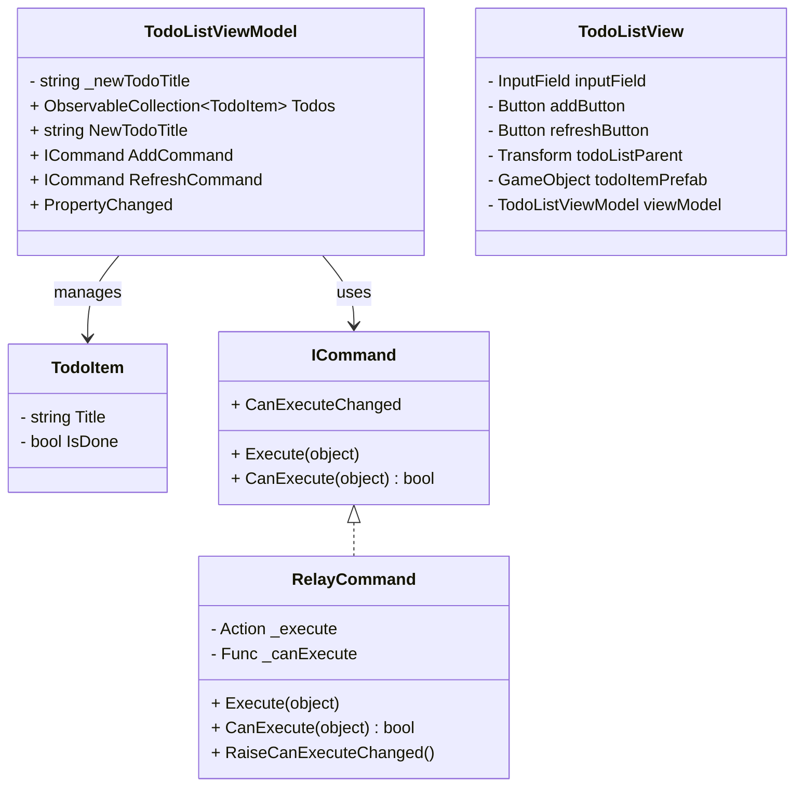

```mermaid
classDiagram
    class TodoItem {
        - string Title
        - bool IsDone
    }

    class ICommand {
        + Execute(object)
        + CanExecute(object) bool
        + CanExecuteChanged
    }

    class RelayCommand {
        - Action<object> _execute
        - Func<object, bool> _canExecute
        + Execute(object)
        + CanExecute(object) bool
        + RaiseCanExecuteChanged()
    }

    class TodoListViewModel {
        - string _newTodoTitle
        + ObservableCollection~TodoItem~ Todos
        + string NewTodoTitle
        + ICommand AddCommand
        + ICommand RefreshCommand
        + PropertyChanged
    }

    class TodoListView {
        - InputField inputField
        - Button addButton
        - Button refreshButton
        - Transform todoListParent
        - GameObject todoItemPrefab
        - TodoListViewModel viewModel
    }

    ICommand <|.. RelayCommand
    TodoListViewModel --> ICommand : uses
    TodoListViewModel --> TodoItem : manages
```